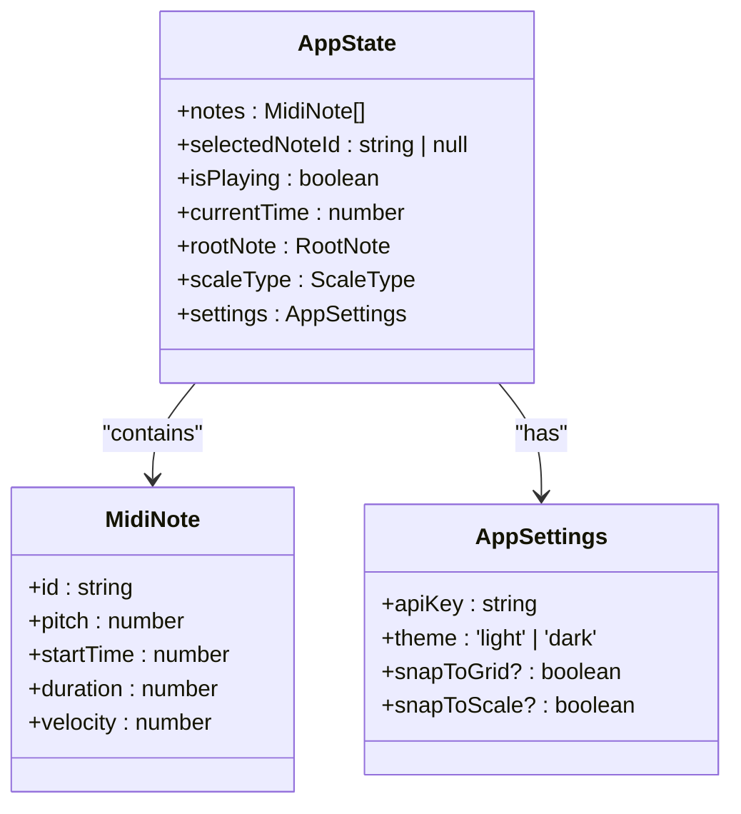
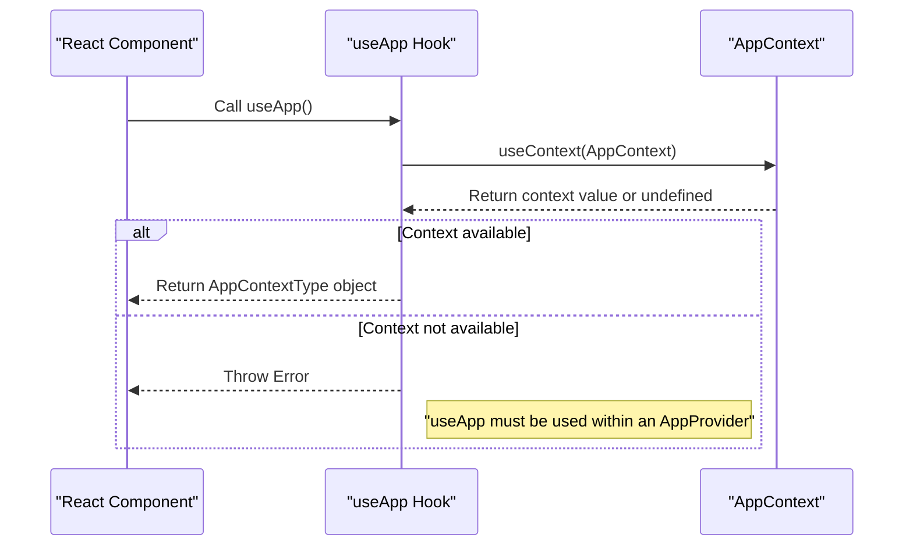
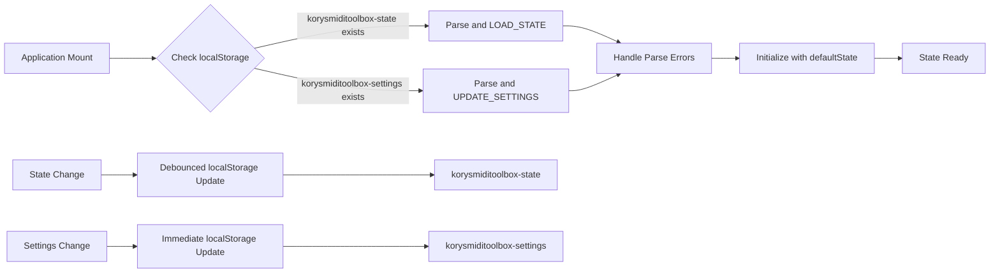
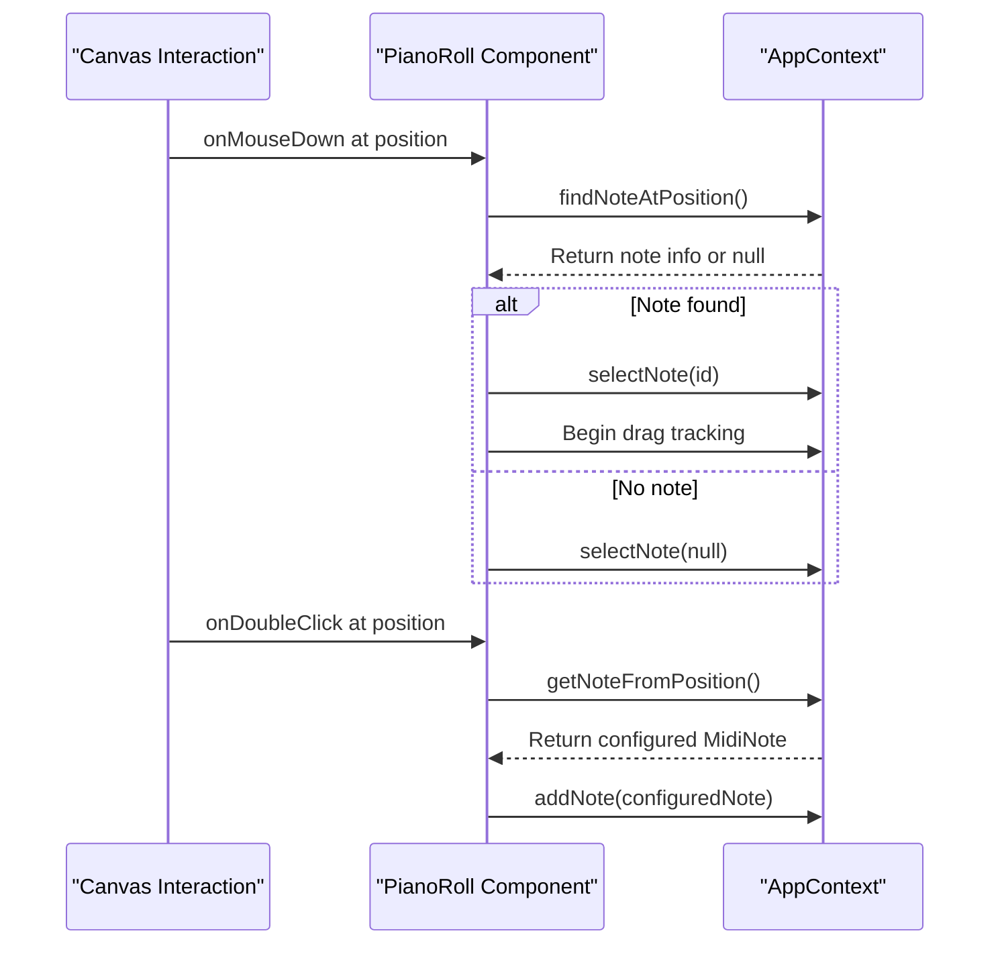

# AppContext API

<cite>
**Referenced Files in This Document**   
- [AppContext.tsx](file://src/context/AppContext.tsx)
- [index.ts](file://src/types/index.ts)
- [PianoRoll.tsx](file://src/components/PianoRoll.tsx)
- [ControlBar.tsx](file://src/components/ControlBar.tsx)
- [SettingsPanel.tsx](file://src/components/SettingsPanel.tsx)
</cite>

## Table of Contents
1. [Introduction](#introduction)
2. [AppState Interface](#appstate-interface)
3. [Dispatch Actions](#dispatch-actions)
4. [useApp Custom Hook](#useapp-custom-hook)
5. [State Initialization and Persistence](#state-initialization-and-persistence)
6. [Component Integration Examples](#component-integration-examples)
7. [Error Handling and Edge Cases](#error-handling-and-edge-cases)
8. [Extending the Reducer](#extending-the-reducer)
9. [Conclusion](#conclusion)

## Introduction

The AppContext in korysmiditoolbox provides a centralized state management system for the music composition application. Built using React's Context API with useReducer, it manages all application state including MIDI notes, playback controls, musical parameters, and user settings. The context enables components throughout the application to access and modify shared state without prop drilling, while maintaining type safety through TypeScript interfaces.

**Section sources**
- [AppContext.tsx](file://src/context/AppContext.tsx#L1-L50)
- [index.ts](file://src/types/index.ts#L1-L10)

## AppState Interface

The AppState interface defines the complete structure of the application's state, encompassing musical data, UI state, and user preferences. It serves as the single source of truth for the entire application.



**Diagram sources**
- [index.ts](file://src/types/index.ts#L15-L40)
- [AppContext.tsx](file://src/context/AppContext.tsx#L39-L45)

### Core State Properties

The AppState contains several key properties that define the current state of the music composition:

- **notes**: Array of MidiNote objects representing the musical content in the piano roll
- **selectedNoteId**: Tracks which note is currently selected for editing
- **isPlaying**: Boolean flag indicating playback status
- **currentTime**: Current playback position in seconds
- **rootNote**: The root note of the musical scale (e.g., 'C', 'D#')
- **scaleType**: The type of musical scale being used (e.g., 'Major', 'Minor')
- **settings**: User preferences including API key and UI behavior options

The interface leverages TypeScript union types for constrained values like RootNote and ScaleType, ensuring type safety while providing autocompletion benefits during development.

**Section sources**
- [index.ts](file://src/types/index.ts#L15-L40)
- [AppContext.tsx](file://src/context/AppContext.tsx#L39-L45)

## Dispatch Actions

The AppContext exposes a comprehensive set of dispatch actions that enable controlled state mutations through a well-defined action/reducer pattern. Each action type corresponds to a specific state transformation operation.

```mermaid
flowchart TD
Start([Action Dispatch]) --> ADD_NOTE["ADD_NOTE: Add new MIDI note"]
Start --> UPDATE_NOTE["UPDATE_NOTE: Modify existing note"]
Start --> DELETE_NOTE["DELETE_NOTE: Remove note"]
Start --> SELECT_NOTE["SELECT_NOTE: Set active note"]
Start --> CLEAR_NOTES["CLEAR_NOTES: Remove all notes"]
Start --> SET_ROOT_NOTE["SET_ROOT_NOTE: Change root note"]
Start --> SET_SCALE_TYPE["SET_SCALE_TYPE: Change scale type"]
Start --> SET_PLAYING["SET_PLAYING: Toggle playback"]
Start --> SET_CURRENT_TIME["SET_CURRENT_TIME: Update playhead"]
Start --> UPDATE_SETTINGS["UPDATE_SETTINGS: Modify user settings"]
Start --> LOAD_STATE["LOAD_STATE: Bulk state update"]
ADD_NOTE --> End([State Updated])
UPDATE_NOTE --> End
DELETE_NOTE --> End
SELECT_NOTE --> End
CLEAR_NOTES --> End
SET_ROOT_NOTE --> End
SET_SCALE_TYPE --> End
SET_PLAYING --> End
SET_CURRENT_TIME --> End
UPDATE_SETTINGS --> End
LOAD_STATE --> End
style Start fill:#f9f,stroke:#333
style End fill:#bbf,stroke:#333
```



**Diagram sources**
- [AppContext.tsx](file://src/context/AppContext.tsx#L47-L75)

### Action Types and Payloads

Each dispatch action follows a consistent pattern with a descriptive type and appropriate payload:

- **ADD_NOTE**: Adds a new MIDI note with generated ID; payload is a complete MidiNote object
- **UPDATE_NOTE**: Modifies specific properties of an existing note; payload includes note ID and partial updates
- **DELETE_NOTE**: Removes a note by ID; payload is the string ID
- **SELECT_NOTE**: Sets or clears the selected note; payload is string ID or null
- **CLEAR_NOTES**: Empties all notes from the composition
- **SET_ROOT_NOTE**: Changes the root note of the scale; payload is RootNote value
- **SET_SCALE_TYPE**: Changes the scale type; payload is ScaleType value
- **SET_PLAYING**: Toggles playback state; payload is boolean
- **SET_CURRENT_TIME**: Updates the current playback position; payload is number in seconds
- **UPDATE_SETTINGS**: Merges new settings with existing ones; payload is partial AppSettings
- **LOAD_STATE**: Performs bulk state update; payload is partial AppState

The reducer function handles each action type with immutable state updates, ensuring predictable state transitions and enabling time-travel debugging capabilities.

**Section sources**
- [AppContext.tsx](file://src/context/AppContext.tsx#L47-L120)

## useApp Custom Hook

The useApp custom hook provides a convenient way for components to access the AppContext value, abstracting away the direct useContext call and adding valuable error handling.



**Diagram sources**
- [AppContext.tsx](file://src/context/AppContext.tsx#L217-L219)

### Usage Pattern

Components consume the context through the useApp hook, which returns an object containing both the state and various convenience methods:

```typescript
const { state, addNote, updateNote, deleteNote } = useApp();
```

This pattern eliminates the need for components to directly dispatch actions, instead providing higher-level functions that encapsulate the dispatch logic. For example, calling `addNote(note)` internally generates a unique ID and dispatches the ADD_NOTE action, abstracting these implementation details from the consumer.

### Error Handling

The hook implements critical error handling by checking if the context value is undefined, which occurs when the hook is used outside of an AppProvider wrapper:

```typescript
export function useApp() {
  const context = useContext(AppContext);
  if (context === undefined) {
    throw new Error('useApp must be used within an AppProvider');
  }
  return context;
}
```

This fails fast with a descriptive error message, helping developers quickly identify and fix context usage errors during development rather than experiencing silent failures or runtime exceptions later.

**Section sources**
- [AppContext.tsx](file://src/context/AppContext.tsx#L217-L219)
- [PianoRoll.tsx](file://src/components/PianoRoll.tsx#L10-L12)

## State Initialization and Persistence

The AppContext implements a robust state initialization and persistence mechanism using localStorage to provide continuity between application sessions.



**Diagram sources**
- [AppContext.tsx](file://src/context/AppContext.tsx#L125-L165)

### Default State Initialization

The context initializes with a predefined defaultState object that establishes the initial application configuration:

```typescript
const defaultState: AppState = {
  notes: [],
  selectedNoteId: null,
  isPlaying: false,
  currentTime: 0,
  rootNote: 'C',
  scaleType: 'Major',
  settings: defaultSettings
};
```

This ensures the application starts in a known, consistent state regardless of whether persisted data exists.

### LocalStorage Persistence

The implementation uses two useEffect hooks to synchronize state with localStorage:

1. **On Mount**: Attempts to load saved state and settings from localStorage, with proper error handling for parsing failures
2. **On Change**: Persists relevant portions of state to localStorage whenever they change, using separate keys for application state and user settings

The persistence strategy selectively saves only essential state (notes, rootNote, scaleType) while excluding transient values like playback position, optimizing storage efficiency and preventing stale playback states from interfering with new sessions.

**Section sources**
- [AppContext.tsx](file://src/context/AppContext.tsx#L125-L165)

## Component Integration Examples

Several key components demonstrate how to effectively integrate with the AppContext to create interactive music composition features.

### PianoRoll Component

The PianoRoll component represents the primary interface for creating and editing MIDI notes, leveraging multiple aspects of the AppContext:



**Diagram sources**
- [PianoRoll.tsx](file://src/components/PianoRoll.tsx#L10-L12)
- [AppContext.tsx](file://src/context/AppContext.tsx#L10-L15)

The