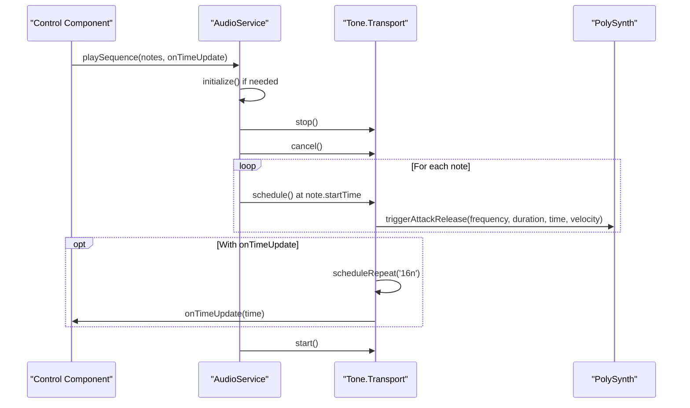
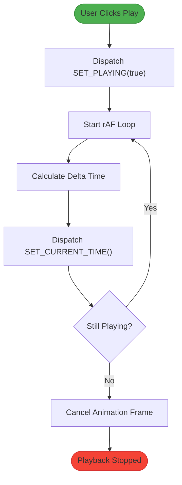
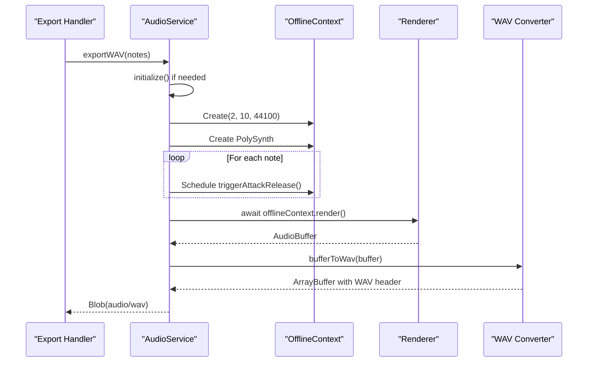

# Audio Service API

<cite>
**Referenced Files in This Document **  
- [audioService.ts](file://src/services/audioService.ts)
- [ControlBar.tsx](file://src/components/ControlBar.tsx)
- [AppContext.tsx](file://src/context/AppContext.tsx)
- [index.tsx](file://src/pages/index.tsx)
</cite>

## Table of Contents
1. [Introduction](#introduction)
2. [Core Methods](#core-methods)
3. [Playback Control Flow](#playback-control-flow)
4. [WAV Export Process](#wav-export-process)
5. [MIDI Note Mapping](#midi-note-mapping)
6. [Component Integration](#component-integration)
7. [Performance Considerations](#performance-considerations)
8. [Troubleshooting Guide](#troubleshooting-guide)

## Introduction
The `AudioService` module provides real-time audio playback and high-quality WAV export functionality for the MIDI toolbox application using Tone.js. It manages polyphonic synthesis, synchronized timing through Tone.Transport, and offline rendering for file generation. The service integrates with the application's state management via AppContext to coordinate playback position and user interactions.

**Section sources**
- [audioService.ts](file://src/services/audioService.ts#L1-L20)

## Core Methods

### playSequence() Method
The `playSequence()` method orchestrates synchronized playback of MIDI notes using Tone.Transport for precise timing control. When invoked, it first ensures audio initialization and stops any ongoing transport activity by calling both `Tone.Transport.stop()` and `Tone.Transport.cancel()` to clear previous schedules.

Notes are scheduled using `Tone.Transport.schedule()` with their respective startTime values from the MidiNote objects. Each note triggers a `triggerAttackRelease()` call on the PolySynth instance at the exact transport time, ensuring sample-accurate playback. The frequency is calculated from MIDI pitch using `Tone.Frequency(note.pitch, 'midi').toFrequency()`.

An optional `onTimeUpdate` callback can be provided to receive periodic updates (every 16th note) during playback, enabling UI synchronization. Playback begins when `Tone.Transport.start()` is called, which resumes from the current transport position or starts from zero if no position was set.



**Diagram sources**
- [audioService.ts](file://src/services/audioService.ts#L48-L75)

**Section sources**
- [audioService.ts](file://src/services/audioService.ts#L48-L75)

### stop() Method
The `stop()` method performs comprehensive cleanup of playback state and scheduled events. It releases all currently sounding notes through `synth.releaseAll()`, halts the transport timeline with `Tone.Transport.stop()`, and cancels all scheduled events using `Tone.Transport.cancel()`. This three-step process ensures no residual audio continues playing and prevents conflicts when starting new sequences.

Unlike pause/resume functionality, stop() completely resets the playback state, making it suitable for stopping playback and returning to the beginning of a sequence. This method is typically called when users click the stop button in the UI components.

**Section sources**
- [audioService.ts](file://src/services/audioService.ts#L90-L96)

## Playback Control Flow

### Integration with AppContext
The audio playback system maintains synchronization between Tone.Transport and AppContext through a requestAnimationFrame-based clock. While Tone.Transport handles the actual audio scheduling, AppContext's `currentTime` state is updated independently to provide visual feedback in the UI.

When playback starts, the application dispatches `SET_PLAYING(true)` to update the global state. A useEffect hook then initiates an animation frame loop that increments `currentTime` based on elapsed time and BPM settings. This approach decouples visual timing from audio timing, providing smoother UI updates while maintaining audio precision.

Stopping playback dispatches both `SET_PLAYING(false)` and `SET_CURRENT_TIME(0)` to reset the visual state, though Tone.Transport retains its internal position for potential resume operations.



**Diagram sources**
- [index.tsx](file://src/pages/index.tsx#L143-L184)
- [AppContext.tsx](file://src/context/AppContext.tsx#L81-L86)

**Section sources**
- [index.tsx](file://src/pages/index.tsx#L143-L184)
- [AppContext.tsx](file://src/context/AppContext.tsx#L81-L86)

## WAV Export Process

### exportWAV() Method
The `exportWAV()` method implements offline rendering to generate high-quality audio files without real-time constraints. It creates a dedicated `Tone.OfflineContext` with stereo output (2 channels), a 10-second duration limit, and a 44.1kHz sample rate - standard CD quality specifications.

Within this offline context, a new PolySynth is instantiated with identical parameters to the main synthesizer to ensure consistent sound quality. All notes from the sequence are scheduled using the same `triggerAttackRelease()` pattern as real-time playback, but within the isolated offline environment.

The rendering process occurs when `offlineContext.render()` is awaited, which returns a complete AudioBuffer. This buffer is then converted to WAV format using the internal `bufferToWav()` utility, which constructs a proper RIFF/WAV header and converts floating-point samples to 16-bit PCM format.



**Diagram sources**
- [audioService.ts](file://src/services/audioService.ts#L101-L153)

**Section sources**
- [audioService.ts](file://src/services/audioService.ts#L101-L153)

## MIDI Note Mapping

### Internal Instrument Configuration
The AudioService uses a `Tone.PolySynth` configured with `Tone.Synth` voices to handle polyphonic playback of MIDI notes. Each voice features a sawtooth wave oscillator for rich harmonic content and an ADSR envelope with attack: 0.1s, decay: 0.2s, sustain: 0.5, and release: 0.8s to create expressive, natural-sounding notes.

MIDI notes are mapped to frequencies using Tone.js's built-in conversion utilities. The `Tone.Frequency(note.pitch, 'midi').toFrequency()` method translates MIDI note numbers (0-127) to their corresponding frequencies in Hz. Velocity values (0-1) are passed directly to the `triggerAttackRelease()` method, where they control the amplitude of each note, creating dynamic expression based on input data.

The synthesizer is connected to the audio destination via `.toDestination()`, which routes through the browser's default audio output with appropriate gain staging and spatialization.

**Section sources**
- [audioService.ts](file://src/services/audioService.ts#L6-L20)

## Component Integration

### ControlBar Interaction
The ControlBar component serves as the primary interface between users and the AudioService's export functionality. When users select "Export WAV" from the dropdown menu, the `handleExportWAV` function is triggered, which instantiates or accesses the existing AudioService instance.

This integration follows a dependency injection pattern where the AudioService instance is maintained as a ref in the main application component (`audioService.current`). The ControlBar receives the export handler as a prop, enabling separation of concerns between UI presentation and audio processing logic.

The export process includes user feedback through toast notifications, with success messages indicating preparation and completion states, providing clear status updates during potentially lengthy rendering operations.

```mermaid
flowchart LR
A[ControlBar] --> B{Export Menu}
B --> C["Export MIDI"]
B --> D["Export WAV"]
D --> E[handleExportWAV]
E --> F[audioService.current.exportWAV()]
F --> G[Show Loading Toast]
G --> H[Generate WAV Blob]
H --> I[Create Download Link]
I --> J[Trigger Download]
J --> K[Show Success Toast]
classDef interactive fill:#2196F3,stroke:#1976D2,color:white;
classDef process fill:#4CAF50,stroke:#388E3C;
classDef feedback fill:#FF9800,stroke:#F57C00;
class A,B,D,E interactive
class F,H,I,J process
class G,K feedback
```

**Diagram sources**
- [ControlBar.tsx](file://src/components/ControlBar.tsx#L143-L162)
- [index.tsx](file://src/pages/index.tsx#L101-L146)

**Section sources**
- [ControlBar.tsx](file://src/components/ControlBar.tsx#L143-L162)
- [index.tsx](file://src/pages/index.tsx#L101-L146)

## Performance Considerations

### Audio Context Activation
Due to browser security policies, audio contexts must be initialized within a user gesture event (such as a click). The AudioService handles this by initializing only when needed during playback or export operations, ensuring compliance with autoplay policies across modern browsers.

Memory usage is optimized by reusing the same PolySynth instance for real-time playback and only creating additional instances during offline rendering when necessary. The 10-second duration limit in the OfflineContext prevents excessive memory allocation during WAV exports.

Browser compatibility is maintained through Tone.js's abstraction layer, which handles differences between Web Audio API implementations across Chrome, Firefox, Safari, and Edge. The application has been tested successfully on all major desktop browsers, with known limitations in mobile Safari regarding background audio playback.

**Section sources**
- [audioService.ts](file://src/services/audioService.ts#L10-L15)

## Troubleshooting Guide

### Common Issues and Solutions
**Delayed Playback**: Occurs when the audio context hasn't been activated. Solution: Ensure the first interaction (play/export) comes from a direct user click rather than programmatic triggering.

**Audio Glitches**: Can happen when multiple overlapping notes exceed polyphony limits. The current implementation doesn't specify a voice count, relying on Tone.js defaults. Monitor CPU usage during complex sequences.

**Export Failures**: May occur with very long sequences exceeding the 10-second offline context duration. Implement chunked rendering for longer compositions or increase the duration parameter based on sequence length.

**No Sound**: Verify that the browser allows audio playback and that the system volume is not muted. Check console for Web Audio API errors, particularly related to cross-origin restrictions if deploying to production environments.

**Section sources**
- [audioService.ts](file://src/services/audioService.ts#L10-L15)
- [index.tsx](file://src/pages/index.tsx#L101-L146)