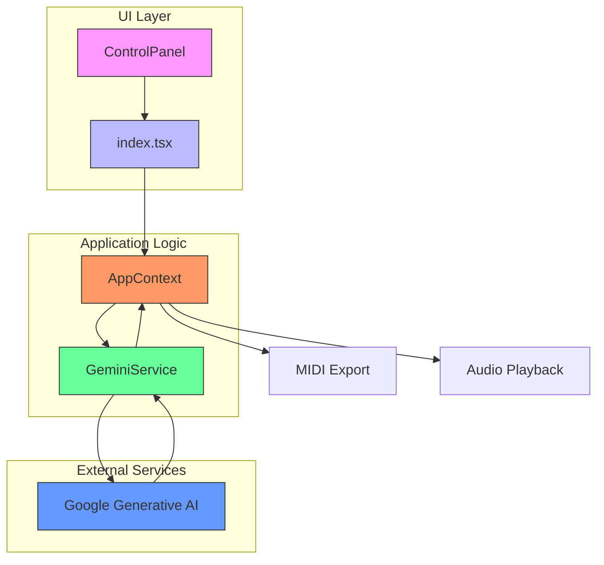
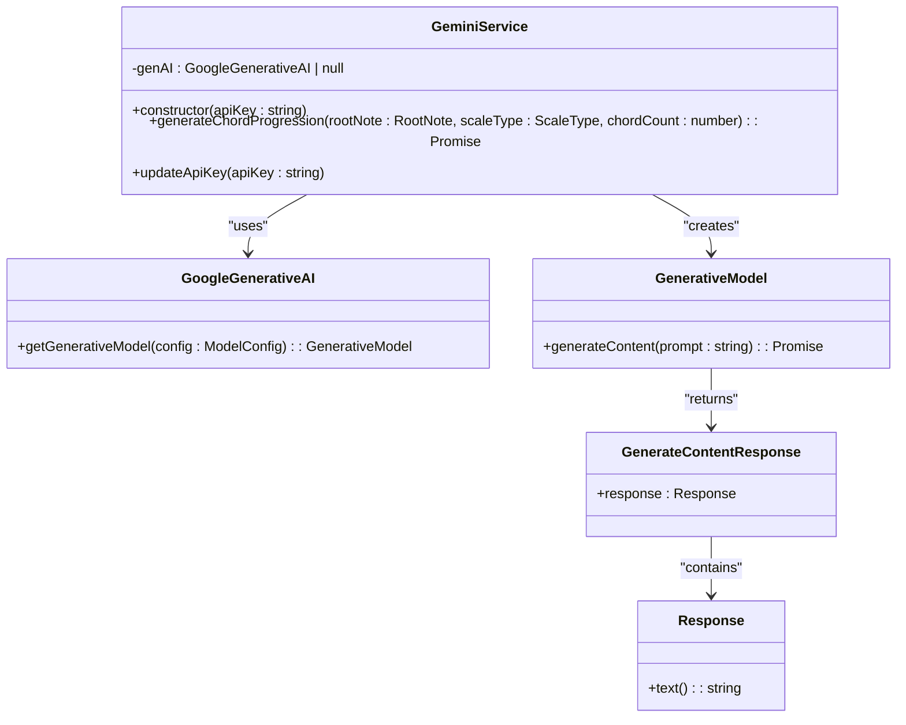
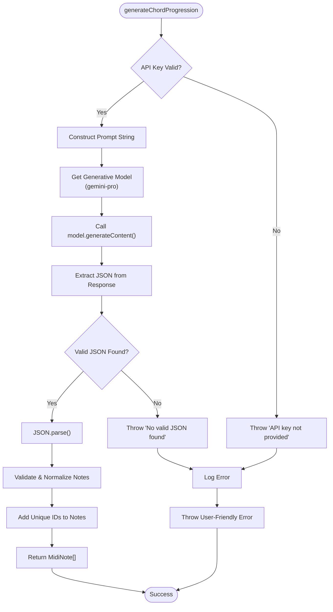
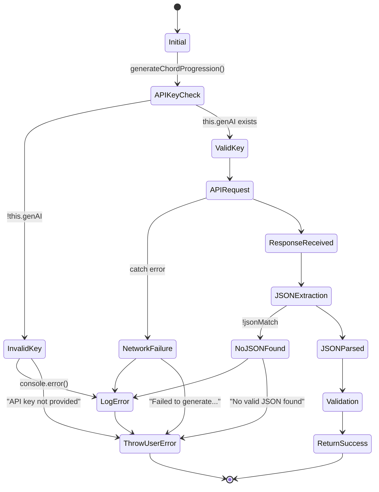
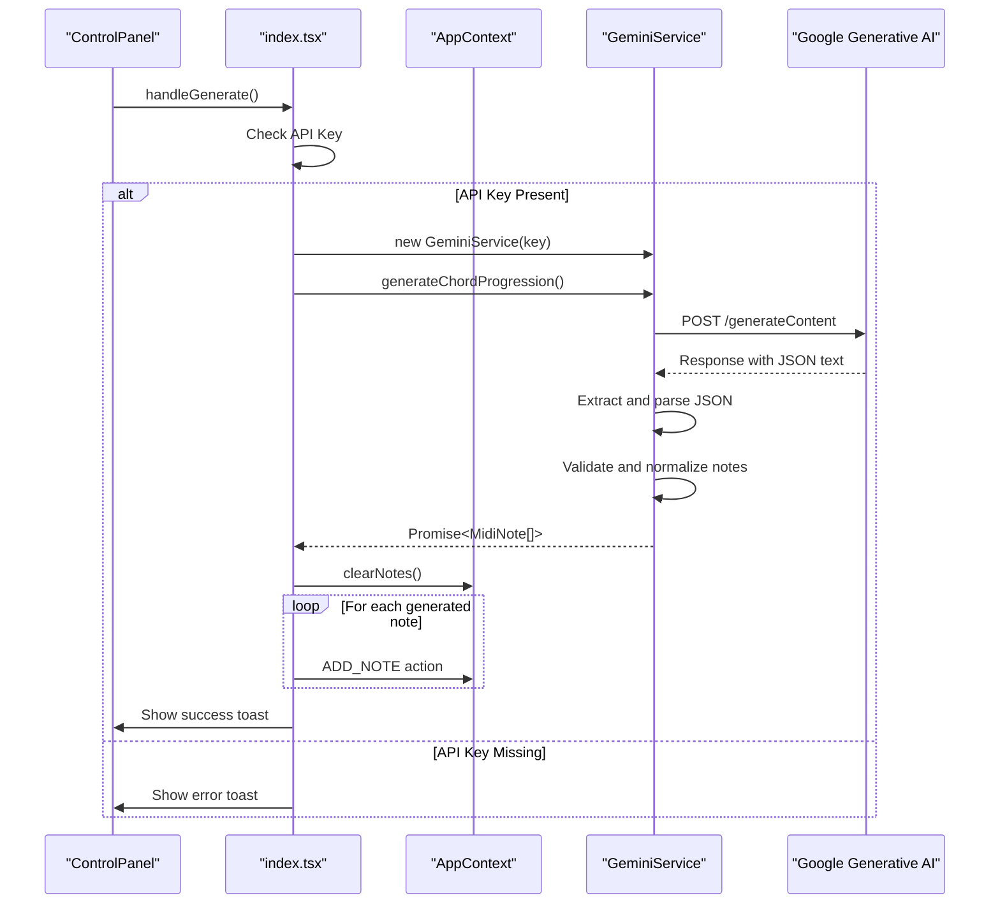

# Gemini Service API

<cite>
**Referenced Files in This Document**   
- [geminiService.ts](file://src/services/geminiService.ts)
- [AppContext.tsx](file://src/context/AppContext.tsx)
- [index.ts](file://src/types/index.ts)
- [index.tsx](file://src/pages/index.tsx)
</cite>

## Table of Contents
1. [Introduction](#introduction)
2. [Core Components](#core-components)
3. [Architecture Overview](#architecture-overview)
4. [Detailed Component Analysis](#detailed-component-analysis)
5. [Dependency Analysis](#dependency-analysis)
6. [Performance Considerations](#performance-considerations)
7. [Troubleshooting Guide](#troubleshooting-guide)

## Introduction
The Gemini Service API provides AI-powered chord progression generation capabilities for the Korys MIDI Toolbox application. This service leverages Google's Generative AI model to create musically coherent chord sequences based on user-specified parameters. The core functionality centers around the `generateChordProgression` method, which accepts musical parameters and returns structured MIDI data suitable for playback and editing within the application.

## Core Components
The geminiService class serves as the primary interface between the application and Google's Generative AI platform. It handles API key management, prompt construction, response parsing, and error handling for chord generation requests. The service works in conjunction with the AppContext to access user settings and state, ensuring seamless integration with the application's UI components.

**Section sources**
- [geminiService.ts](file://src/services/geminiService.ts#L0-L70)
- [AppContext.tsx](file://src/context/AppContext.tsx#L0-L220)

## Architecture Overview


**Diagram sources**
- [geminiService.ts](file://src/services/geminiService.ts#L0-L70)
- [index.tsx](file://src/pages/index.tsx#L0-L330)
- [AppContext.tsx](file://src/context/AppContext.tsx#L0-L220)

## Detailed Component Analysis

### GeminiService Class Analysis
The GeminiService class encapsulates all functionality related to AI-generated chord progressions. It manages the connection to Google's Generative AI service and provides a clean interface for generating musical content.

#### Class Structure


**Diagram sources**
- [geminiService.ts](file://src/services/geminiService.ts#L0-L70)

#### Chord Generation Process Flow


**Diagram sources**
- [geminiService.ts](file://src/services/geminiService.ts#L0-L70)

### Parameter Definitions and Musical Theory Implications

#### RootNote and ScaleType Parameters
The `generateChordProgression` method accepts two primary musical parameters that define the harmonic context of the generated progression:

**RootNote**: Specifies the tonic or home note of the key. Valid values are:
- C, C#, D, D#, E, F, F#, G, G#, A, A#, B

**ScaleType**: Defines the mode or scale pattern used for chord construction. Valid values include:
- Major: Ionian mode, bright/happy character
- Minor: Aeolian mode, sad/serious character  
- Dorian: Minor with raised 6th, jazzy/mysterious quality
- Phrygian: Minor with lowered 2nd, Spanish/exotic flavor
- Lydian: Major with raised 4th, dreamy/ethereal sound
- Mixolydian: Major with lowered 7th, bluesy/rock character
- Harmonic Minor: Minor with raised 7th, classical/Middle Eastern feel

These parameters work together to establish the tonal center and emotional character of the generated chord progression. The service uses music theory principles to ensure that generated chords follow common harmonic practices within the specified key and mode.

**Section sources**
- [index.ts](file://src/types/index.ts#L30-L38)
- [midiUtils.ts](file://src/utils/midiUtils.ts#L0-L41)

### Return Type and Data Structure

#### MidiNote Interface
The service returns a Promise that resolves to an array of MidiNote objects, each conforming to the following structure:

```typescript
interface MidiNote {
  id: string;
  pitch: number; // MIDI note number (0-127)
  startTime: number; // in seconds
  duration: number; // in seconds
  velocity: number; // 0-1
}
```

The pitch value represents standard MIDI note numbers (C4 = 60), with validation ensuring values remain within the 0-127 range. Start times are relative to the beginning of the progression in seconds, with each chord typically starting at 0, 2, 4, and 6 seconds for a four-chord sequence. Duration defaults to 2 seconds per chord, and velocity is normalized to the 0-1 range for consistent playback dynamics.

**Section sources**
- [index.ts](file://src/types/index.ts#L0-L10)

### Error Handling Mechanisms

#### Comprehensive Error Handling Strategy
The service implements robust error handling to manage various failure scenarios:



**Diagram sources**
- [geminiService.ts](file://src/services/geminiService.ts#L30-L70)

The error handling covers three main categories:
1. **Configuration errors**: Missing or invalid API keys prevent service initialization
2. **Network/API errors**: Failures during communication with Google's Generative AI service
3. **Response validation errors**: Malformed or unexpected response content that cannot be parsed

All errors are logged to the console for debugging purposes while presenting user-friendly messages through the application's toast notification system.

### HTTP Request Implementation

#### Google Generative AI SDK Configuration
The service utilizes the official `@google/generative-ai` SDK to communicate with the Gemini API. The implementation configures the following model parameters:

- **Model**: gemini-pro (text generation model)
- **Temperature**: Default value (balanced creativity vs. predictability)
- **Max Output Tokens**: Default limits (sufficient for chord progression JSON)
- **Response Format**: Text-only with JSON extraction post-processing

The prompt engineering strategy focuses on precise instructions that guide the AI to produce well-structured JSON output containing valid MIDI data. The prompt specifies exact field requirements, timing constraints (2-second chords), and pitch ranges (MIDI 36-84, corresponding to C2-C6) to ensure musically appropriate results.

**Section sources**
- [geminiService.ts](file://src/services/geminiService.ts#L15-L30)

### Usage Example and Integration Pattern

#### UI Layer Integration
The following sequence diagram illustrates how the UI layer invokes the chord generation service:



**Diagram sources**
- [index.tsx](file://src/pages/index.tsx#L60-L104)
- [geminiService.ts](file://src/services/geminiService.ts#L0-L70)

#### Code Example
```typescript
// Example usage from UI component
const handleGenerate = async () => {
  if (!state.settings.apiKey) {
    error('Please set your Gemini API key in the settings panel.', 'API Key Required');
    return;
  }

  if (!geminiService.current) {
    geminiService.current = new GeminiService(state.settings.apiKey);
  }

  setIsGenerating(true);
  try {
    const newNotes = await geminiService.current.generateChordProgression(
      state.rootNote as RootNote,
      state.scaleType as ScaleType,
      4
    );
    
    // Clear existing notes and add new ones
    clearNotes();
    newNotes.forEach(note => {
      dispatch({ type: 'ADD_NOTE', payload: note });
    });
    
    success('Chord progression generated successfully!');
  } catch (err) {
    console.error('Generation error:', err);
    error(err instanceof Error ? err.message : 'Failed to generate chord progression.');
  } finally {
    setIsGenerating(false);
  }
};
```

This implementation follows the async/await pattern for clean, readable asynchronous code. The service call is wrapped in a try-catch block to handle potential errors gracefully, with loading states managed through the `isGenerating` flag.

**Section sources**
- [index.tsx](file://src/pages/index.tsx#L60-L104)

## Dependency Analysis
```mermaid
graph LR
A[geminiService.ts] --> B[@google/generative-ai]
A --> C[types/index.ts]
C --> D[MidiNote]
C --> E[RootNote]
C --> F[ScaleType]
A --> G[AppContext]
G --> H[AppState]
G --> I[AppSettings]
A --> J[index.tsx]
J --> K[handleGenerate]
style A fill:#6f9,stroke:#333
style B fill:#f96,stroke:#333
style C fill:#69f,stroke:#333
style G fill:#f96,stroke:#333
style J fill:#bbf,stroke:#333
```

**Diagram sources**
- [geminiService.ts](file://src/services/geminiService.ts#L0-L70)
- [index.ts](file://src/types/index.ts#L0-L40)
- [AppContext.tsx](file://src/context/AppContext.tsx#L0-L220)
- [index.tsx](file://src/pages/index.tsx#L0-L330)

## Performance Considerations
The