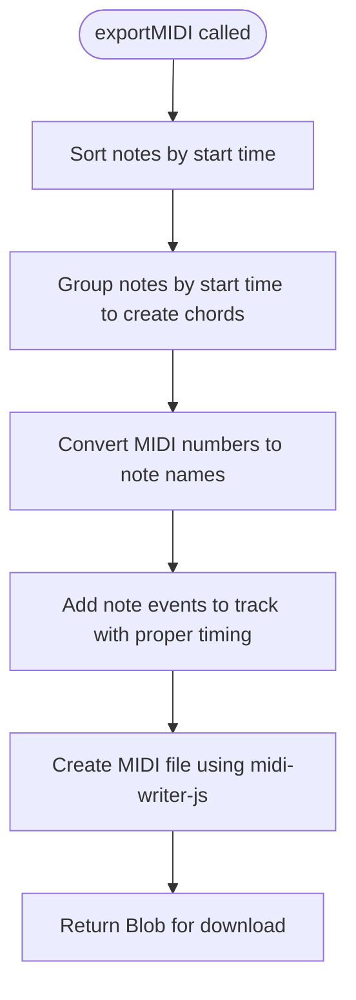
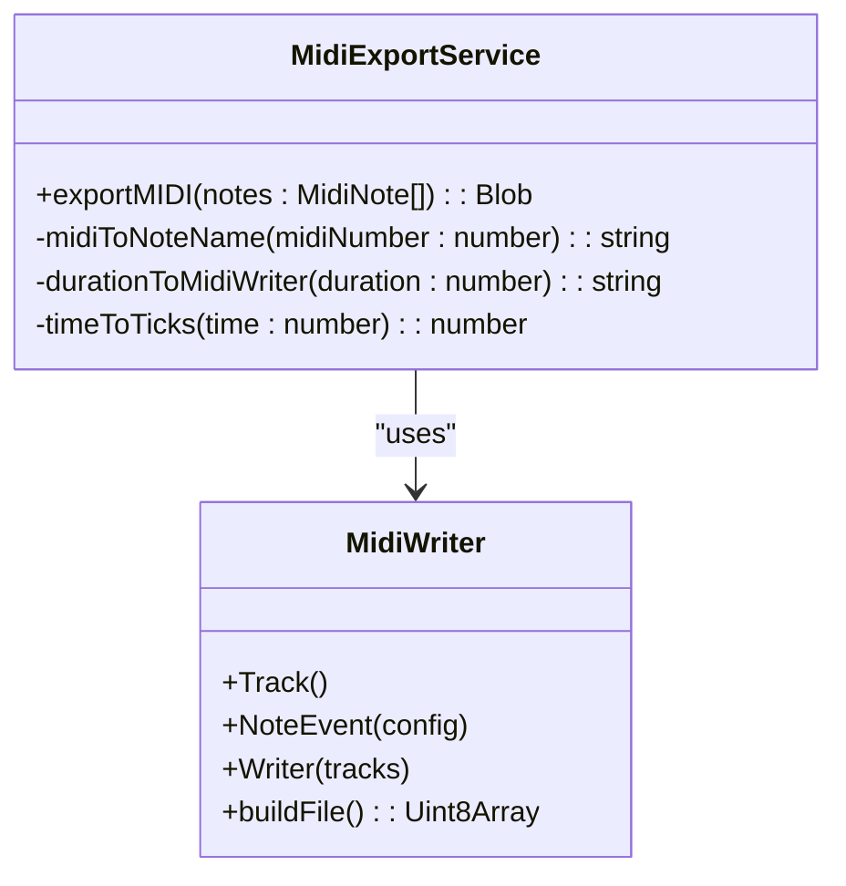
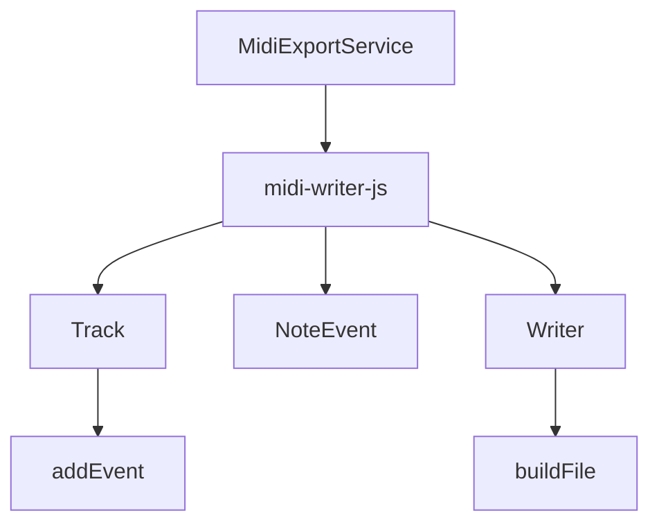
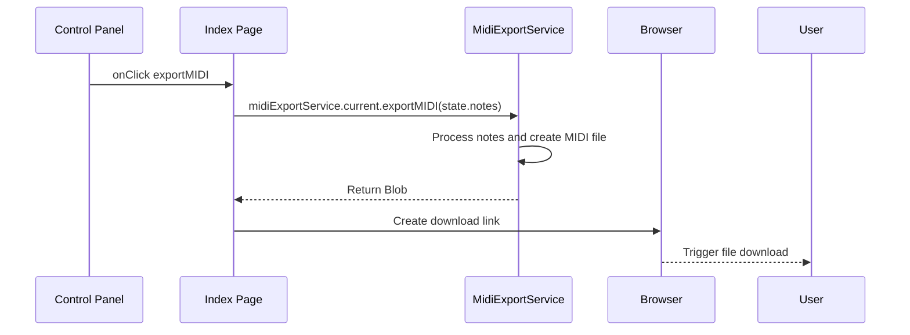

# MIDI Export Service API

<cite>
**Referenced Files in This Document**   
- [midiExportService.ts](file://src/services/midiExportService.ts)
- [index.tsx](file://src/pages/index.tsx)
- [types/index.ts](file://src/types/index.ts)
- [midiUtils.ts](file://src/utils/midiUtils.ts)
- [package.json](file://package.json)
</cite>

## Table of Contents
1. [Introduction](#introduction)
2. [Core Functionality](#core-functionality)
3. [Parameter Specifications](#parameter-specifications)
4. [Internal Processing Logic](#internal-processing-logic)
5. [MIDI Timing Conversion](#midi-timing-conversion)
6. [Library Integration](#library-integration)
7. [Return Type and Usage](#return-type-and-usage)
8. [Practical Implementation Example](#practical-implementation-example)
9. [Edge Case Handling](#edge-case-handling)
10. [Extension Opportunities](#extension-opportunities)

## Introduction

The MIDI Export Service provides a robust solution for generating standard MIDI files from musical note data within the application. This service enables users to export their chord progressions and compositions as downloadable MIDI files, facilitating integration with digital audio workstations and other music production software. The core functionality is encapsulated within the `MidiExportService` class, which leverages the `midi-writer-js` library to create properly formatted MIDI files according to industry standards.

**Section sources**
- [midiExportService.ts](file://src/services/midiExportService.ts#L3-L78)

## Core Functionality

The `MidiExportService` class implements the `exportMIDI()` method as its primary interface for MIDI file generation. This method processes an array of `MidiNote` objects, organizing them into musical events that are then compiled into a standard MIDI file format. The service handles note grouping, timing calculations, and proper MIDI event sequencing to ensure compatibility with various MIDI players and editors.



**Diagram sources**
- [midiExportService.ts](file://src/services/midiExportService.ts#L3-L78)

**Section sources**
- [midiExportService.ts](file://src/services/midiExportService.ts#L3-L78)

## Parameter Specifications

### MidiNote Array Structure
The primary input parameter is an array of `MidiNote` objects, each containing specific musical properties:

| Property | Type | Description | Range |
|---------|------|-------------|-------|
| id | string | Unique identifier for the note | N/A |
| pitch | number | MIDI note number representing the musical pitch | 0-127 |
| startTime | number | Absolute time when the note begins playing | seconds |
| duration | number | Length of time the note is sustained | seconds |
| velocity | number | Strength or volume of the note | 0-1 |

**Section sources**
- [types/index.ts](file://src/types/index.ts#L1-L10)

### Configuration Parameters
While not explicitly passed as parameters, the service internally configures MIDI generation with:
- **Tempo**: Fixed at 120 BPM (beats per minute)
- **PPQ Resolution**: 480 pulses per quarter note
- **Time Signature**: Implicitly 4/4 based on beat calculations

These configurations are hardcoded within the service implementation, ensuring consistent timing calculations across all exported MIDI files.

## Internal Processing Logic

The MIDI export process follows a structured sequence of operations to transform raw note data into a properly formatted MIDI file:



**Diagram sources**
- [midiExportService.ts](file://src/services/midiExportService.ts#L3-L78)

**Section sources**
- [midiExportService.ts](file://src/services/midiExportService.ts#L3-L78)

### Note Processing Pipeline
1. **Sorting**: Notes are first sorted by their start time to ensure chronological processing
2. **Grouping**: Notes with identical start times are grouped together to form chords
3. **Conversion**: MIDI note numbers are converted to textual note names (e.g., C4, D#5)
4. **Event Creation**: Note events are created with appropriate durations and velocities
5. **Timing Assignment**: Events are assigned precise tick positions based on absolute time

The service uses millisecond precision when grouping notes (`Math.round(note.startTime * 1000)`) to handle floating-point timing inaccuracies while maintaining musical accuracy.

## MIDI Timing Conversion

### Time to Ticks Conversion
The service converts absolute time values (in seconds) to MIDI ticks using a fixed PPQ (pulses per quarter note) resolution of 480:


The conversion formula implemented in `timeToTicks()` is:
```
ticks = Math.round((seconds / 0.5) * 480)
```

Where 0.5 represents the duration of one beat at 120 BPM (60 seconds / 120 beats).

### Duration Mapping
Note durations are mapped to standard MIDI duration strings based on their length relative to the 120 BPM tempo:

| Duration (beats) | MIDI Duration String | Musical Equivalent |
|------------------|---------------------|-------------------|
| ≤ 0.25 | '16' | Sixteenth note |
| ≤ 0.5 | '8' | Eighth note |
| ≤ 1 | '4' | Quarter note |
| ≤ 2 | '2' | Half note |
| ≤ 4 | '1' | Whole note |

This mapping ensures that exported MIDI files maintain readable notation when imported into music editing software.

**Section sources**
- [midiExportService.ts](file://src/services/midiExportService.ts#L65-L78)

## Library Integration

The service utilizes the `midi-writer-js` library as its foundation for MIDI file creation. This third-party library is specifically designed for browser-based MIDI generation and provides the necessary abstractions for creating valid MIDI files.



**Diagram sources**
- [midiExportService.ts](file://src/services/midiExportService.ts#L1-L3)
- [package.json](file://package.json#L15)

The integration involves:
- Creating a new `MidiWriter.Track()` instance to hold musical events
- Using `MidiWriter.NoteEvent()` to define individual note occurrences
- Employing `MidiWriter.Writer()` to compile tracks into a complete MIDI file
- Calling `buildFile()` to generate the binary MIDI data

The library version `3.1.1` is specified in the project's dependencies, ensuring consistent behavior across installations.

## Return Type and Usage

The `exportMIDI()` function returns a `Blob` object with MIME type `audio/midi`, making it suitable for direct browser downloads:

```typescript
return new Blob([midiData as BlobPart], { type: 'audio/midi' });
```

This Blob can be used to trigger file downloads in the browser by:
1. Creating an object URL with `URL.createObjectURL()`
2. Programmatically clicking a hidden anchor element with the URL
3. Cleaning up resources with `URL.revokeObjectURL()`

The returned Blob contains the complete binary MIDI data, ready for use in any MIDI-compatible application.

**Section sources**
- [midiExportService.ts](file://src/services/midiExportService.ts#L75-L78)

## Practical Implementation Example

The MIDI export functionality is triggered through the application's UI components, particularly via the ControlPanel and associated handlers:



**Diagram sources**
- [index.tsx](file://src/pages/index.tsx#L92-L96)
- [midiExportService.ts](file://src/services/midiExportService.ts#L3-L78)

In practice, the export process is initiated when users click the "Export MIDI" button in the control panel. The current state's notes are passed to the service, which generates the MIDI file and triggers a download with a timestamped filename (`chord-progression-{timestamp}.mid`).

**Section sources**
- [index.tsx](file://src/pages/index.tsx#L92-L96)
- [midiExportService.ts](file://src/services/midiExportService.ts#L3-L78)

## Edge Case Handling

The service includes considerations for several edge cases:

### Empty Note Arrays
When an empty array is passed to `exportMIDI()`, the service will still generate a valid MIDI file containing an empty track. This prevents runtime errors and maintains API consistency, though the resulting file will contain no musical content.

### Overlapping Notes
The current implementation groups notes by their start time to create chords, effectively handling overlapping notes that begin simultaneously. However, notes with slightly different start times due to floating-point precision may be treated as separate events rather than chord components.

### Timing Precision
The service rounds start times to the nearest millisecond (`Math.round(note.startTime * 1000)`) to mitigate floating-point comparison issues when grouping notes. This ensures reliable chord detection while maintaining sufficient timing precision for musical applications.

**Section sources**
- [midiExportService.ts](file://src/services/midiExportService.ts#L15-L25)

## Extension Opportunities

The current implementation provides a solid foundation that can be extended to support additional MIDI features:

### Multiple Tracks
Future enhancements could introduce support for multiple instrument tracks by:
- Accepting track configuration parameters
- Creating separate `MidiWriter.Track()` instances for different instruments
- Assigning program change messages to specify instrument sounds

### Controller Messages
The service could be extended to include MIDI controller messages such as:
- Expression and volume automation
- Pan positioning
- Sustain pedal events
- Pitch bend data

### Enhanced Timing Configuration
Rather than hardcoding tempo and PPQ values, the service could accept these as configurable parameters, allowing users to export MIDI files with custom tempos and timing resolutions.

### Metadata Support
Additional MIDI metadata could be incorporated, including:
- Track name and instrument designation
- Copyright information
- Tempo changes throughout the composition
- Key signature specification

These extensions would enhance the service's capabilities while maintaining backward compatibility with the existing API.

**Section sources**
- [midiExportService.ts](file://src/services/midiExportService.ts#L3-L78)