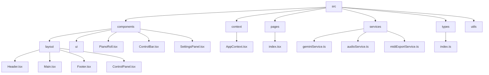
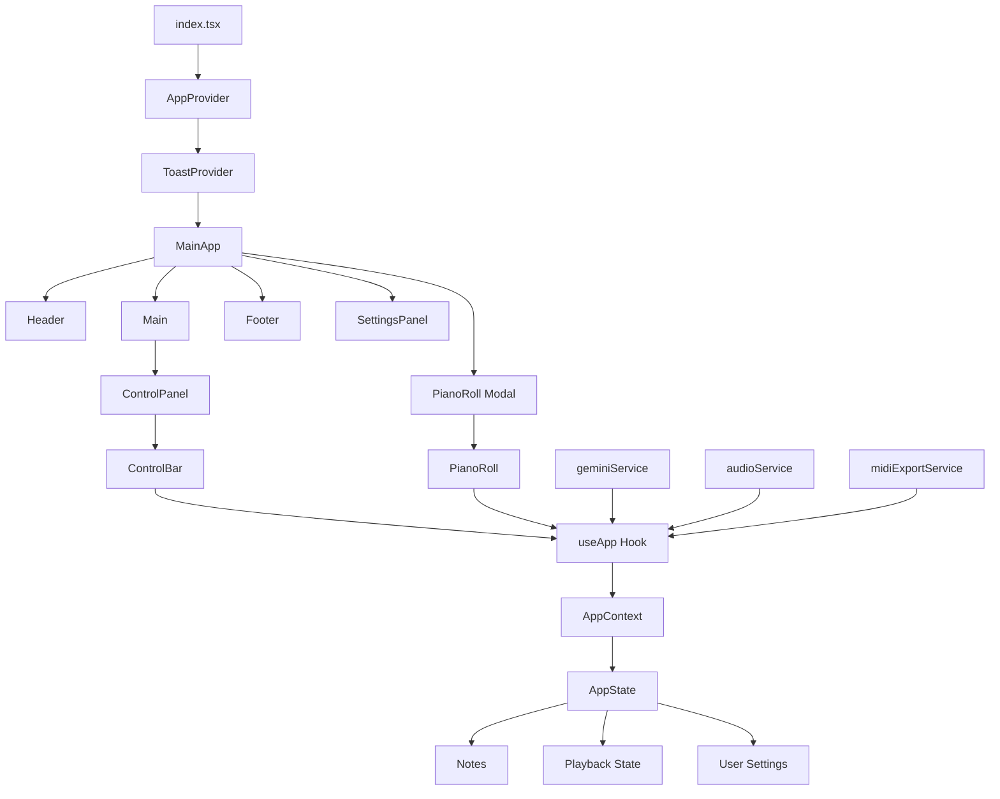
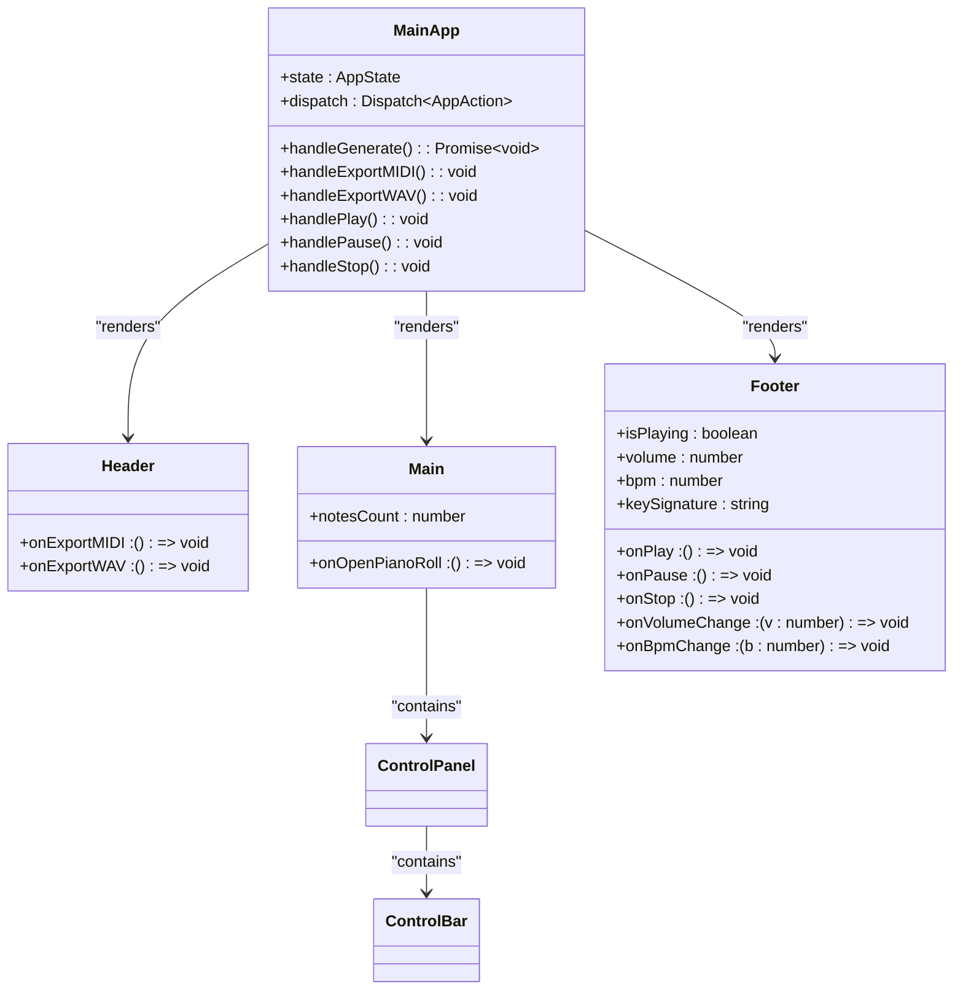
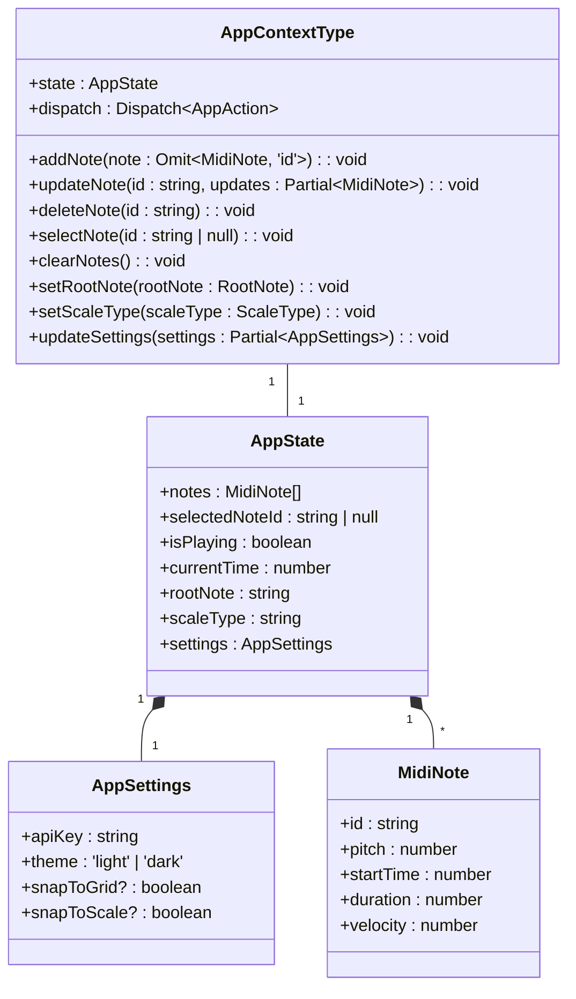
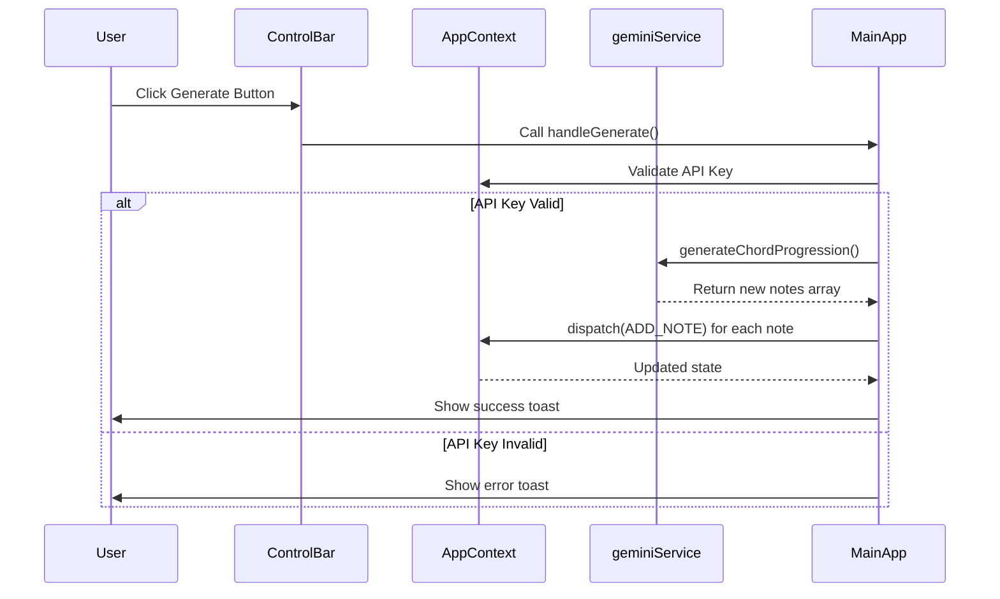
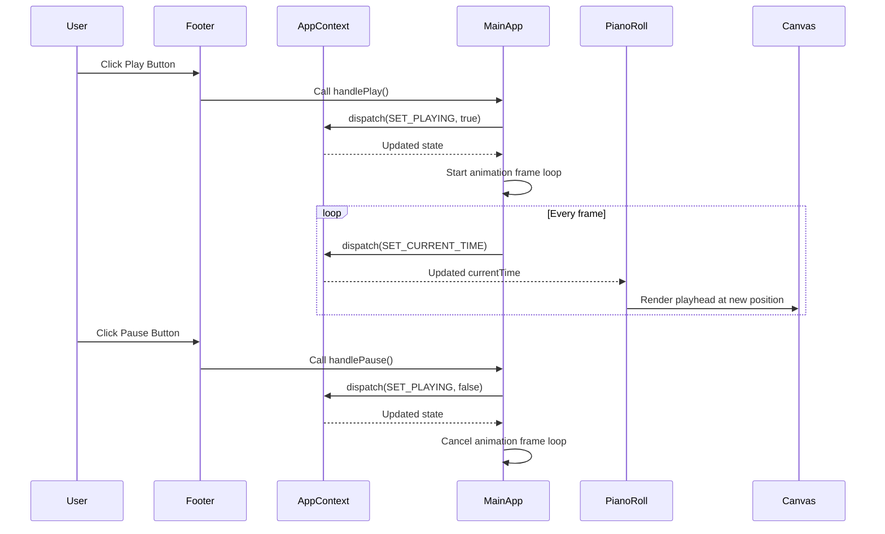
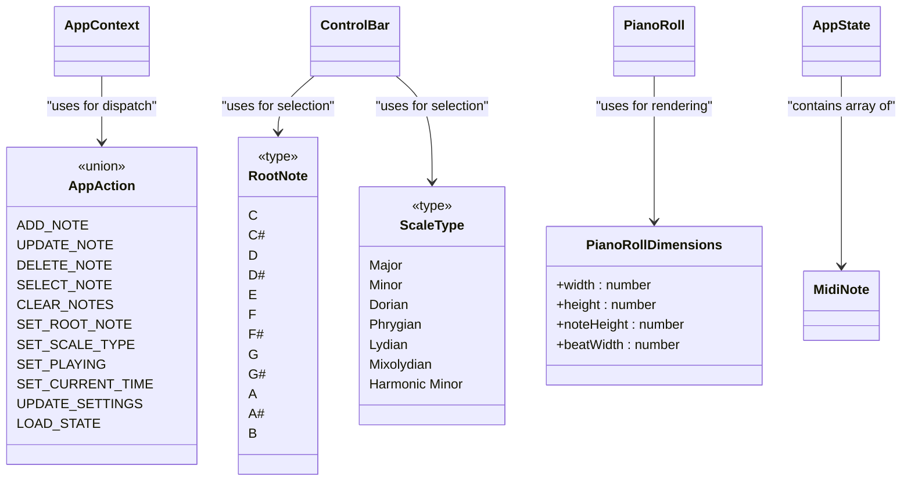
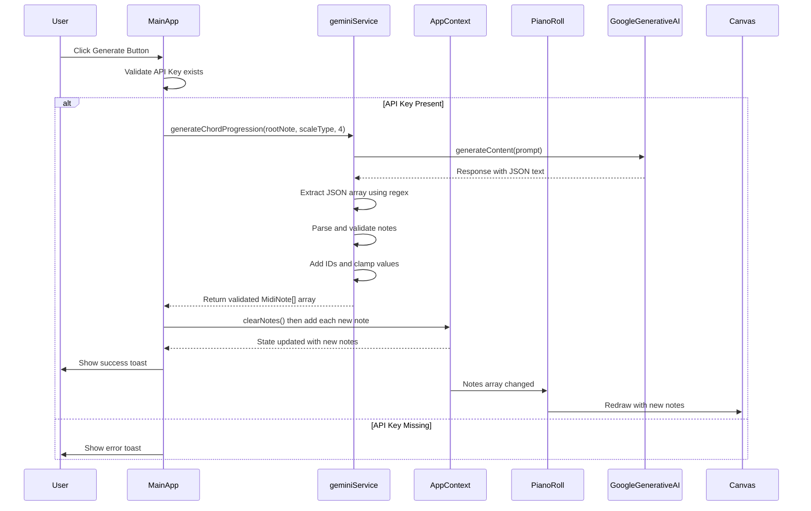
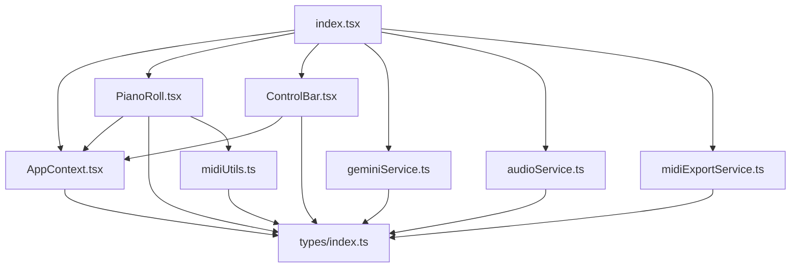

# Application Architecture

<cite>
**Referenced Files in This Document**
- [index.tsx](file://src/pages/index.tsx)
- [AppContext.tsx](file://src/context/AppContext.tsx)
- [PianoRoll.tsx](file://src/components/PianoRoll.tsx)
- [ControlBar.tsx](file://src/components/ControlBar.tsx)
- [geminiService.ts](file://src/services/geminiService.ts)
- [types/index.ts](file://src/types/index.ts)
</cite>

## Table of Contents
1. [Introduction](#introduction)
2. [Project Structure](#project-structure)
3. [Core Components](#core-components)
4. [Architecture Overview](#architecture-overview)
5. [Detailed Component Analysis](#detailed-component-analysis)
6. [Dependency Analysis](#dependency-analysis)
7. [Performance Considerations](#performance-considerations)
8. [Troubleshooting Guide](#troubleshooting-guide)
9. [Conclusion](#conclusion)

## Introduction
This document provides a comprehensive architectural overview of korysmiditoolbox's frontend application, focusing on its React component hierarchy, state management system, and data flow patterns. The application enables users to create, edit, and export MIDI-based chord progressions with AI assistance through Google's Gemini API. Central to the architecture is the AppContext system that manages application state, user settings, and playback controls.

## Project Structure

**Diagram sources**
- [src/pages/index.tsx](file://src/pages/index.tsx)
- [src/components/layout/Header.tsx](file://src/components/layout/Header.tsx)
- [src/components/layout/Main.tsx](file://src/components/layout/Main.tsx)
- [src/components/layout/Footer.tsx](file://src/components/layout/Footer.tsx)
- [src/components/ControlBar.tsx](file://src/components/ControlBar.tsx)
- [src/components/PianoRoll.tsx](file://src/components/PianoRoll.tsx)

**Section sources**
- [src/pages/index.tsx](file://src/pages/index.tsx)
- [src/components/layout/Header.tsx](file://src/components/layout/Header.tsx)
- [src/components/layout/Main.tsx](file://src/components/layout/Main.tsx)
- [src/components/layout/Footer.tsx](file://src/components/layout/Footer.tsx)

## Core Components

The application's core components form a hierarchical structure starting from the root index.tsx file, progressing through layout components, and culminating in interactive elements like PianoRoll and ControlBar. The AppContext serves as the central hub for state management, providing global access to notes, playback state, and user preferences across all components.

**Section sources**
- [index.tsx](file://src/pages/index.tsx)
- [AppContext.tsx](file://src/context/AppContext.tsx)
- [PianoRoll.tsx](file://src/components/PianoRoll.tsx)
- [ControlBar.tsx](file://src/components/ControlBar.tsx)

## Architecture Overview

**Diagram sources**
- [index.tsx](file://src/pages/index.tsx)
- [AppContext.tsx](file://src/context/AppContext.tsx)
- [PianoRoll.tsx](file://src/components/PianoRoll.tsx)
- [ControlBar.tsx](file://src/components/ControlBar.tsx)
- [services/geminiService.ts](file://src/services/geminiService.ts)

## Detailed Component Analysis

### Component Hierarchy Analysis

#### Main Application Structure:

**Diagram sources**
- [index.tsx](file://src/pages/index.tsx)

**Section sources**
- [index.tsx](file://src/pages/index.tsx)

### AppState Interface and Context Management

The AppState interface defines the complete state structure for the application, centralizing all critical data in a single location accessible throughout the component tree via the AppContext.

**Diagram sources**
- [types/index.ts](file://src/types/index.ts)
- [AppContext.tsx](file://src/context/AppContext.tsx)

**Section sources**
- [types/index.ts](file://src/types/index.ts)
- [AppContext.tsx](file://src/context/AppContext.tsx)

### Data Flow Analysis

#### User Interaction Flow:

**Diagram sources**
- [index.tsx](file://src/pages/index.tsx)
- [AppContext.tsx](file://src/context/AppContext.tsx)
- [services/geminiService.ts](file://src/services/geminiService.ts)

#### Playback Control Flow:

**Diagram sources**
- [index.tsx](file://src/pages/index.tsx)
- [AppContext.tsx](file://src/context/AppContext.tsx)
- [PianoRoll.tsx](file://src/components/PianoRoll.tsx)

### TypeScript Type Safety Implementation

The application leverages TypeScript interfaces to enforce type safety across components and services, ensuring consistent data structures and reducing runtime errors.

**Diagram sources**
- [types/index.ts](file://src/types/index.ts)
- [AppContext.tsx](file://src/context/AppContext.tsx)
- [PianoRoll.tsx](file://src/components/PianoRoll.tsx)
- [ControlBar.tsx](file://src/components/ControlBar.tsx)

**Section sources**
- [types/index.ts](file://src/types/index.ts)

### AI Chord Progression Generation Lifecycle

The sequence diagram below illustrates the complete lifecycle of an AI-generated chord progression, from the initial API call to state update and visual rendering.

**Diagram sources**
- [index.tsx](file://src/pages/index.tsx)
- [services/geminiService.ts](file://src/services/geminiService.ts)
- [AppContext.tsx](file://src/context/AppContext.tsx)
- [PianoRoll.tsx](file://src/components/PianoRoll.tsx)

**Section sources**
- [index.tsx](file://src/pages/index.tsx)
- [services/geminiService.ts](file://src/services/geminiService.ts)

## Dependency Analysis

**Diagram sources**
- [index.tsx](file://src/pages/index.tsx)
- [AppContext.tsx](file://src/context/AppContext.tsx)
- [PianoRoll.tsx](file://src/components/PianoRoll.tsx)
- [ControlBar.tsx](file://src/components/ControlBar.tsx)
- [services/geminiService.ts](file://src/services/geminiService.ts)
- [types/index.ts](file://src/types/index.ts)

**Section sources**
- [index.tsx](file://src/pages/index.tsx)
- [AppContext.tsx](file://src/context/AppContext.tsx)
- [PianoRoll.tsx](file://src/components/PianoRoll.tsx)
- [ControlBar.tsx](file://src/components/ControlBar.tsx)
- [services/geminiService.ts](file://src/services/geminiService.ts)
- [types/index.ts](file://src/types/index.ts)

## Performance Considerations
The application implements several performance optimizations including requestAnimationFrame for smooth playback visualization, useCallback for memoizing event handlers in the PianoRoll component, and useEffect dependency arrays to prevent unnecessary re-renders. The use of refs for service instances prevents recreation on every render, while localStorage persistence reduces initialization time by restoring previous state.

## Troubleshooting Guide
Common issues include failed AI generation due to missing or invalid API keys, which is handled with appropriate error messaging. MIDI/WAV export failures may occur if the browser blocks automatic downloads, requiring user interaction. Note editing issues can arise from incorrect snapping behavior, which can be toggled via the settings panel. Performance degradation may occur with very large note collections, though the current implementation is optimized for typical chord progression sizes.

## Conclusion
korysmiditoolbox employs a well-structured React architecture with Context API for state management, which is appropriate for its medium complexity level. The separation of concerns between UI components, context providers, and service classes creates a maintainable codebase. TypeScript interfaces provide robust type safety, while the modular service architecture allows for easy extension. The Context API proves effective for this application size, avoiding the complexity of external state management libraries while providing sufficient scalability and performance.