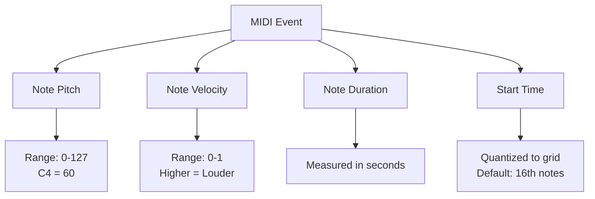
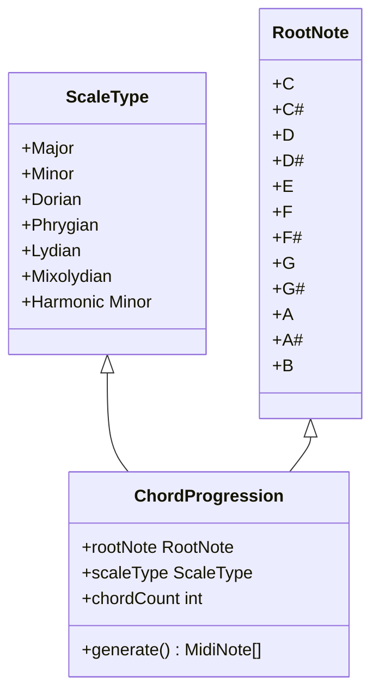
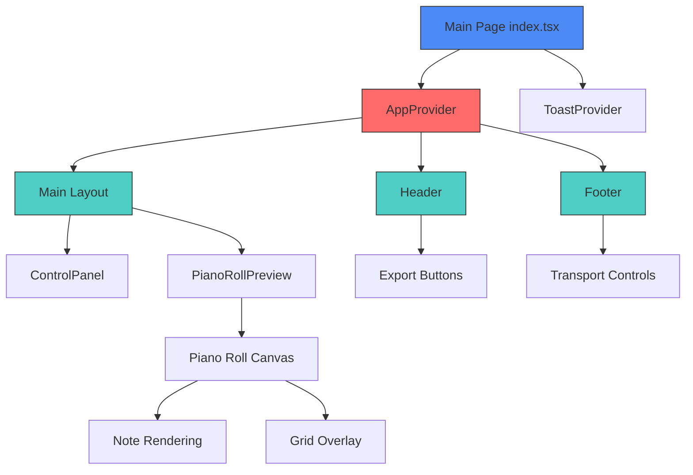
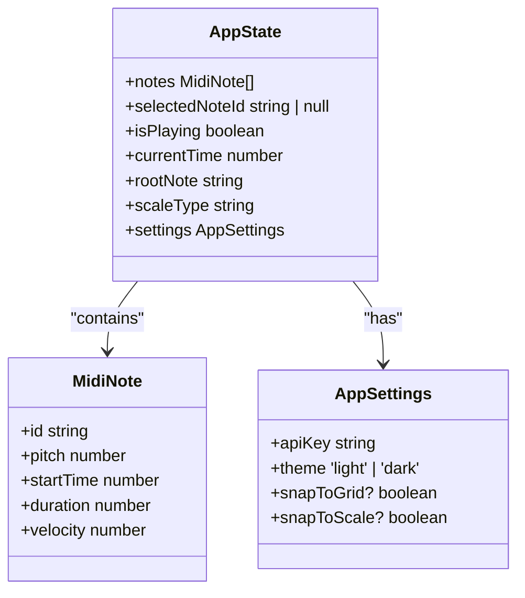

# Core Concepts

<cite>
**Referenced Files in This Document**   
- [README.md](file://README.md)
- [src/types/index.ts](file://src/types/index.ts)
- [src/utils/midiUtils.ts](file://src/utils/midiUtils.ts)
- [src/context/AppContext.tsx](file://src/context/AppContext.tsx)
- [src/components/PianoRoll.tsx](file://src/components/PianoRoll.tsx)
- [src/pages/index.tsx](file://src/pages/index.tsx)
- [src/components/layout/Header.tsx](file://src/components/layout/Header.tsx)
- [src/components/layout/Footer.tsx](file://src/components/layout/Footer.tsx)
</cite>

## Table of Contents
1. [Introduction](#introduction)
2. [MIDI Fundamentals](#midi-fundamentals)
3. [Music Theory Essentials](#music-theory-essentials)
4. [Application Architecture](#application-architecture)
5. [Data Models and TypeScript Interfaces](#data-models-and-typescript-interfaces)
6. [MIDI Processing Utilities](#midi-processing-utilities)
7. [UI Integration and Practical Examples](#ui-integration-and-practical-examples)

## Introduction

Kory's MIDI Toolbox is a web application designed for generating, editing, and exporting MIDI chord progressions with AI assistance. The application combines music theory principles with modern web technologies to create an intuitive interface for musical composition. Built on Next.js with React components, the tool features a piano roll editor, real-time audio playback, and export capabilities for both MIDI and WAV formats. This document explains the fundamental concepts required to understand and use the application effectively, covering MIDI fundamentals, essential music theory, application architecture, data models, and utility functions.

**Section sources**
- [README.md](file://README.md#L1-L20)

## MIDI Fundamentals

MIDI (Musical Instrument Digital Interface) is a technical standard that enables electronic musical instruments, computers, and other devices to communicate and synchronize with each other. In Kory's MIDI Toolbox, MIDI data is represented through several key parameters that define how notes are played.

### Note Pitch
Pitch refers to the frequency of a musical note, determining how high or low it sounds. In the MIDI standard, pitch is represented by numbers from 0 to 127, where each number corresponds to a specific note on the chromatic scale. Middle C (C4) has a MIDI note number of 60, with each semitone increment increasing the number by 1. The application displays these pitches visually on the piano roll, with higher pitches appearing toward the top of the interface.

### Velocity
Velocity represents the intensity or loudness with which a note is played, typically corresponding to how hard a key is pressed on a physical keyboard. In MIDI, velocity values range from 0 to 127, but in this application, they are normalized to a 0-1 scale for easier processing. Higher velocity values produce louder sounds, and in the UI, velocity is visually represented by the opacity of notes—notes with higher velocity appear more opaque.

### Duration
Duration specifies how long a note should be sustained after it is triggered. In Kory's MIDI Toolbox, duration is measured in seconds and determines the horizontal length of notes in the piano roll editor. When users resize notes by dragging their edges, they are directly modifying the duration parameter. The minimum duration is constrained by the grid resolution to maintain rhythmic consistency.

### Timing Resolution
Timing resolution refers to the precision with which note events can be positioned in time. The application implements a quantization system that aligns notes to a grid based on beats and subdivisions. By default, the grid snaps to 16th notes (four divisions per beat), but users can enable fine grid mode with Shift key to access even smaller time increments. This timing system ensures that compositions maintain rhythmic integrity while allowing for expressive timing variations when needed.



**Diagram sources**
- [src/types/index.ts](file://src/types/index.ts#L2-L5)
- [src/components/PianoRoll.tsx](file://src/components/PianoRoll.tsx#L212-L222)

## Music Theory Essentials

Understanding basic music theory concepts is essential for creating coherent and harmonious compositions in Kory's MIDI Toolbox. The application incorporates several theoretical principles to guide users in creating musically meaningful chord progressions.

### Root Notes
A root note serves as the foundational pitch of a chord or scale, establishing the tonal center of a musical passage. In the application, users can select from twelve possible root notes (C, C#, D, D#, E, F, F#, G, G#, A, A#, B), each representing a different key. The choice of root note determines the starting point for all subsequent harmonic elements in the composition.

### Scales
Scales are ordered sequences of notes that form the basis of melodies and harmonies. The application supports several common scale types:
- **Major**: Bright, happy sound characterized by the interval pattern W-W-H-W-W-W-H
- **Minor**: Darker, sadder sound with the pattern W-H-W-W-H-W-W
- **Dorian**: Minor scale with a raised sixth degree, creating a jazzy quality
- **Phrygian**: Minor scale with a lowered second degree, giving an exotic flavor
- **Lydian**: Major scale with a raised fourth degree, producing a dreamy quality
- **Mixolydian**: Major scale with a lowered seventh degree, common in rock music
- **Harmonic Minor**: Minor scale with a raised seventh degree, creating tension

When users select a scale type, the application uses this information to constrain note selection to pitches that belong to the chosen scale, helping ensure harmonic coherence.

### Chord Progressions
A chord progression is a sequence of chords played in succession, forming the harmonic foundation of a musical piece. In Kory's MIDI Toolbox, users can generate AI-powered chord progressions based on their selected root note and scale. The application creates four-chord progressions that follow common harmonic patterns, providing a starting point for musical ideas. Users can then edit these progressions by adding, removing, or modifying individual notes within the piano roll interface.



**Diagram sources**
- [src/types/index.ts](file://src/types/index.ts#L38-L41)
- [src/utils/midiUtils.ts](file://src/utils/midiUtils.ts#L9-L15)

## Application Architecture

Kory's MIDI Toolbox follows a component-based architecture built on React and Next.js, with state management handled through the Context API. This architectural approach provides a clear separation of concerns while maintaining efficient data flow throughout the application.

### React Components
The user interface is constructed from reusable React components organized in a hierarchical structure. Key components include:
- **Header**: Contains the application title and export controls
- **ControlPanel**: Provides access to generation and settings functionality
- **PianoRoll**: The main editing surface for MIDI notes
- **Footer**: Displays transport controls and playback information
- **SettingsPanel**: Allows configuration of application preferences

These components are composed together in the main page layout, with parent components passing data and callback functions to their children through props.

### Next.js Routing
The application uses Next.js file-based routing, where pages are created by adding files to the `src/pages` directory. The primary interface is defined in `index.tsx`, which serves as the entry point for the application. Next.js also enables static site export, allowing the application to be deployed as a fully static website without requiring server-side rendering in production.

### State Management via Context API
The application employs React's Context API for global state management, avoiding the need for prop drilling across multiple component levels. The `AppContext` provides a centralized store for the application's state, including MIDI notes, playback status, and user settings. Components access this state through the `useApp` custom hook, which wraps the `useContext` hook for type safety and convenience.



**Diagram sources**
- [src/pages/index.tsx](file://src/pages/index.tsx#L1-L330)
- [src/components/layout/Header.tsx](file://src/components/layout/Header.tsx#L1-L66)
- [src/components/layout/Footer.tsx](file://src/components/layout/Footer.tsx#L1-L130)

## Data Models and TypeScript Interfaces

The application's data structures are defined using TypeScript interfaces in `types/index.ts`, providing type safety and clear documentation of the expected data shapes throughout the codebase.

### AppState Interface
The `AppState` interface defines the complete state structure managed by the React Context. It includes arrays of MIDI notes, the currently selected note, playback status, current time position, and user preferences for root note and scale type. This comprehensive state object serves as the single source of truth for the application's data.

### MidiNote Interface
The `MidiNote` interface specifies the properties of individual MIDI events within the composition. Each note has a unique identifier, pitch value (0-127), start time in seconds, duration in seconds, and velocity (0-1). These properties directly correspond to standard MIDI message parameters, ensuring compatibility with external MIDI systems.

### AppSettings Interface
User preferences are stored in the `AppSettings` interface, which includes the Google Gemini API key, theme selection (light/dark), and boolean flags for snap-to-grid and snap-to-scale functionality. These settings are persisted in the browser's localStorage, maintaining user preferences across sessions.



**Diagram sources**
- [src/types/index.ts](file://src/types/index.ts#L1-L36)

## MIDI Processing Utilities

The `midiUtils.ts` file contains essential functions for converting between musical concepts and their numerical representations, as well as for processing and organizing MIDI data.

### Note Conversion Functions
The utility module provides functions to convert between MIDI note numbers and human-readable note names. `getMidiNoteNumber` translates a root note and octave into the corresponding MIDI number, while `getNoteName` performs the reverse operation, taking a MIDI number and returning a string like "C4" or "G#5". These functions enable seamless translation between the abstract musical concepts users interact with and the numerical data used internally.

### Scale Interval Mapping
The `getScaleIntervals` function returns an array of semitone intervals that define each supported scale type. For example, the major scale returns [0, 2, 4, 5, 7, 9, 11], representing the distances from the root note to each scale degree. This mapping is crucial for implementing the snap-to-scale functionality, allowing the application to constrain note placement to harmonically appropriate pitches.

### Note Segmentation
The `segmentNotesForPreview` function analyzes a collection of MIDI notes and categorizes them into roles such as chord, melody, bass, and arpeggio based on heuristics like pitch range, duration, and timing relationships. This segmentation enables the application to create meaningful visual previews of the composition structure, helping users quickly understand the harmonic and melodic content of their work.

```mermaid
sequenceDiagram
    participant User as "User Interaction"
    participant PianoRoll as "PianoRoll Component"
    participant Utils as "midiUtils.ts"
    participant Context as "AppContext"
    
    User->>PianoRoll: Double-click to add note
    PianoRoll->>Utils: getNoteFromPosition(x,y)
    Utils->>Utils: snapPitchToScale(pitch)
    Utils->>Utils: quantizeTime(timeSec)
    Utils-->>PianoRoll: Return MidiNote object
    PianoRoll->>Context: dispatch ADD_NOTE action
    Context->>Context: Update state.notes array
    Context-->>PianoRoll: Re-render with new note
    PianoRoll->>PianoRoll: Visual