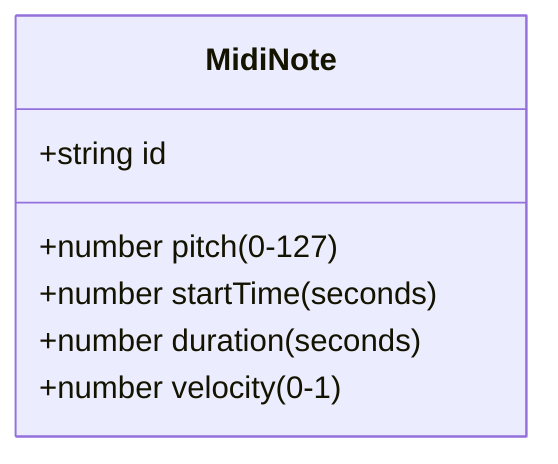
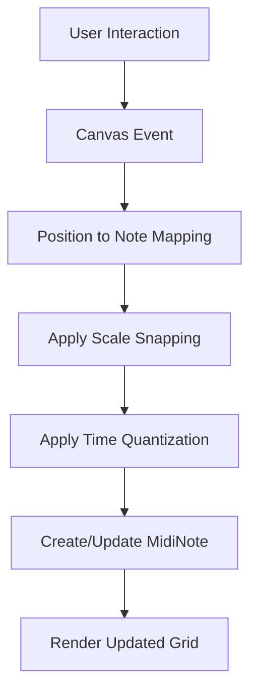
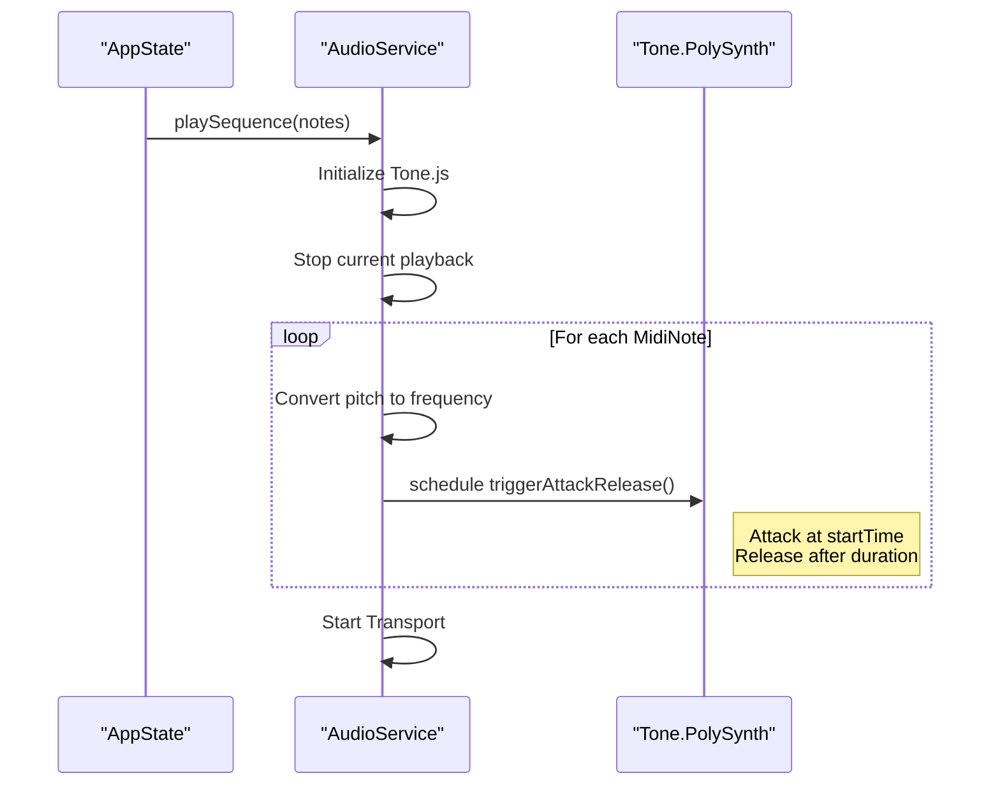
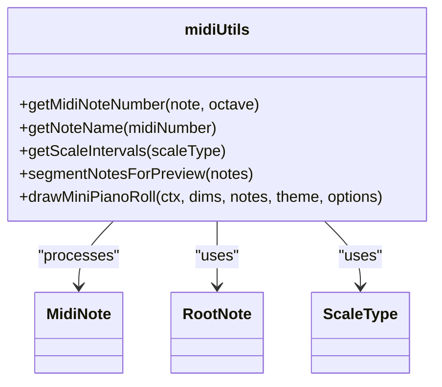
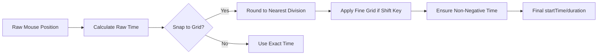
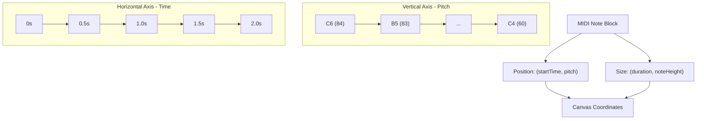

# MIDI Fundamentals

<cite>
**Referenced Files in This Document**   
- [midiUtils.ts](file://src/utils/midiUtils.ts)
- [index.ts](file://src/types/index.ts)
- [PianoRoll.tsx](file://src/components/PianoRoll.tsx)
- [audioService.ts](file://src/services/audioService.ts)
</cite>

## Table of Contents
1. [Introduction](#introduction)
2. [MidiNote Interface Structure](#midinote-interface-structure)
3. [Property Details and Usage](#property-details-and-usage)
4. [Piano Roll Editor Integration](#piano-roll-editor-integration)
5. [Audio Playback System](#audio-playback-system)
6. [Utility Functions for Note Conversion](#utility-functions-for-note-conversion)
7. [Timing Calculations and Quantization](#timing-calculations-and-quantization)
8. [Visual Representation in UI](#visual-representation-in-ui)
9. [Common Issues and Handling](#common-issues-and-handling)
10. [Conclusion](#conclusion)

## Introduction
The korysmiditoolbox application implements a comprehensive MIDI processing system centered around the `MidiNote` interface. This document explains the core MIDI concepts as applied within the codebase, detailing how musical notes are represented, manipulated, and rendered both visually and audibly. The system integrates piano roll editing, audio playback via Tone.js, and utility functions for musical notation conversion.

**Section sources**
- [index.ts](file://src/types/index.ts#L0-L6)
- [midiUtils.ts](file://src/utils/midiUtils.ts#L0-L271)

## MidiNote Interface Structure
The `MidiNote` interface serves as the fundamental data structure for representing musical notes within the application. It standardizes note properties to ensure consistency across editing, visualization, and playback components.



**Diagram sources**
- [index.ts](file://src/types/index.ts#L0-L6)

**Section sources**
- [index.ts](file://src/types/index.ts#L0-L6)

## Property Details and Usage
Each property in the `MidiNote` interface plays a specific role in defining a musical event:

- **pitch**: Represents the MIDI note number from 0 (C-1) to 127 (G9), following the MIDI standard
- **startTime**: Specifies when the note begins in seconds relative to the start of the sequence
- **duration**: Defines how long the note sounds in seconds
- **velocity**: Indicates the note's intensity on a scale from 0 (silent) to 1 (maximum)

These properties enable precise control over musical expression and timing in both the editor and playback systems.

**Section sources**
- [index.ts](file://src/types/index.ts#L0-L6)

## Piano Roll Editor Integration
The piano roll editor visualizes `MidiNote` objects on a grid where vertical position corresponds to pitch and horizontal position to time. Notes are rendered as rectangular blocks with rounded corners, color-coded by selection state.



**Diagram sources**
- [PianoRoll.tsx](file://src/components/PianoRoll.tsx#L0-L438)

**Section sources**
- [PianoRoll.tsx](file://src/components/PianoRoll.tsx#L0-L438)

## Audio Playback System
The audio playback system uses Tone.js to convert `MidiNote` objects into audible sound. Each note's properties are directly mapped to synthesis parameters.



**Diagram sources**
- [audioService.ts](file://src/services/audioService.ts#L0-L198)

**Section sources**
- [audioService.ts](file://src/services/audioService.ts#L0-L198)

## Utility Functions for Note Conversion
The `midiUtils.ts` file provides essential functions for translating between musical notation and MIDI values, enabling user-friendly interaction with the piano roll.



**Diagram sources**
- [midiUtils.ts](file://src/utils/midiUtils.ts#L0-L271)

**Section sources**
- [midiUtils.ts](file://src/utils/midiUtils.ts#L0-L271)

### Note Name Conversion
The `getMidiNoteNumber` function converts a musical note name and octave to its corresponding MIDI number using a lookup table and octave-based offset calculation.

```mermaid
erDiagram
NOTE_NAME {
string letter
int accidental
int octave
}
MIDI_NUMBER {
int value 0-127
}
NOTE_NAME ||--|| MIDI_NUMBER : "conversion"
NOTE_NAME {
"C" 0 4
"C#" 1 4
"D" 2 4
"D#" 3 4
"E" 4 4
"F" 5 4
"F#" 6 4
"G" 7 4
"G#" 8 4
"A" 9 4
"A#" 10 4
"B" 11 4
}
MIDI_NUMBER {
60
61
62
63
64
65
66
67
68
69
70
71
}
```

**Diagram sources**
- [midiUtils.ts](file://src/utils/midiUtils.ts#L14-L20)
- [index.ts](file://src/types/index.ts#L34-L35)

## Timing Calculations and Quantization
The system implements sophisticated timing calculations to ensure rhythmic precision. Time values are quantized to the nearest grid division based on user settings and modifier keys.



**Diagram sources**
- [PianoRoll.tsx](file://src/components/PianoRoll.tsx#L120-L130)

**Section sources**
- [PianoRoll.tsx](file://src/components/PianoRoll.tsx#L120-L130)

## Visual Representation in UI
The piano roll visually represents MIDI notes using a coordinate system where pitch maps to vertical position and time to horizontal position. The UI includes features like playhead tracking and hover effects.



**Diagram sources**
- [PianoRoll.tsx](file://src/components/PianoRoll.tsx#L150-L200)

**Section sources**
- [PianoRoll.tsx](file://src/components/PianoRoll.tsx#L150-L200)

## Common Issues and Handling
The implementation addresses several common challenges in MIDI processing:

### Timing Precision
The system uses floating-point seconds for maximum timing precision, with quantization applied only during user input to preserve accuracy in playback.

### Note Overlap Handling
When multiple notes occupy the same time range, the system renders them as overlapping rectangles without automatic collision resolution, preserving user intent.

### Velocity Interpretation
Velocity values (0-1) are passed directly to Tone.js's `triggerAttackRelease` method, where they control the amplitude of the synthesized sound according to the envelope configuration.

**Section sources**
- [audioService.ts](file://src/services/audioService.ts#L50-L60)
- [PianoRoll.tsx](file://src/components/PianoRoll.tsx#L300-L320)

## Conclusion
The korysmiditoolbox implements a robust MIDI foundation through the `MidiNote` interface and supporting utilities. By standardizing note representation and providing comprehensive conversion and playback functionality, the system enables intuitive music creation and editing. The integration between visual editing, timing calculations, and audio synthesis creates a cohesive environment for musical experimentation.