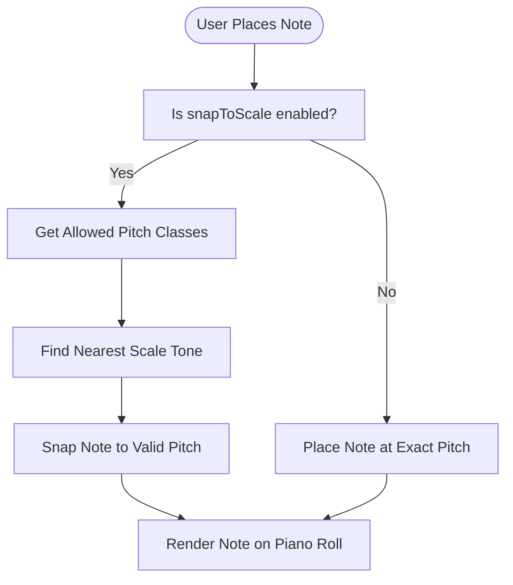
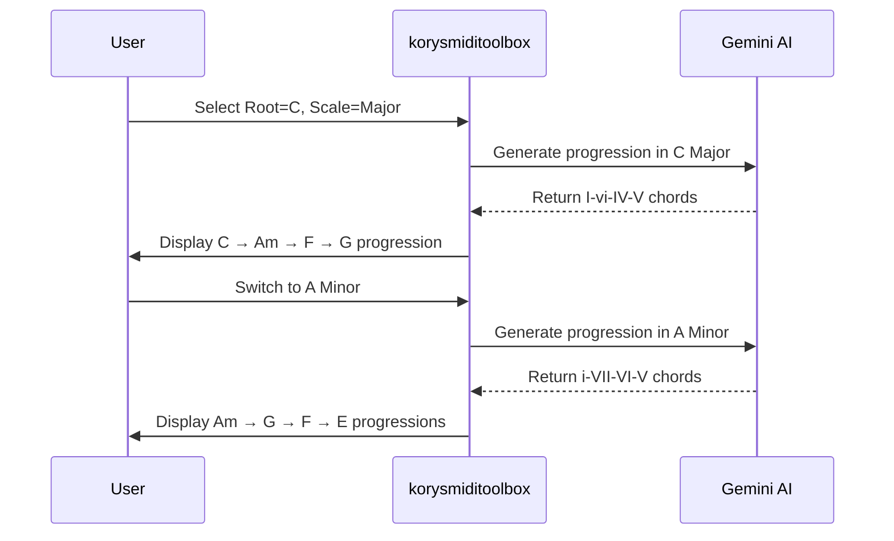

# Music Theory Basics

<cite>
**Referenced Files in This Document**   
- [index.ts](file://src/types/index.ts)
- [midiUtils.ts](file://src/utils/midiUtils.ts)
- [PianoRoll.tsx](file://src/components/PianoRoll.tsx)
- [defaultProgression.ts](file://src/utils/defaultProgression.ts)
- [geminiService.ts](file://src/services/geminiService.ts)
- [PianoRollPreview.tsx](file://src/components/PianoRollPreview.tsx)
</cite>

## Table of Contents
1. [Introduction](#introduction)
2. [Root Notes and Scale Types](#root-notes-and-scale-types)
3. [Scale Intervals and Scale Snapping](#scale-intervals-and-scale-snapping)
4. [Chord Generation: C Major vs A Minor](#chord-generation-c-major-vs-a-minor)
5. [Note Role Classification with segmentNotesForPreview](#note-role-classification-with-segmentnotesforpreview)
6. [Visual Examples of Chord Progressions](#visual-examples-of-chord-progressions)
7. [Modal Scales and Voice Leading Challenges](#modal-scales-and-voice-leading-challenges)

## Introduction
This document explains essential music theory concepts for effectively using korysmiditoolbox, a MIDI composition tool that integrates AI-assisted chord generation and piano roll editing. The application uses root notes and scale types to constrain note selection, enable scale snapping, and guide AI-generated progressions. Understanding how these elements work together—particularly through functions like `getScaleIntervals` and `segmentNotesForPreview`—is crucial for creating musically coherent compositions. This guide covers the theoretical foundations, their implementation in the codebase, and practical usage patterns.

## Root Notes and Scale Types

The korysmiditoolbox defines **RootNote** and **ScaleType** as TypeScript types that constrain musical input within valid theoretical boundaries. These types ensure that users select from standardized pitch classes and modal forms, which are then used to validate and generate MIDI content.

### Root Notes (C, C#, D, etc.)
A **RootNote** represents the tonal center of a key or chord. In Western music, there are 12 chromatic pitches per octave, represented here as:

```typescript
export type RootNote = 'C' | 'C#' | 'D' | 'D#' | 'E' | 'F' | 'F#' | 'G' | 'G#' | 'A' | 'A#' | 'B';
```

Each root note corresponds to a specific MIDI pitch class (0–11), where C = 0, C# = 1, ..., B = 11. For example, middle C (C4) has a MIDI number of 60. The `getMidiNoteNumber` utility converts a `RootNote` and octave into its corresponding MIDI value.

### Scale Types (Major, Minor, Dorian, etc.)
A **ScaleType** defines the interval pattern relative to the root, determining the mood and harmonic structure of the composition. Supported scales include:

```typescript
export type ScaleType = 'Major' | 'Minor' | 'Dorian' | 'Phrygian' | 'Lydian' | 'Mixolydian' | 'Harmonic Minor';
```

These represent common diatonic and modal scales:
- **Major**: Bright, happy sound
- **Minor**: Sad, introspective
- **Dorian**: Jazz minor with raised sixth
- **Phrygian**: Spanish/ethnic flavor with lowered second
- **Lydian**: Dreamy, with raised fourth
- **Mixolydian**: Bluesy dominant seventh feel
- **Harmonic Minor**: Classical with augmented second

These types are used throughout the UI (e.g., dropdowns in ControlPanel) and logic layers to maintain consistency between user input and musical output.

**Section sources**
- [index.ts](file://src/types/index.ts#L38-L41)
- [midiUtils.ts](file://src/utils/midiUtils.ts#L2-L12)
- [ControlPanel.tsx](file://src/components/layout/ControlPanel.tsx#L82-L117)

## Scale Intervals and Scale Snapping

The function `getScaleIntervals` maps each **ScaleType** to its semitone interval pattern from the root. These intervals define which notes belong to the scale and are critical for enabling **scale snapping** in the piano roll editor.

### Interval Patterns by Scale Type
```typescript
export const getScaleIntervals = (scaleType: ScaleType): number[] => {
  const scaleMap: Record<ScaleType, number[]> = {
    'Major': [0, 2, 4, 5, 7, 9, 11],
    'Minor': [0, 2, 3, 5, 7, 8, 10],
    'Dorian': [0, 2, 3, 5, 7, 9, 10],
    'Phrygian': [0, 1, 3, 5, 7, 8, 10],
    'Lydian': [0, 2, 4, 6, 7, 9, 11],
    'Mixolydian': [0, 2, 4, 5, 7, 9, 10],
    'Harmonic Minor': [0, 2, 3, 5, 7, 8, 11]
  };
  return scaleMap[scaleType] || scaleMap['Major'];
};
```

For example:
- **C Major**: C(0), D(2), E(4), F(5), G(7), A(9), B(11)
- **A Minor**: A(0), B(2), C(3), D(5), E(7), F(8), G(10)

### Scale Snapping in the Piano Roll
When **snapToScale** is enabled in settings, the piano roll uses `snapPitchToScale` to automatically adjust off-key notes to the nearest scale tone. This occurs during:
- Note creation (on double-click)
- Note dragging (pitch adjustment)

The process involves:
1. Calculating allowed pitch classes using `allowedPitchClasses`
2. Finding the closest valid pitch when placing or moving a note

This ensures all user input conforms to the selected key, reducing dissonance and improving musical coherence.



**Diagram sources**
- [midiUtils.ts](file://src/utils/midiUtils.ts#L29-L40)
- [PianoRoll.tsx](file://src/components/PianoRoll.tsx#L146-L183)

**Section sources**
- [midiUtils.ts](file://src/utils/midiUtils.ts#L29-L40)
- [PianoRoll.tsx](file://src/components/PianoRoll.tsx#L146-L212)

## Chord Generation: C Major vs A Minor

Although C Major and A Minor share the same notes (they are **relative keys**), selecting one over the other significantly affects chord generation due to different harmonic hierarchies.

### Default Progression Example
The `getDefaultProgression` function generates a classic **I–vi–IV–V** progression in C Major:
- **C Major (I)**: C4, E4, G4
- **A Minor (vi)**: A4, C5, E5
- **F Major (IV)**: F4, A4, C5
- **G Major (V)**: G4, B4, D5



**Diagram sources**
- [defaultProgression.ts](file://src/utils/defaultProgression.ts#L0-L38)
- [geminiService.ts](file://src/services/geminiService.ts#L0-L70)

**Section sources**
- [defaultProgression.ts](file://src/utils/defaultProgression.ts#L0-L38)
- [geminiService.ts](file://src/services/geminiService.ts#L0-L70)

## Note Role Classification with segmentNotesForPreview

The `segmentNotesForPreview` function applies heuristic logic to classify notes into four roles: **chord**, **melody**, **bass**, and **arp** (arpeggio). This classification powers the visual segmentation in the preview panel.

### Heuristic Logic Summary
| Role | Criteria |
|------|----------|
| **Bass** | Lowest pitch in each bar among sustained notes |
| **Melody** | High-pitched, shorter-duration notes not part of arps |
| **Arp** | Short notes (< 0.35s) spanning ≥3 distinct pitches in a bar |
| **Chord** | Remaining sustained notes (≥ 0.35s) after bass extraction |

### Algorithm Flow
```mermaid
flowchart TD
    Start([Input: All Notes]) --> Sort["Sort by startTime, then pitch"]
    Sort --> GroupBars["Group Notes by Bar (2s each)"]
    
    GroupBars --> LoopBar["For Each Bar"]
    LoopBar --> SplitDur["Split into Short (<0.35s) and