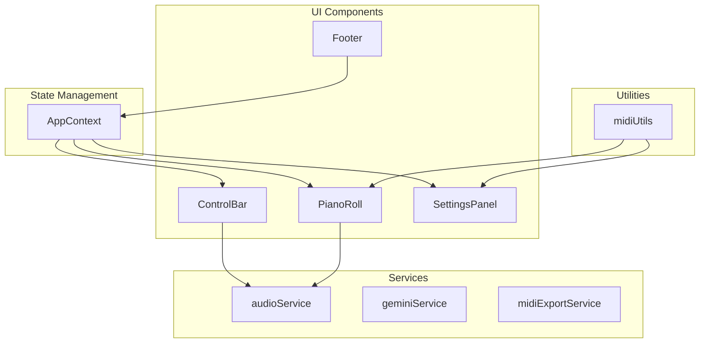
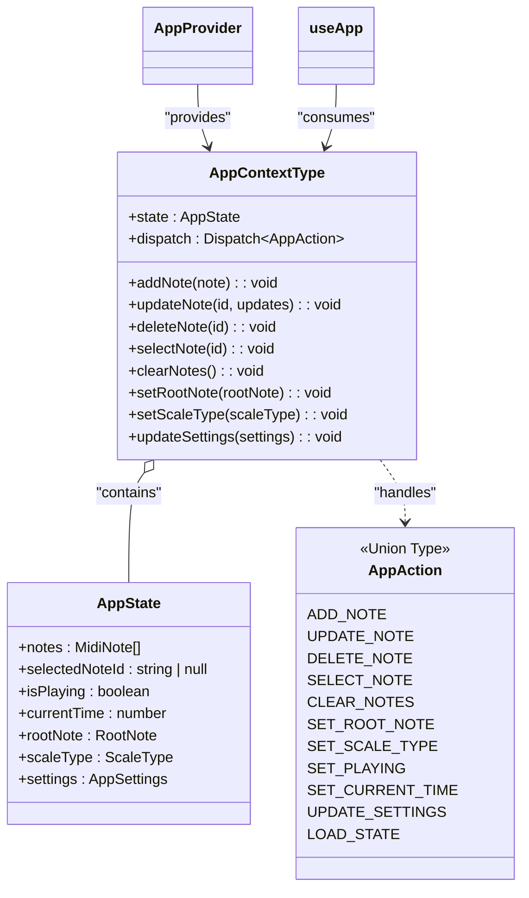
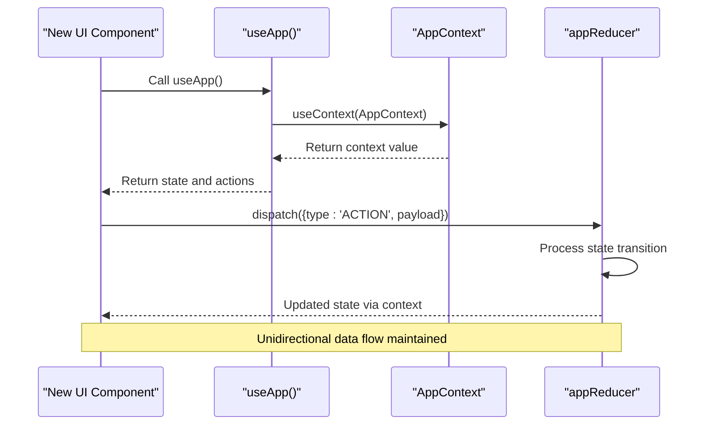
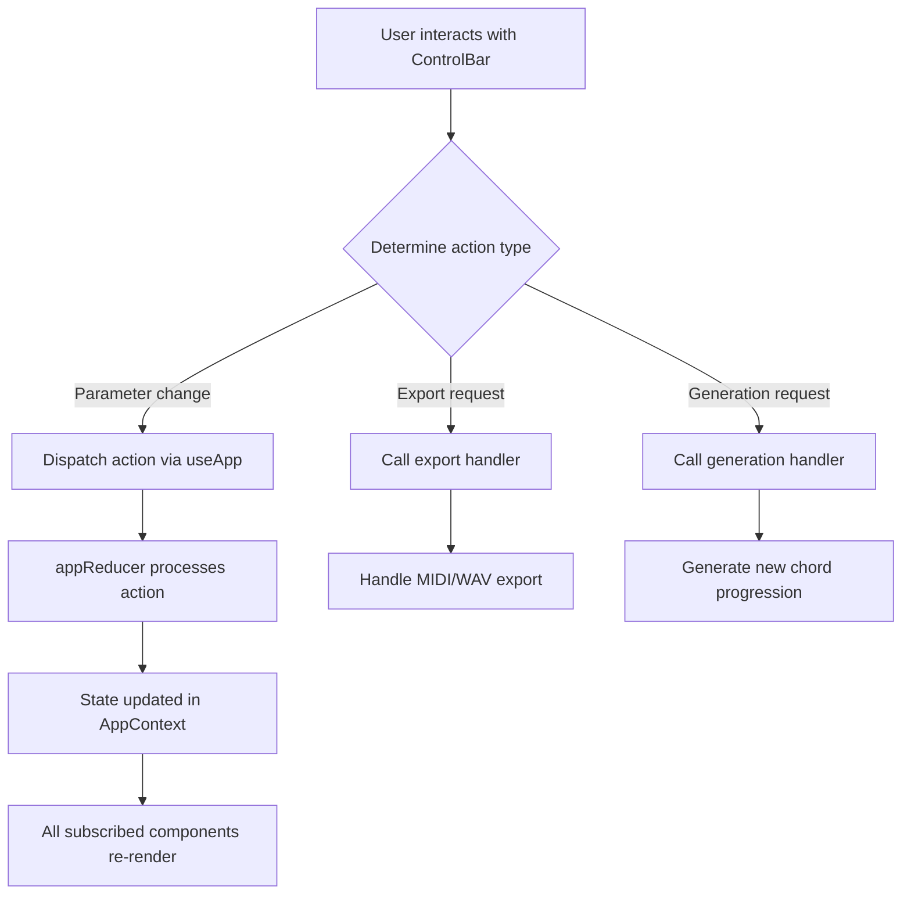
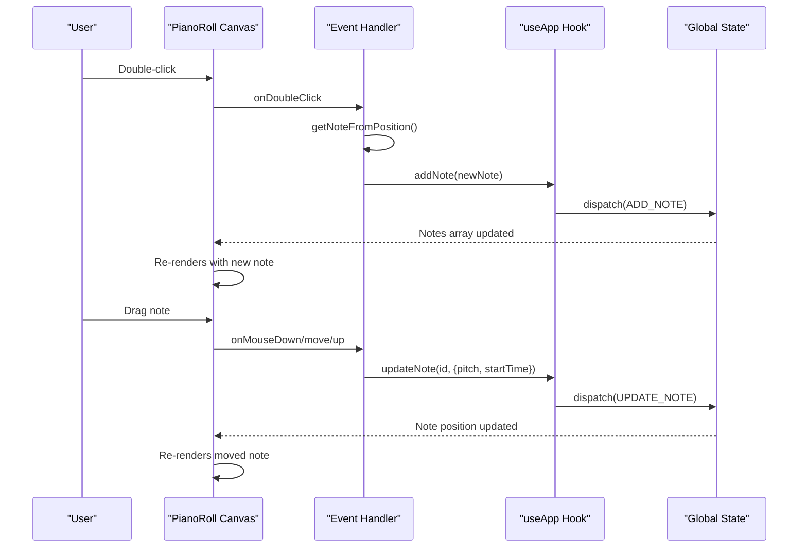
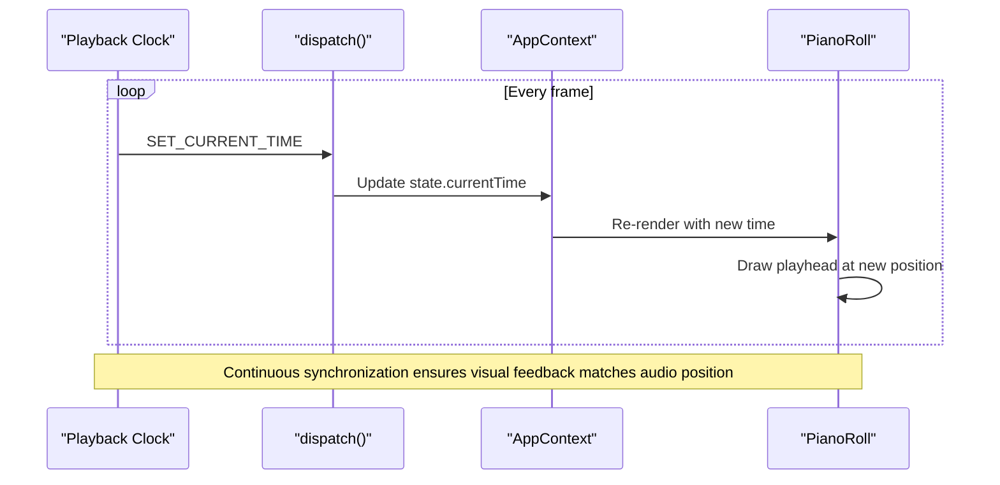
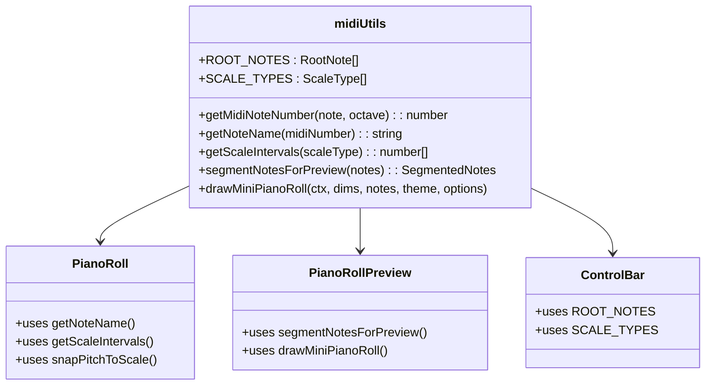
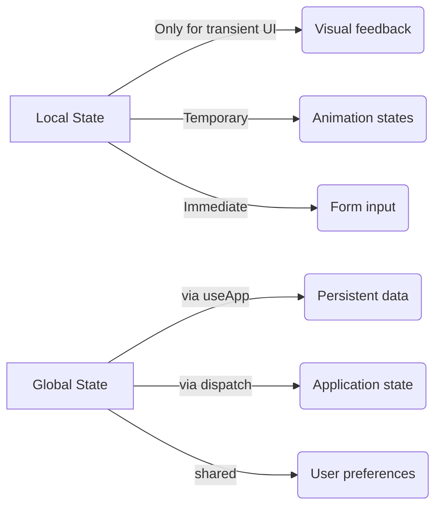

# Adding New Features

<cite>
**Referenced Files in This Document **   
- [AppContext.tsx](file://src/context/AppContext.tsx)
- [ControlBar.tsx](file://src/components/ControlBar.tsx)
- [PianoRoll.tsx](file://src/components/PianoRoll.tsx)
- [audioService.ts](file://src/services/audioService.ts)
- [midiUtils.ts](file://src/utils/midiUtils.ts)
- [index.tsx](file://src/pages/index.tsx)
- [PianoRollPreview.tsx](file://src/components/PianoRollPreview.tsx)
</cite>

## Table of Contents
1. [Introduction](#introduction)
2. [Project Structure Overview](#project-structure-overview)
3. [Core State Management with AppContext](#core-state-management-with-appcontext)
4. [Creating New UI Modules](#creating-new-ui-modules)
5. [Integrating with ControlBar](#integrating-with-controlbar)
6. [Extending PianoRoll Functionality](#extending-pianoroll-functionality)
7. [Synchronizing with Audio Playback](#synchronizing-with-audio-playback)
8. [Reusing Music Theory Logic](#reusing-music-theory-logic)
9. [Best Practices for Component Design](#best-practices-for-component-design)
10. [Common Pitfalls and Solutions](#common-pitfalls-and-solutions)

## Introduction
This document provides comprehensive guidance on extending korysmiditoolbox with new features while maintaining architectural consistency. It covers the process of creating new UI components that integrate seamlessly with the existing state management system, demonstrates proper usage patterns for global state access, and illustrates how to extend core functionality in a maintainable way. The documentation emphasizes unidirectional data flow principles and effective side-effect management through React's useEffect hook.

## Project Structure Overview
The korysmiditoolbox application follows a modular component-based architecture organized into distinct directories:
- `components`: Contains all UI components, organized by type (layout, ui) and function
- `context`: Houses the AppContext state management system
- `services`: Implements business logic and external integrations
- `utils`: Provides reusable utility functions and constants
- `types`: Defines TypeScript interfaces and types
- `pages`: Contains page-level components and routing

The application uses React with TypeScript, leveraging modern hooks patterns and a context-based global state management approach rather than external state management libraries.



**Diagram sources **
- [AppContext.tsx](file://src/context/AppContext.tsx)
- [ControlBar.tsx](file://src/components/ControlBar.tsx)
- [PianoRoll.tsx](file://src/components/PianoRoll.tsx)
- [audioService.ts](file://src/services/audioService.ts)
- [midiUtils.ts](file://src/utils/midiUtils.ts)

**Section sources**
- [AppContext.tsx](file://src/context/AppContext.tsx)
- [ControlBar.tsx](file://src/components/ControlBar.tsx)
- [PianoRoll.tsx](file://src/components/PianoRoll.tsx)

## Core State Management with AppContext
The application's state is managed through a centralized AppContext system implemented using React's Context API combined with useReducer. This pattern provides a scalable solution for managing global state without prop drilling.

The AppContext exposes both raw state and action dispatchers as well as convenience methods that encapsulate common operations:



**Diagram sources **
- [AppContext.tsx](file://src/context/AppContext.tsx#L1-L220)

**Section sources**
- [AppContext.tsx](file://src/context/AppContext.tsx#L1-L220)

## Creating New UI Modules
To create new UI modules such as EffectPanel or InstrumentSelector, follow the established patterns in the codebase. All components should leverage the useApp custom hook to access global state and dispatch actions, ensuring consistency with the existing architecture.

When creating a new component, import the useApp hook from the context module and destructure the necessary state and actions:



**Diagram sources **
- [AppContext.tsx](file://src/context/AppContext.tsx#L213-L219)
- [index.tsx](file://src/pages/index.tsx)

**Section sources**
- [AppContext.tsx](file://src/context/AppContext.tsx#L213-L219)
- [index.tsx](file://src/pages/index.tsx)

## Integrating with ControlBar
The ControlBar component serves as a primary interface for user interactions and should be extended when adding new global controls. To add new controls while maintaining synchronization with the playback state, follow these steps:

1. Import the useApp hook to access the current playback state
2. Add new control elements that dispatch appropriate actions
3. Ensure controls are properly disabled/enabled based on application state

The ControlBar already demonstrates this pattern with its root note and scale type selectors, which directly dispatch actions to update the global state:



**Diagram sources **
- [ControlBar.tsx](file://src/components/ControlBar.tsx#L1-L181)

**Section sources**
- [ControlBar.tsx](file://src/components/ControlBar.tsx#L1-L181)

## Extending PianoRoll Functionality
The PianoRoll component provides a canvas-based interface for MIDI note editing and can be enhanced with additional event handlers for improved editing capabilities. When extending this component, maintain the existing interaction patterns:

- Double-click to add notes
- Drag to move notes
- Resize from edges
- Delete with keyboard shortcuts

New event handlers should be registered within the component's event handling system and should dispatch appropriate actions through the useApp hook rather than modifying state directly:



**Diagram sources **
- [PianoRoll.tsx](file://src/components/PianoRoll.tsx#L1-L438)

**Section sources**
- [PianoRoll.tsx](file://src/components/PianoRoll.tsx#L1-L438)

## Synchronizing with Audio Playback
Audio playback state is managed through the audioService class and synchronized with the UI via the AppContext. The playback clock in index.tsx updates the currentTime in the global state, which is then used to render the playhead in the PianoRoll component.

To maintain synchronization between UI components and audio playback:

1. Use the isPlaying flag from AppContext to determine playback status
2. Update currentTime through dispatch actions rather than direct service calls
3. Register time update callbacks that dispatch SET_CURRENT_TIME actions



**Diagram sources **
- [index.tsx](file://src/pages/index.tsx)
- [PianoRoll.tsx](file://src/components/PianoRoll.tsx)
- [audioService.ts](file://src/services/audioService.ts)

**Section sources**
- [index.tsx](file://src/pages/index.tsx)
- [PianoRoll.tsx](file://src/components/PianoRoll.tsx)

## Reusing Music Theory Logic
The midiUtils.ts file contains reusable music theory functions that should be leveraged when implementing new features. These utilities provide consistent handling of musical concepts across the application:

- Note name conversion
- Scale interval calculation
- Pitch class validation
- MIDI number mapping

When creating new components that require music theory logic, import and use these existing functions rather than implementing duplicate logic:



**Diagram sources **
- [midiUtils.ts](file://src/utils/midiUtils.ts#L1-L271)
- [PianoRoll.tsx](file://src/components/PianoRoll.tsx)
- [PianoRollPreview.tsx](file://src/components/PianoRollPreview.tsx)
- [ControlBar.tsx](file://src/components/ControlBar.tsx)

**Section sources**
- [midiUtils.ts](file://src/utils/midiUtils.ts#L1-L271)

## Best Practices for Component Design
To ensure new components are decoupled and testable, follow these best practices established in the codebase:

### Props Interface Definition
Define clear props interfaces that specify exactly what data a component needs:

```typescript
interface NewComponentProps {
  onAction: () => void;
  disabled?: boolean;
  label: string;
}
```

### Minimal State
Keep component state minimal by leveraging the global AppContext for shared state:



### Pure Functions
Structure components to be as pure as possible, with rendering determined solely by props and global state.

### Testing Considerations
Components that follow these patterns are easier to test because:
- They have well-defined inputs and outputs
- They don't directly depend on complex services
- Their behavior can be controlled