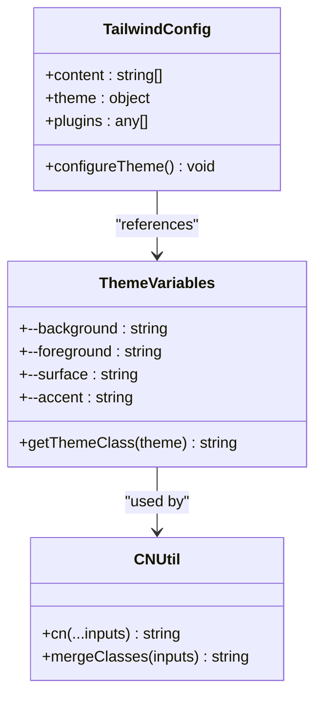
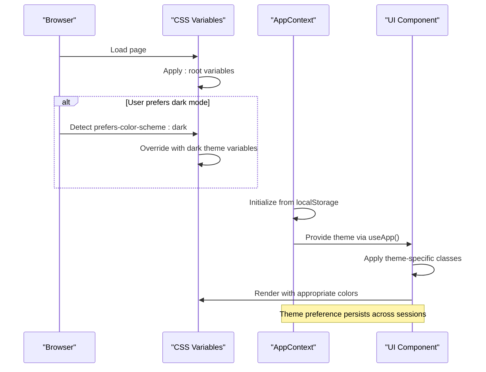
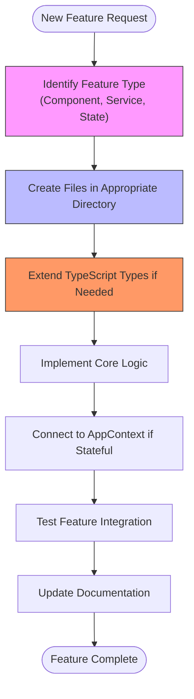
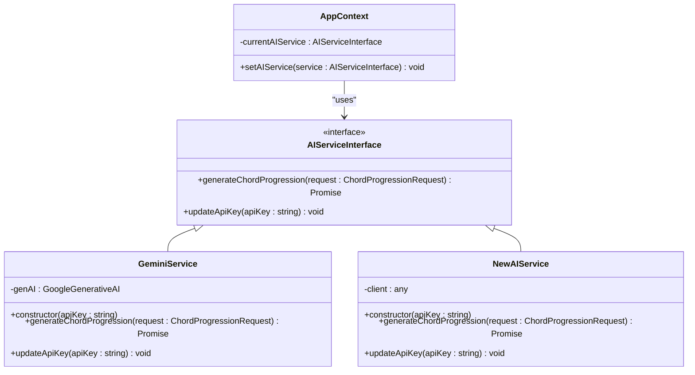

# Customization and Extensibility

<cite>
**Referenced Files in This Document**   
- [globals.css](file://src/styles/globals.css)
- [AppContext.tsx](file://src/context/AppContext.tsx)
- [geminiService.ts](file://src/services/geminiService.ts)
- [audioService.ts](file://src/services/audioService.ts)
- [midiExportService.ts](file://src/services/midiExportService.ts)
- [index.ts](file://src/types/index.ts)
- [PianoRoll.tsx](file://src/components/PianoRoll.tsx)
- [Main.tsx](file://src/components/layout/Main.tsx)
- [cn.ts](file://src/utils/cn.ts)
- [next.config.ts](file://next.config.ts)
- [postcss.config.mjs](file://postcss.config.mjs)
</cite>

## Table of Contents
1. [Introduction](#introduction)
2. [Theme Customization with Tailwind CSS](#theme-customization-with-tailwind-css)
3. [Dark Mode Implementation](#dark-mode-implementation)
4. [Extending Application Features](#extending-application-features)
5. [Integrating Additional AI Providers](#integrating-additional-ai-providers)
6. [Adding New Export Formats](#adding-new-export-formats)
7. [Extending Musical Scales and Modes](#extending-musical-scales-and-modes)
8. [Implementing Plugin Systems with Tone.js](#implementing-plugin-systems-with-tonejs)
9. [Modifying UI Layout with Component Composition](#modifying-ui-layout-with-component-composition)
10. [Conclusion](#conclusion)

## Introduction
This document provides comprehensive guidance on customizing and extending korysmiditoolbox, a modern web application for generating, editing, and exporting MIDI chord progressions. The application is built with Next.js 15, TypeScript, and React 19, leveraging Tailwind CSS for styling and Tone.js for audio processing. The documentation covers theme customization, dark mode implementation, feature extension patterns, AI provider integration, export format expansion, musical scale extensions, plugin system development, and UI layout modifications while maintaining state consistency through AppContext.

## Theme Customization with Tailwind CSS

The korysmiditoolbox application utilizes Tailwind CSS for its styling system, enabling extensive theme customization through configuration files and utility classes. The theme system is implemented using CSS variables that integrate seamlessly with Tailwind's design tokens.

The application's styling foundation is established in the `globals.css` file, which imports Tailwind CSS and defines custom CSS variables for the color palette. These variables are used throughout the application to maintain consistent theming across components. The `cn` utility function in `cn.ts` combines `clsx` and `tailwind-merge` to safely compose Tailwind classes, resolving potential conflicts when applying conditional styles.

**Diagram sources**
- [globals.css](file://src/styles/globals.css#L1-L60)
- [cn.ts](file://src/utils/cn.ts#L1-L5)

**Section sources**
- [globals.css](file://src/styles/globals.css#L1-L155)
- [cn.ts](file://src/utils/cn.ts#L1-L5)
- [postcss.config.mjs](file://postcss.config.mjs#L1-L4)

## Dark Mode Implementation

Dark mode in korysmiditoolbox is implemented using a combination of CSS media queries and React context state management. The system respects user preferences through the `prefers-color-scheme` media query while also allowing manual toggling through application settings.

The implementation begins with CSS variable definitions in `globals.css`, where the default light theme values are set in the `:root` selector. When the user's system preference is for dark mode, the `@media (prefers-color-scheme: dark)` rule overrides these variables with darker color values. This approach ensures that the application automatically matches the user's system-wide appearance preferences.

Application-level theme state is managed through the `AppContext` system, which stores the current theme preference in the `AppSettings` interface. The theme setting is persisted in localStorage, ensuring that user preferences are maintained across sessions. Components access the current theme value through the `useApp` hook and can conditionally apply theme-specific classes.

**Diagram sources**
- [globals.css](file://src/styles/globals.css#L1-L60)
- [AppContext.tsx](file://src/context/AppContext.tsx#L1-L220)

**Section sources**
- [globals.css](file://src/styles/globals.css#L1-L155)
- [AppContext.tsx](file://src/context/AppContext.tsx#L1-L220)

## Extending Application Features

The korysmiditoolbox application is designed with extensibility in mind, following consistent patterns for adding new features. The architecture separates concerns into components, services, context, and utilities, making it straightforward to extend functionality by following existing patterns.

New features should be implemented by creating components in the appropriate directory within `src/components`, such as `layout` for structural components or `ui` for reusable interface elements. Services that interact with external APIs or perform complex operations should be added to the `src/services` directory, following the pattern established by existing services like `geminiService.ts` and `audioService.ts`.

When adding features that require global state management, developers should extend the `AppState` and `AppAction` types in `AppContext.tsx` and add corresponding reducer cases and action creators. This ensures that new state properties are properly typed and managed through the centralized context system. All state changes should flow through the context dispatch mechanism to maintain predictable state updates.

**Diagram sources**
- [AppContext.tsx](file://src/context/AppContext.tsx#L1-L220)
- [PianoRoll.tsx](file://src/components/PianoRoll.tsx#L1-L438)

**Section sources**
- [AppContext.tsx](file://src/context/AppContext.tsx#L1-L220)
- [PianoRoll.tsx](file://src/components/PianoRoll.tsx#L1-L438)
- [Main.tsx](file://src/components/layout/Main.tsx#L1-L74)

## Integrating Additional AI Providers

The application currently uses Google Gemini for AI-powered chord progression generation through the `GeminiService` class. To integrate additional AI providers, developers should implement service classes that adhere to the same interface pattern, enabling easy swapping or addition of multiple AI services.

The `ChordProgressionRequest` interface defined in `types/index.ts` specifies the required parameters for chord generation requests, including root note, scale type, and chord count. New AI services should accept this interface and return `MidiNote[]` arrays in the same format as the existing `GeminiService`. This consistent input/output contract allows the UI components to work with any AI provider without modification.

To add a new AI provider, create a service class in the `src/services` directory that implements the same method signature as `generateChordProgression`. The service should handle API key management, request formatting, response parsing, and error handling similar to the existing `geminiService.ts`. Configuration for the new service can be added to the `AppSettings` interface to allow users to specify their API keys through the settings interface.

**Diagram sources**
- [geminiService.ts](file://src/services/geminiService.ts#L1-L70)
- [index.ts](file://src/types/index.ts#L1-L41)

**Section sources**
- [geminiService.ts](file://src/services/geminiService.ts#L1-L70)
- [index.ts](file://src/types/index.ts#L1-L41)

## Adding New Export Formats

The application currently supports exporting compositions as MIDI (.mid) and WAV (.wav) files through dedicated service classes. To add support for additional audio formats such as MP3 or FLAC, developers can extend the existing export functionality by integrating appropriate encoding libraries.

The `audioService.ts`