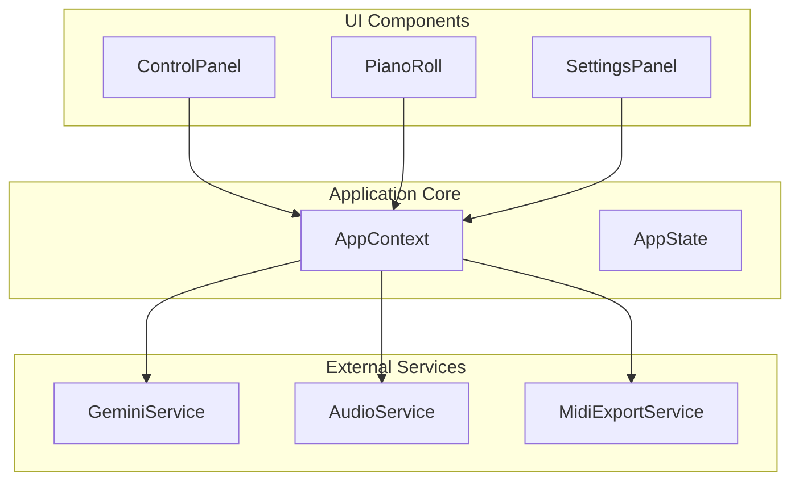
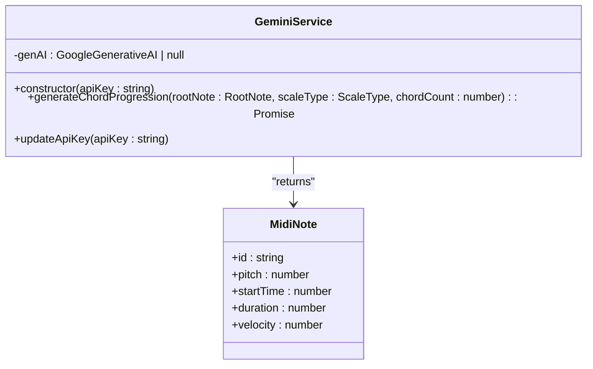
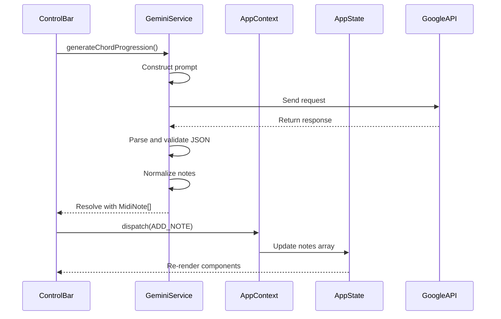

# Integrating Additional Services

<cite>
**Referenced Files in This Document **   
- [geminiService.ts](file://src/services/geminiService.ts)
- [audioService.ts](file://src/services/audioService.ts)
- [midiExportService.ts](file://src/services/midiExportService.ts)
- [AppContext.tsx](file://src/context/AppContext.tsx)
- [index.ts](file://src/types/index.ts)
</cite>

## Table of Contents
1. [Introduction](#introduction)
2. [Core Service Architecture](#core-service-architecture)
3. [Gemini Service Implementation](#gemini-service-implementation)
4. [Standardized Service Interface Pattern](#standardized-service-interface-pattern)
5. [State Management and Context Dispatching](#state-management-and-context-dispatching)
6. [Dependency Injection Principles](#dependency-injection-principles)
7. [Audio Export Service Templates](#audio-export-service-templates)
8. [Web Audio API Integration](#web-audio-api-integration)
9. [Security Considerations](#security-considerations)
10. [Migration Strategies](#migration-strategies)

## Introduction
This document provides comprehensive guidance for integrating additional external services into korysmiditoolbox, with a focus on replacing or augmenting the current AI provider (Gemini) with alternatives like OpenAI or MusicGen. The documentation covers service architecture patterns, implementation details, state management integration, and security considerations to enable seamless extension of the application's capabilities.

## Core Service Architecture
The korysmiditoolbox application implements a modular service architecture that separates external integrations from core application logic. Services are encapsulated within the `src/services` directory and follow consistent design patterns for initialization, execution, and error handling. This architecture enables loose coupling between UI components and external providers through dependency injection and standardized interfaces.



**Diagram sources **
- [AppContext.tsx](file://src/context/AppContext.tsx#L1-L221)
- [services directory](file://src/services/)

**Section sources**
- [AppContext.tsx](file://src/context/AppContext.tsx#L1-L221)
- [project structure](file://README.md#L90-L125)

## Gemini Service Implementation
The GeminiService class provides the current implementation for AI-generated chord progressions using Google's Gemini API. It follows a clean class-based pattern with proper error handling and response normalization.

### Service Structure and Methodology
The service exposes a primary method `generateChordProgression` that takes musical parameters and returns structured MIDI data. The implementation includes robust error handling, response parsing, and data validation to ensure reliable operation.



**Diagram sources **
- [geminiService.ts](file://src/services/geminiService.ts#L1-L70)

**Section sources**
- [geminiService.ts](file://src/services/geminiService.ts#L1-L70)

### Async Generation Method
The `generateChordProgression` method orchestrates the complete workflow from prompt construction to response processing:

1. Validates API key availability
2. Constructs a detailed natural language prompt with specific formatting requirements
3. Communicates with the Gemini API using the generative model
4. Extracts JSON from the text response using regex matching
5. Parses and validates the JSON structure
6. Normalizes data into the application's MidiNote format
7. Adds unique identifiers to generated notes

The method employs defensive programming techniques including input validation, error boundary handling, and data sanitization to prevent malformed responses from disrupting application state.

### Error Handling Strategy
The service implements a comprehensive error handling strategy that distinguishes between different failure modes:

- **Configuration errors**: Thrown when no API key is provided, preventing unauthorized API calls
- **API communication errors**: Caught during the generateContent call, typically due to network issues or rate limiting
- **Response parsing errors**: Handled when the AI response doesn't contain valid JSON
- **Data validation errors**: Addressed during the normalization phase to ensure data integrity

All errors are logged to the console for debugging purposes while user-facing messages are sanitized to avoid exposing sensitive information.

## Standardized Service Interface Pattern
To facilitate the integration of alternative AI providers, a standardized service interface should be established. This pattern ensures consistency across different implementations while maintaining flexibility for provider-specific configurations.

### Interface Definition
```typescript
interface ChordGenerationService {
  generateChordProgression(
    rootNote: RootNote,
    scaleType: ScaleType,
    chordCount?: number
  ): Promise<MidiNote[]>;
  
  updateApiKey(apiKey: string): void;
}
```

This interface abstracts the core functionality required by the application, allowing for interchangeable implementations of different AI providers such as OpenAI or MusicGen.

### Implementation Requirements
New service implementations must adhere to the following requirements:
- Return promises that resolve to arrays of MidiNote objects
- Handle authentication and API key management internally
- Implement robust error handling with meaningful user feedback
- Normalize responses to match the application's data structure
- Support dynamic API key updates without requiring service recreation

## State Management and Context Dispatching
The application uses React Context for global state management, with service responses being normalized and dispatched to update the application state.

### Response Normalization Process
When a service returns chord progression data, it undergoes a normalization process before being integrated into the application state:

1. Each note receives a unique identifier using timestamp and random components
2. Pitch values are clamped to the valid MIDI range (0-127)
3. Time values are validated and corrected if necessary
4. Velocity values are normalized to the 0-1 range
5. All properties are verified to match the MidiNote interface

### Context Dispatching Workflow
The normalized data is then dispatched through the AppContext to update the global state:



**Diagram sources **
- [geminiService.ts](file://src/services/geminiService.ts#L1-L70)
- [AppContext.tsx](file://src/context/AppContext.tsx#L1-L221)
- [index.tsx](file://src/pages/index.tsx#L1-L200)

**Section sources**
- [geminiService.ts](file://src/services/geminiService.ts#L1-L70)
- [AppContext.tsx](file://src/context/AppContext.tsx#L1-L221)
- [index.tsx](file://src/pages/index.tsx#L1-L200)

## Dependency Injection Principles
The application employs dependency injection to maintain loose coupling between services and UI components, enhancing testability and flexibility.

### Service Initialization Pattern
Services are initialized in the main application component and made available through React refs:

```typescript
const geminiService = useRef<GeminiService | null>(null);
const audioService = useRef<AudioService | null>(null);
const midiExportService = useRef<MidiExportService | null>(null);

useEffect(() => {
  if (state.settings.apiKey) {
    geminiService.current = new GeminiService(state.settings.apiKey);
  }
  audioService.current = new AudioService();
  midiExportService.current = new MidiExportService();
}, [state.settings.apiKey]);
```

This pattern allows services to be instantiated once and reused throughout the application lifecycle, while still enabling reinitialization when configuration changes occur.

### Conditional Service Creation
The implementation supports conditional service creation based on configuration:

- GeminiService is only created when an API key is available
- Services can be recreated when settings change
- Null checks prevent operations on uninitialized services
- References are maintained across component re-renders

This approach enables graceful degradation when services are unavailable and supports dynamic configuration changes without requiring application restart.

## Audio Export Service Templates
To support additional audio export formats like MP3 or FLAC, new service implementations can be created following the existing pattern established by the MIDI and WAV exporters.

### MP3 Export Service Template
```typescript
import lamejs from 'lamejs';

export class Mp3ExportService {
  async exportMP3(notes: MidiNote[]): Promise<Blob> {
    // Initialize audio rendering context
    const offlineContext = new Tone.OfflineContext(2, this.calculateDuration(notes), 44100);
    const synth = new Tone.PolySynth(Tone.Synth).connect(offlineContext.destination);
    
    // Schedule all notes
    notes.forEach(note => {
      const frequency = Tone.Frequency(note.pitch, 'midi').toFrequency();
      synth.triggerAttackRelease(frequency, note.duration, note.startTime, note.velocity);
    });
    
    // Render to audio buffer
    const renderedBuffer = await offlineContext.render();
    const audioBuffer = renderedBuffer.get() as AudioBuffer;
    
    // Convert to MP3 using lamejs
    return this.convertToMp3(audioBuffer);
  }
  
  private convertToMp3(buffer: AudioBuffer): Blob {
    const leftChannel = buffer.getChannelData(0);
    const rightChannel = buffer.numberOfChannels > 1 ? buffer.getChannelData(1) : leftChannel;
    
    const sampleRate = buffer.sampleRate;
    const mp3Encoder = new lamejs.Mp3Encoder(2, sampleRate, 128);
    const samplesPerFrame = 1152;
    const maxSamples = Math.floor((leftChannel.length / samplesPerFrame)) * samplesPerFrame;
    
    const mp3Data = [];
    for (let i = 0; i < maxSamples; i += samplesPerFrame) {
      const left = leftChannel.subarray(i, i + samplesPerFrame);
      const right = rightChannel.subarray(i, i + samplesPerFrame);
      const mp3buf = mp3Encoder.encodeBuffer(left, right);
      if (mp3buf.length > 0) {
        mp3Data.push(new Int8Array(mp3buf));
      }
    }
    
    // Flush remaining samples
    const d = mp3Encoder.flush();
    if (d.length > 0) {
      mp3Data.push(new Int8Array(d));
    }
    
    return new Blob(mp3Data, { type: 'audio/mp3' });
  }
  
  private calculateDuration(notes: MidiNote[]): number {
    return Math.max(...notes.map(note => note.startTime + note.duration)) + 1;
  }
}
```

### FLAC Export Service Template
```typescript
import { createFFmpeg, fetchFile } from '@ffmpeg/ffmpeg';

export class FlacExportService {
  private ffmpeg: any;
  
  constructor() {
    this.ffmpeg = createFFmpeg({ log: false });
  }
  
  async exportFLAC(notes: MidiNote[]): Promise<Blob> {
    // First export as WAV
    const wavService = new AudioService();
    const wavBlob = await wavService.exportWAV(notes);
    
    // Initialize FFmpeg if not already loaded
    if (!this.ffmpeg.isLoaded()) {
      await this.ffmpeg.load();
    }
    
    // Write WAV to virtual file system
    const wavBytes = await fetchFile(wavBlob);
    this.ffmpeg.FS('writeFile', 'input.wav', wavBytes);
    
    // Convert to FLAC
    await this.ffmpeg.run('-i', 'input.wav', 'output.flac');
    
    // Read result
    const data = this.ffmpeg.FS('readFile', 'output.flac');
    
    // Clean up
    this.ffmpeg.FS('unlink', 'input.wav');
    this.ffmpeg.FS('unlink', 'output.flac');
    
    return new Blob([data.buffer], { type: 'audio/flac' });
  }
}
```

**Section sources**
- [midiExportService.ts](file://src/services/midiExportService.ts#L1-L80)
- [audioService.ts](file://src/services/audioService.ts#L1-L199)

## Web Audio API Integration
The audioService provides advanced integration with the Web Audio API through the Tone.js library, enabling sophisticated audio rendering and processing capabilities.

### Advanced Rendering Pipeline
The service implements an offline rendering pipeline for high-quality audio export:

1. Creates an OfflineAudioContext for non-realtime processing
2. Sets up a polyphonic synthesizer with configurable oscillator and envelope parameters
3. Schedules all notes with precise timing
4. Renders the complete audio buffer
5. Converts the buffer to WAV format with proper header generation

### Synthesizer Configuration
The current implementation uses a sawtooth waveform oscillator with ADSR envelope shaping:

- **Oscillator type**: Sawtooth (rich harmonic content)
- **Attack**: 0.1 seconds (quick onset)
- **Decay**: 0.2 seconds (short decay to sustain level)
- **Sustain**: 0.5 (medium sustain level)
- **Release**: 0.8 seconds (gradual release)

These parameters can be exposed as configurable options to allow users to customize the timbre of generated audio.

## Security Considerations
Integrating external services requires careful attention to security, particularly regarding API key management and rate limiting.

###