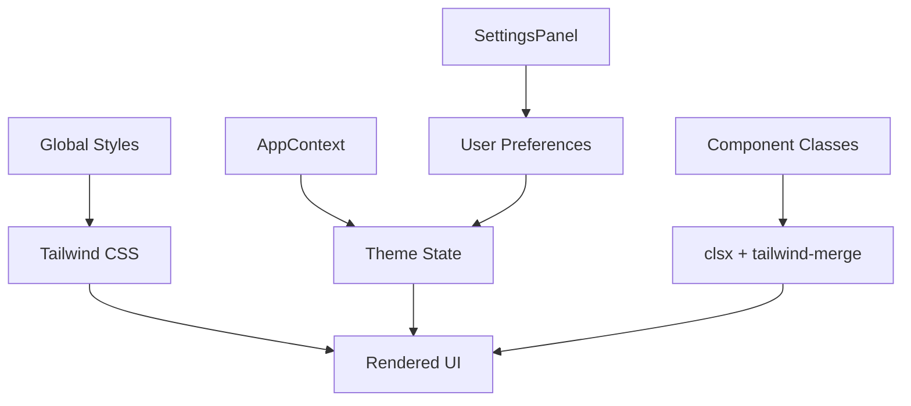
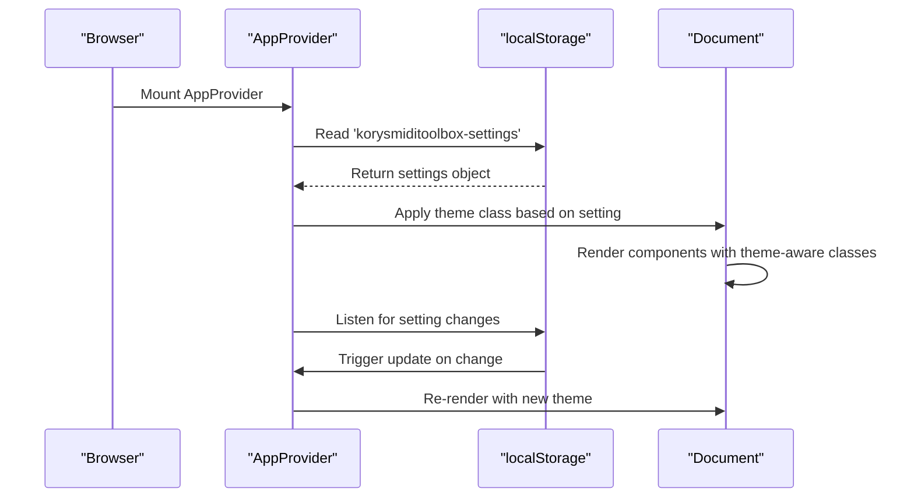
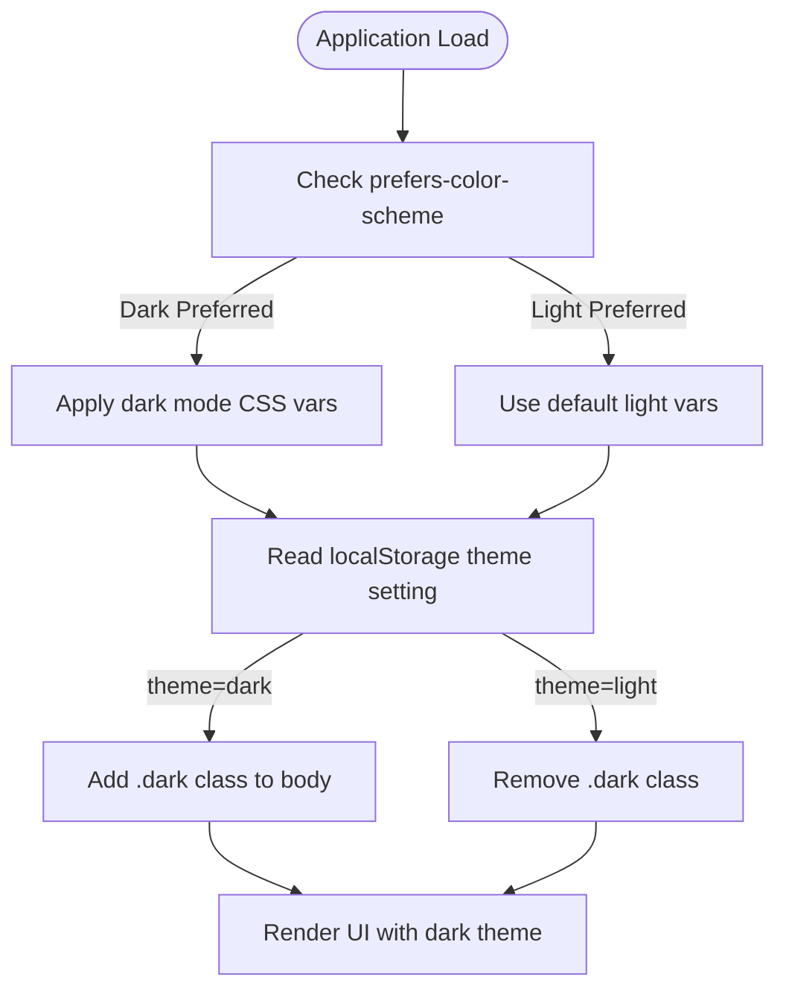
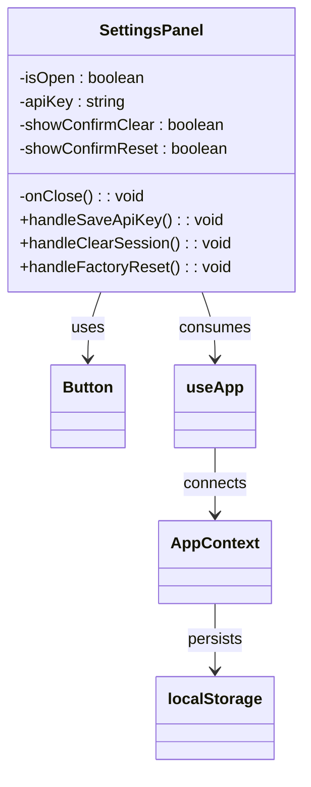
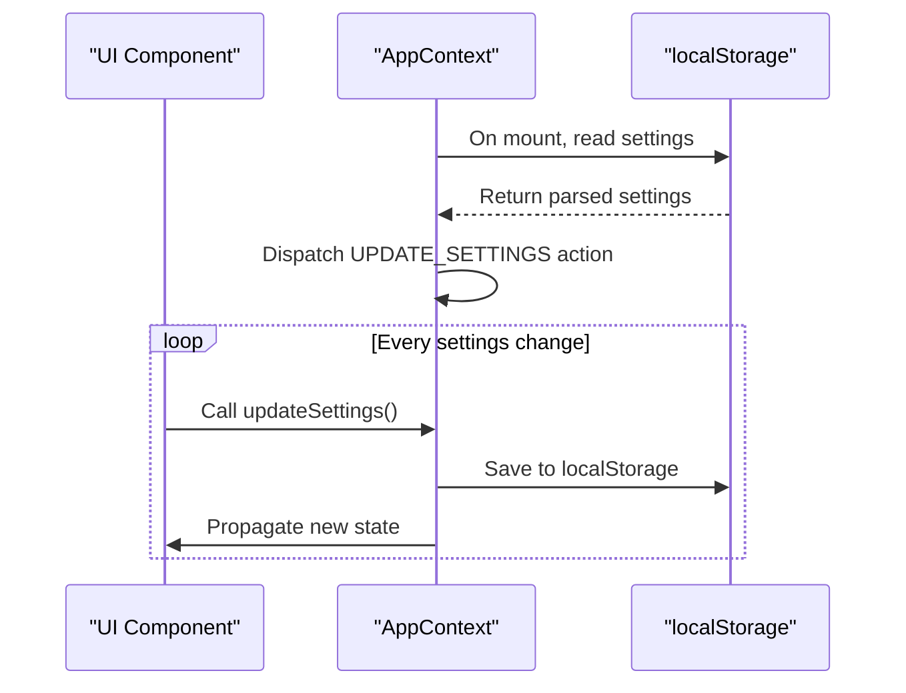
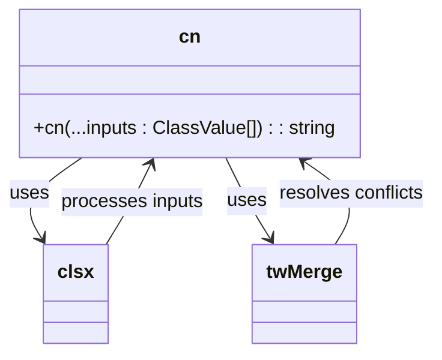
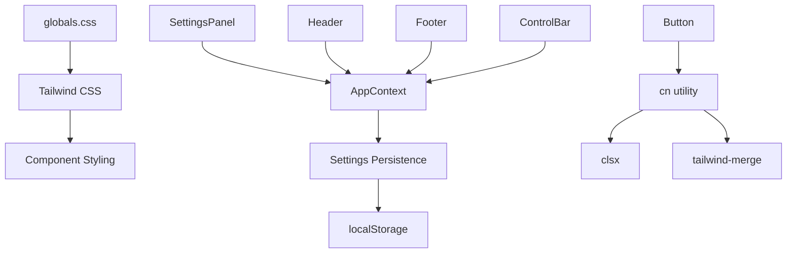

# Theme Customization

<cite>
**Referenced Files in This Document**   
- [globals.css](file://src/styles/globals.css)
- [AppContext.tsx](file://src/context/AppContext.tsx)
- [SettingsPanel.tsx](file://src/components/SettingsPanel.tsx)
- [Button.tsx](file://src/components/ui/Button.tsx)
- [cn.ts](file://src/utils/cn.ts)
</cite>

## Table of Contents
1. [Introduction](#introduction)
2. [Project Structure](#project-structure)
3. [Core Components](#core-components)
4. [Architecture Overview](#architecture-overview)
5. [Detailed Component Analysis](#detailed-component-analysis)
6. [Dependency Analysis](#dependency-analysis)
7. [Performance Considerations](#performance-considerations)
8. [Troubleshooting Guide](#troubleshooting-guide)
9. [Conclusion](#conclusion)

## Introduction
This document provides a comprehensive overview of theme customization within the korysmiditoolbox application. It details how the dark theme is implemented using Tailwind CSS utility classes and configured through global styles, explains state management via AppContext, and outlines user preference persistence using localStorage. The documentation also covers best practices for extending color schemes, managing className composition with utility functions, and ensuring accessibility compliance across UI components.

## Project Structure
The project follows a modular React architecture with clear separation of concerns:
- `components/`: Contains reusable UI elements including layout components (Header, Footer, ControlBar) and interactive panels (SettingsPanel)
- `context/`: Houses AppContext for global state management
- `styles/`: Includes global CSS definitions and Tailwind integration
- `utils/`: Provides helper functions like `cn()` for className manipulation
- `pages/`: Contains page-level components and routing logic

The theme system primarily operates through the interaction of global styles, context state, and component-level className bindings.



**Diagram sources**
- [globals.css](file://src/styles/globals.css#L0-L312)
- [AppContext.tsx](file://src/context/AppContext.tsx#L0-L220)

**Section sources**
- [globals.css](file://src/styles/globals.css#L0-L312)
- [AppContext.tsx](file://src/context/AppContext.tsx#L0-L220)

## Core Components
The theme customization system revolves around three core components: global CSS variables, AppContext state management, and the SettingsPanel interface. These work together to provide a consistent dark-themed experience that respects user preferences while maintaining accessibility standards.

**Section sources**
- [globals.css](file://src/styles/globals.css#L0-L312)
- [AppContext.tsx](file://src/context/AppContext.tsx#L0-L220)
- [SettingsPanel.tsx](file://src/components/SettingsPanel.tsx#L0-L203)

## Architecture Overview
The theming architecture implements a layered approach combining CSS custom properties, React context for state management, and localStorage for persistence. When the application loads, it reads saved settings from localStorage and applies the appropriate theme configuration through Tailwind's dark mode support.



**Diagram sources**
- [AppContext.tsx](file://src/context/AppContext.tsx#L81-L133)
- [globals.css](file://src/styles/globals.css#L0-L60)

## Detailed Component Analysis

### Theme Implementation with Tailwind CSS
The dark theme is implemented using Tailwind CSS utility classes combined with CSS custom properties defined in globals.css. The base styling uses a light theme by default but automatically switches to dark mode when the `.dark` class is applied to the document or when the user's system prefers dark colors.

#### CSS Custom Properties
```mermaid
classDiagram
class ThemeVariables {
--background : #ffffff
--foreground : #171717
--surface : #f7f7f8
--surface-dark : #121212
--accent : #6366f1
}
ThemeVariables --> : root : defines
: root --> body : uses
body --> .dark : overrides
```

**Diagram sources**
- [globals.css](file://src/styles/globals.css#L2-L10)

#### Dark Mode Configuration
The application enforces a dark theme by default through both media queries and explicit class application. The `@media (prefers-color-scheme: dark)` rule automatically adjusts colors for users who have dark mode enabled at the OS level.



**Diagram sources**
- [globals.css](file://src/styles/globals.css#L11-L21)
- [AppContext.tsx](file://src/context/AppContext.tsx#L134-L145)

### SettingsPanel and User Preferences
The SettingsPanel component serves as the primary interface for managing application settings, including theme preferences. However, in the current implementation, the theme selection is disabled and enforces dark mode exclusively.

#### Theme Toggle Implementation


**Diagram sources**
- [SettingsPanel.tsx](file://src/components/SettingsPanel.tsx#L0-L203)
- [AppContext.tsx](file://src/context/AppContext.tsx#L167-L219)

The theme switcher button is currently disabled with a cursor-not-allowed style and opacity reduction, indicating that dark theme is enforced throughout the application.

**Section sources**
- [SettingsPanel.tsx](file://src/components/SettingsPanel.tsx#L83-L120)
- [AppContext.tsx](file://src/context/AppContext.tsx#L30-L86)

### AppContext State Management
Theme-related state is managed centrally through the AppContext provider, which handles both initial loading from localStorage and subsequent updates.

#### State Flow


**Diagram sources**
- [AppContext.tsx](file://src/context/AppContext.tsx#L134-L145)
- [AppContext.tsx](file://src/context/AppContext.tsx#L147-L159)

The context initializes with a default dark theme setting and maintains this preference across sessions by persisting to localStorage under the key 'korysmiditoolbox-settings'.

**Section sources**
- [AppContext.tsx](file://src/context/AppContext.tsx#L0-L37)
- [AppContext.tsx](file://src/context/AppContext.tsx#L134-L159)

### Class Name Composition Utilities
The application uses utility functions to manage className composition, ensuring proper merging of Tailwind classes while avoiding conflicts.

#### cn Utility Function


**Diagram sources**
- [cn.ts](file://src/utils/cn.ts#L0-L5)
- [Button.tsx](file://src/components/ui/Button.tsx#L22-L23)

The `cn()` function combines `clsx` for conditional class evaluation and `tailwind-merge` for intelligent merging of conflicting Tailwind classes, particularly important for handling dark mode variants.

**Section sources**
- [cn.ts](file://src/utils/cn.ts#L0-L5)
- [Button.tsx](file://src/components/ui/Button.tsx#L22-L23)

## Dependency Analysis
The theme customization system has well-defined dependencies between components, ensuring cohesive behavior while maintaining separation of concerns.



**Diagram sources**
- [package-lock.json](file://package-lock.json#L5733-L5768)
- [postcss.config.mjs](file://postcss.config.mjs#L0-L4)

The dependency chain shows how global styles flow through the context system to individual components, with utility functions supporting consistent className application.

**Section sources**
- [package-lock.json](file://package-lock.json#L5733-L5768)
- [postcss.config.mjs](file://postcss.config.mjs#L0-L4)

## Performance Considerations
The current theme implementation is optimized for performance with minimal re-renders and efficient style application. The use of CSS custom properties allows for theme switching without requiring JavaScript-based style recalculations,