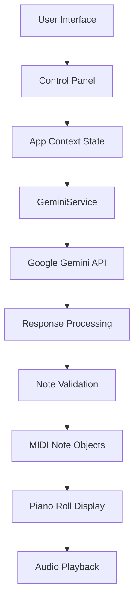
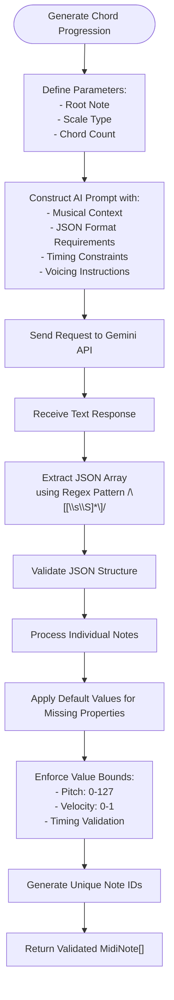

# AI Chord Generation

<cite>
**Referenced Files in This Document **   
- [geminiService.ts](file://src/services/geminiService.ts)
- [types/index.ts](file://src/types/index.ts)
- [index.tsx](file://src/pages/index.tsx)
- [SettingsPanel.tsx](file://src/components/SettingsPanel.tsx)
- [defaultProgression.ts](file://src/utils/defaultProgression.ts)
</cite>

## Table of Contents
1. [Introduction](#introduction)
2. [Architecture Overview](#architecture-overview)
3. [Core Components](#core-components)
4. [Prompt Engineering Strategy](#prompt-engineering-strategy)
5. [Response Parsing and Validation](#response-parsing-and-validation)
6. [Chord Structure and Voicing](#chord-structure-and-voicing)
7. [Error Handling Procedures](#error-handling-procedures)
8. [Performance Considerations](#performance-considerations)
9. [Customization Possibilities](#customization-possibilities)
10. [Conclusion](#conclusion)

## Introduction
The AI Chord Generation feature in korysmiditoolbox leverages Google's Generative AI (Gemini) API to create musically coherent chord progressions based on user-defined parameters such as root note and scale type. This system enables users to generate professional-quality chord sequences through natural language processing and machine learning, providing a powerful tool for music composition and experimentation. The integration is designed with security, usability, and musical accuracy in mind, ensuring that generated outputs adhere to standard music theory principles while maintaining technical compatibility with MIDI standards.

## Architecture Overview
The AI Chord Generation system follows a service-oriented architecture where the GeminiService class acts as an intermediary between the application frontend and Google's Gemini API. When a user initiates chord generation, the request flows from the UI components through the AppContext state management system to the geminiService, which constructs and sends a prompt to the Gemini API. The response is then processed, validated, and integrated into the application's note collection for playback and editing.

**Diagram sources **
- [geminiService.ts](file://src/services/geminiService.ts#L1-L70)
- [index.tsx](file://src/pages/index.tsx#L23-L104)

## Core Components

The core functionality of the AI Chord Generation feature is implemented in the `GeminiService` class, which handles all interactions with Google's Generative AI API. This service manages API authentication via key injection, constructs prompts according to musical parameters, processes responses, and ensures output conforms to the application's MIDI data structure requirements. The service is instantiated and managed within the main application component, allowing seamless integration with the UI controls and state management system.

**Section sources**
- [geminiService.ts](file://src/services/geminiService.ts#L1-L70)
- [index.tsx](file://src/pages/index.tsx#L23-L65)

## Prompt Engineering Strategy

The prompt engineering strategy employed by the AI Chord Generation feature is carefully designed to produce reliable, structured outputs that conform to musical conventions and technical requirements. The prompt explicitly specifies the desired format as a JSON array containing MIDI note objects with defined properties: pitch (0-127), startTime (seconds), duration (seconds), and velocity (0-1). By constraining the output format and providing clear musical context—including root note, scale type, chord count, timing structure (2-second chords at 0, 2, 4, 6 seconds), and voicing instructions (root, third, fifth, seventh)—the system guides the AI toward generating musically appropriate and technically valid results.

The prompt also enforces strict formatting rules by requesting "only the JSON array, no other text," minimizing parsing challenges and reducing the likelihood of malformed responses. This approach combines domain-specific knowledge with effective language model prompting techniques to achieve consistent, high-quality chord progression generation.

**Diagram sources **
- [geminiService.ts](file://src/services/geminiService.ts#L32-L69)

## Response Parsing and Validation

The response parsing logic in the AI Chord Generation system employs a robust two-step process to handle the unstructured text output from the Gemini API. First, a regular expression pattern `/\[[\s\S]*\]/` is used to extract what should be a JSON array from the response text, accommodating potential whitespace or additional characters surrounding the actual JSON content. If no valid JSON array is found, the system throws an error indicating failed extraction.

Once JSON is successfully extracted, it undergoes comprehensive validation and normalization. Each note object is processed to ensure all required properties exist and fall within acceptable ranges. Missing values are assigned sensible defaults (pitch: 60, startTime: 0, duration: 2, velocity: 0.8), while out-of-bounds values are clamped to their respective limits using `Math.max()` and `Math.min()` functions. This validation ensures that every generated note adheres to MIDI specifications and prevents potential issues during playback or export.

**Section sources**
- [geminiService.ts](file://src/services/geminiService.ts#L45-L60)

## Chord Structure and Voicing

The AI Chord Generation feature structures chord progressions with precise timing and voicing parameters to ensure musical coherence and playability. Each chord is designed to last exactly 2 seconds, starting at intervals of 0, 2, 4, and 6 seconds respectively, creating a predictable four-chord progression framework. This timing structure aligns with common musical phrasing and provides a solid foundation for composition.

Voicings are constructed according to standard music theory principles, including 3-4 notes per chord: typically the root, third, fifth, and optionally the seventh. These notes are constrained to the 3rd through 5th octaves (MIDI notes 36-84), which corresponds to the C3-C5 range—optimal for piano voicings that avoid extreme registers while maintaining clarity. This octave limitation ensures that generated chords remain within a practical and sonically balanced range suitable for most musical contexts.

The default progression implementation demonstrates this structure with a C Major progression (C-Am-F-G), where each chord contains three notes spanning these octave constraints, providing both a fallback option and a template for AI-generated content.

**Section sources**
- [geminiService.ts](file://src/services/geminiService.ts#L12-L30)
- [defaultProgression.ts](file://src/utils/defaultProgression.ts#L0-L37)

## Error Handling Procedures

The AI Chord Generation system implements comprehensive error handling to manage various failure scenarios gracefully. At the service initialization level, the constructor checks for the presence of an API key, setting the genAI instance accordingly. When attempting to generate chord progressions without a valid API key, the system throws a specific error message instructing users to provide authentication credentials.

Network-related issues and API communication failures are caught in the try-catch block surrounding the generateContent call, with detailed console logging for debugging purposes. The catch handler converts low-level errors into user-friendly messages that guide troubleshooting ("Failed to generate chord progression. Please check your API key and try again."). Invalid responses lacking proper JSON structure trigger a dedicated error path, ensuring that malformed AI outputs don't propagate through the system.

Client-side validation further enhances reliability by checking for API key presence before initiating requests and providing immediate feedback when keys are missing. This multi-layered approach to error handling improves user experience by transforming technical failures into actionable guidance.

**Section sources**
- [geminiService.ts](file://src/services/geminiService.ts#L55-L69)
- [SettingsPanel.tsx](file://src/components/SettingsPanel.tsx#L53-L85)
- [index.tsx](file://src/pages/index.tsx#L85-L95)

## Performance Considerations

The AI Chord Generation feature incorporates several performance considerations to maintain responsiveness despite the inherent latency of cloud-based AI processing. The asynchronous nature of the generateChordProgression method allows the UI to remain interactive while waiting for API responses. During generation, the interface displays loading states (via setIsGenerating(true)) to provide visual feedback and prevent duplicate requests.

Latency in AI generation is mitigated through efficient prompt design that minimizes token usage while maximizing information density. The system's direct browser-to-API communication eliminates server-side bottlenecks, though performance ultimately depends on network conditions and Google's API response times. To enhance perceived performance, the application could potentially implement progressive rendering or streaming of results if supported by the API.

Resource management is optimized by reusing the GeminiService instance across multiple generations and only recreating the API client when keys change, reducing connection overhead. The lightweight validation and transformation logic applied to responses ensures minimal post-processing delay once results arrive.

**Section sources**
- [geminiService.ts](file://src/services/geminiService.ts#L12-L69)
- [index.tsx](file://src/pages/index.tsx#L61-L104)

## Customization Possibilities

The AI Chord Generation system offers several avenues for customization that could extend its musical capabilities. The current implementation uses a fixed prompt template, but this could be modified to support different musical styles (jazz, classical, pop) by