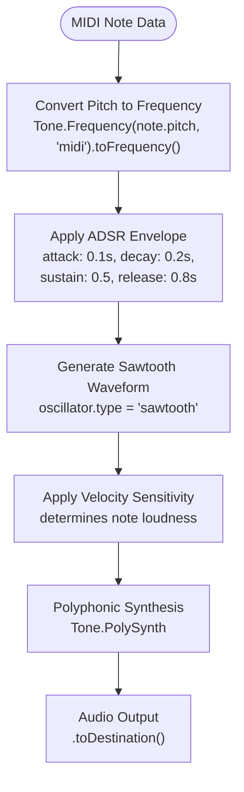
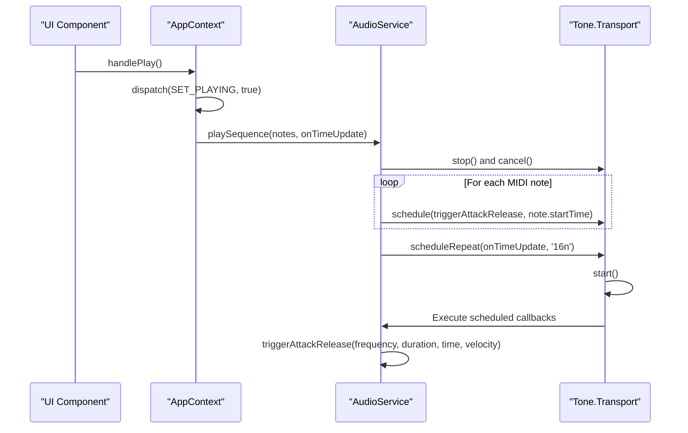
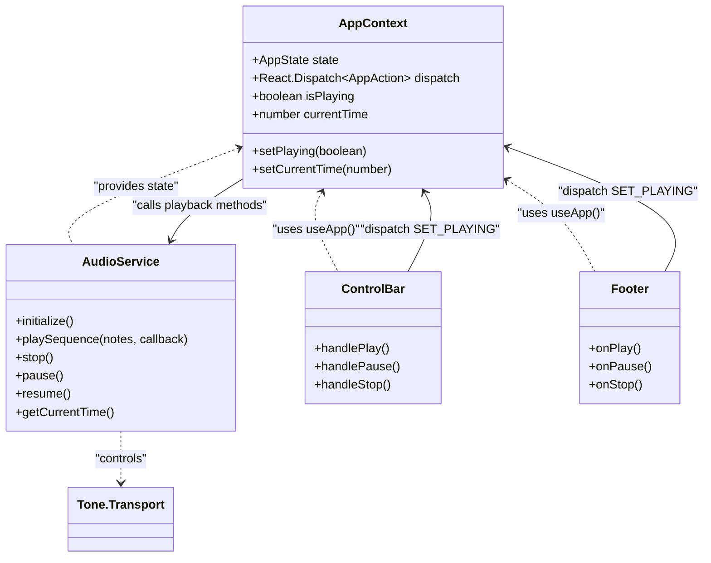
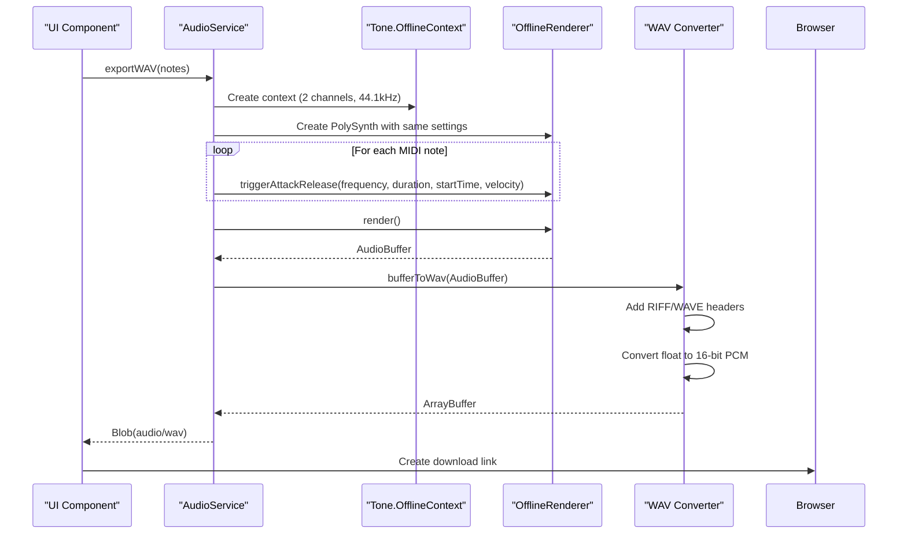

# Audio Playback System

<cite>
**Referenced Files in This Document**   
- [audioService.ts](file://src/services/audioService.ts)
- [AppContext.tsx](file://src/context/AppContext.tsx)
- [index.tsx](file://src/pages/index.tsx)
- [PianoRoll.tsx](file://src/components/PianoRoll.tsx)
- [Footer.tsx](file://src/components/layout/Footer.tsx)
</cite>

## Table of Contents
1. [Introduction](#introduction)
2. [Audio Rendering Pipeline](#audio-rendering-pipeline)
3. [Tone.js Integration and Transport System](#tonejs-integration-and-transport-system)
4. [Playback Controls and State Management](#playback-controls-and-state-management)
5. [Visual-Audio Synchronization](#visual-audio-synchronization)
6. [WAV Export Functionality](#wav-export-functionality)
7. [Error Handling and Initialization](#error-handling-and-initialization)
8. [Performance Considerations](#performance-considerations)

## Introduction

The Audio Playback System in korysmiditoolbox provides a comprehensive solution for MIDI note playback, real-time audio synthesis, and audio file export. Built on the Tone.js library, this system enables precise scheduling of musical events with millisecond accuracy while maintaining tight synchronization between visual elements and audio output. The architecture integrates a global transport system for managing playback timing, a state management system for coordinating UI components, and specialized rendering pipelines for both real-time playback and offline audio export.

**Section sources**
- [audioService.ts](file://src/services/audioService.ts#L1-L198)
- [AppContext.tsx](file://src/context/AppContext.tsx#L1-L220)

## Audio Rendering Pipeline

The audio rendering pipeline in korysmiditoolbox follows a structured approach to transform MIDI note data into audible sound through digital synthesis. At its core is a polyphonic synthesizer that can simultaneously play multiple notes using a sawtooth oscillator waveform. Each note's amplitude is shaped by an ADSR (Attack, Decay, Sustain, Release) envelope with parameters configured to create a rich, expressive sound.

The pipeline begins with MIDI note objects containing pitch, start time, duration, and velocity information. These values are converted to appropriate audio parameters: pitch is transformed from MIDI note numbers to frequency values using Tone.Frequency, while velocity directly influences the loudness of each note. The synthesizer schedules these notes for playback at precise times, ensuring accurate rhythmic placement within the musical timeline.



**Diagram sources**
- [audioService.ts](file://src/services/audioService.ts#L15-L25)

**Section sources**
- [audioService.ts](file://src/services/audioService.ts#L15-L25)
- [types/index.ts](file://src/types/index.ts#L1-L10)

## Tone.js Integration and Transport System

The integration with Tone.js provides the foundation for precise audio scheduling and global timing control. The system utilizes Tone.Transport as a centralized clock that manages the timing of all musical events across the application. This transport system supports essential playback operations including start, stop, pause, and resume, ensuring consistent timing behavior throughout the application.

When initiating playback, the system first stops any currently playing sequence and cancels pending scheduled events to prevent audio artifacts. Notes are then scheduled using Tone.Transport.schedule(), which registers callback functions to be executed at specific times in the musical timeline. The transport system automatically handles the complexities of audio timing, compensating for browser audio processing delays and maintaining sample-accurate synchronization.



**Diagram sources**
- [audioService.ts](file://src/services/audioService.ts#L48-L110)
- [index.tsx](file://src/pages/index.tsx#L118-L128)

**Section sources**
- [audioService.ts](file://src/services/audioService.ts#L48-L110)
- [index.tsx](file://src/pages/index.tsx#L118-L128)

## Playback Controls and State Management

Playback controls are implemented through a coordinated system of React components and context-based state management. The ControlBar component contains buttons for play, pause, and stop operations, which interact with the global application state via AppContext. When a user clicks a control button, it triggers a handler function that updates the application state and invokes the corresponding audio service method.

The AppContext maintains the current playback state through the `isPlaying` boolean flag and the `currentTime` value, which represents the current position in seconds. This state is accessible to all components in the application, enabling synchronized behavior across different UI elements. The Footer component displays the current playback status and provides additional transport controls, creating a cohesive user experience.



**Diagram sources**
- [AppContext.tsx](file://src/context/AppContext.tsx#L1-L220)
- [Footer.tsx](file://src/components/layout/Footer.tsx#L1-L162)
- [index.tsx](file://src/pages/index.tsx#L118-L138)

**Section sources**
- [AppContext.tsx](file://src/context/AppContext.tsx#L114-L114)
- [Footer.tsx](file://src/components/layout/Footer.tsx#L1-L162)
- [index.tsx](file://src/pages/index.tsx#L118-L138)

## Visual-Audio Synchronization

The system maintains precise synchronization between the visual playhead in the Piano Roll and the actual audio playback position. This is achieved through a combination of the global transport system and real-time state updates. As audio plays, the current time is continuously updated in the AppContext, which triggers re-renders of the Piano Roll component.

The Piano Roll component reads the current time from the application state and draws a vertical playhead line at the corresponding horizontal position. The position calculation takes into account the visual representation of time, converting seconds to pixels based on the beat width parameter. This ensures that the visual indicator accurately reflects the current playback position, providing users with immediate feedback on where they are in the musical timeline.

```mermaid
flowchart TD
A[Tone.Transport Time] --> B[Request Animation Frame]
B --> C{Is Playing?}
C --> |Yes| D[Calculate Delta Time]
D --> E[Update Current Time<br/>dispatch(SET_CURRENT_TIME)]
E --> F[State Change in AppContext]
F --> G[PianoRoll Re-renders]
G --> H[Draw Playhead at<br/>state.currentTime * (beatWidth / 2)]
H --> I[Visual Feedback to User]
C --> |No| J[Stop Animation Loop]
```

**Diagram sources**
- [PianoRoll.tsx](file://src/components/PianoRoll.tsx#L183-L226)
- [index.tsx](file://src/pages/index.tsx#L144-L185)

**Section sources**
- [PianoRoll.tsx](file://src/components/PianoRoll.tsx#L183-L226)
- [index.tsx](file://src/pages/index.tsx#L144-L185)

## WAV Export Functionality

The system includes robust functionality for exporting compositions to WAV audio files through offline rendering. The export process creates a separate OfflineContext instance that renders audio without requiring real-time playback. This approach allows for high-quality audio generation regardless of system performance during the export operation.

The exportWAV function initializes an identical synthesizer configuration to the main playback system, ensuring consistent sound quality between real-time playback and exported audio. All MIDI notes are scheduled in the offline context, which then renders the complete audio buffer. The resulting AudioBuffer is converted to WAV format by adding a proper RIFF header and encoding the floating-point samples as 16-bit PCM data.



**Diagram sources**
- [audioService.ts](file://src/services/audioService.ts#L112-L153)
- [index.tsx](file://src/pages/index.tsx#L98-L108)

**Section sources**
- [audioService.ts](file://src/services/audioService.ts#L112-L153)
- [index.tsx](file://src/pages/index.tsx#L98-L108)

## Error Handling and Initialization

The audio system implements comprehensive error handling to manage common issues such as browser autoplay policies and audio context initialization failures. The initialize() method in AudioService handles the asynchronous startup of Tone.js, which requires a user gesture due to browser security restrictions. If initialization fails, the system gracefully handles the error and provides feedback to the user.

The service employs lazy initialization, meaning the audio context is only created when needed (typically when the user first attempts to play audio). This approach respects browser autoplay policies by ensuring audio context creation occurs in direct response to user interaction. The isInitialized flag prevents redundant initialization attempts, while the private synth property ensures type safety and encapsulation of the audio resources.

**Section sources**
- [audioService.ts](file://src/services/audioService.ts#L7-L25)
- [index.tsx](file://src/pages/index.tsx#L58-L62)

## Performance Considerations

The audio playback system addresses several performance considerations to ensure smooth operation even with complex compositions. Memory usage is optimized by reusing the same PolySynth instance for all playback operations and properly cleaning up scheduled events when stopping playback. The system efficiently handles large numbers of simultaneous notes by leveraging Tone.js's optimized scheduling engine, which uses Web Audio API's precise timing capabilities.

For long compositions, the system minimizes memory footprint by avoiding unnecessary data duplication and using efficient data structures for note storage. The requestAnimationFrame-based clock in the main application ensures smooth UI updates without blocking the main thread. Additionally, the separation of real-time playback and offline rendering contexts allows the export process to occur without interfering with interactive playback performance.

**Section sources**
- [audioService.ts](file://src/services/audioService.ts#L1-L198)
- [index.tsx](file://src/pages/index.tsx#L144-L185)