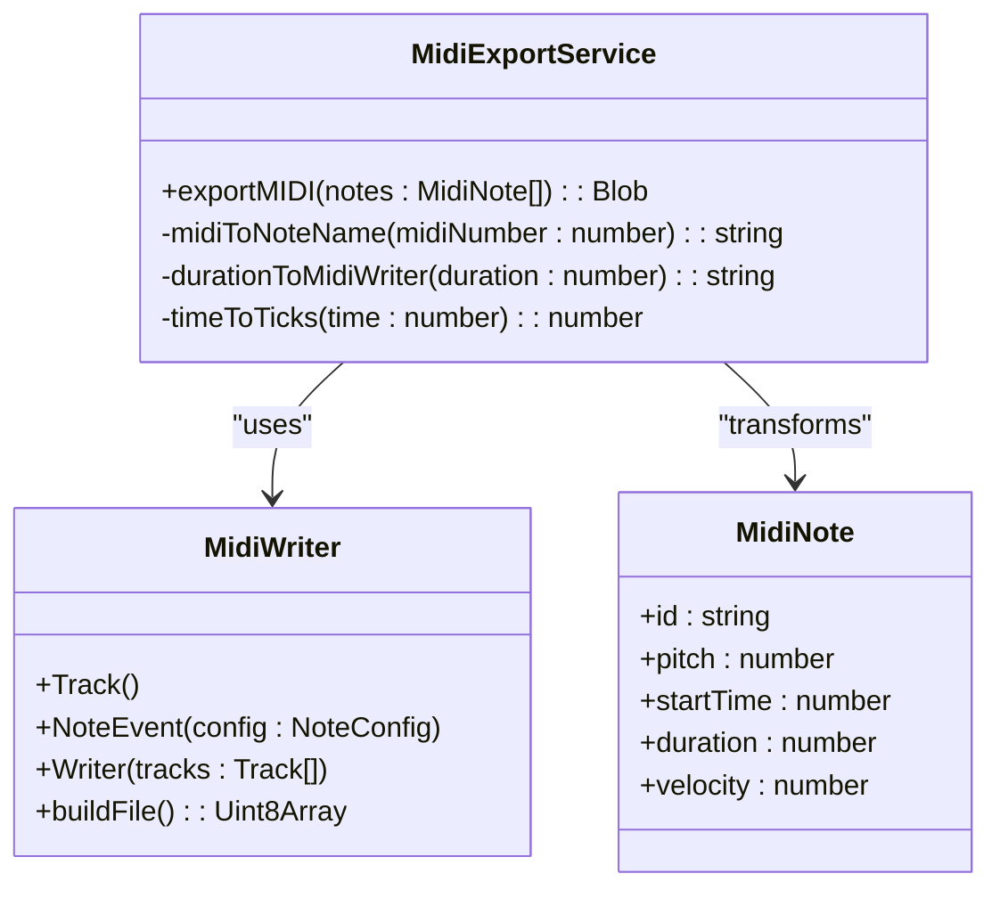
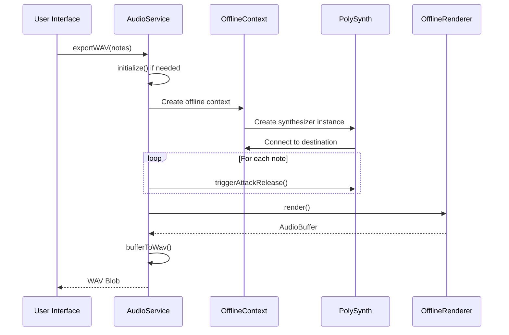
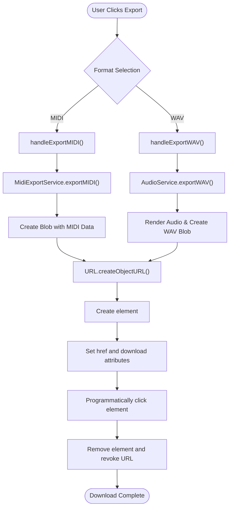

# Export Functionality

<cite>
**Referenced Files in This Document**   
- [midiExportService.ts](file://src/services/midiExportService.ts)
- [audioService.ts](file://src/services/audioService.ts)
- [index.tsx](file://src/pages/index.tsx)
- [ControlBar.tsx](file://src/components/ControlBar.tsx)
- [index.ts](file://src/types/index.ts)
</cite>

## Table of Contents
1. [Introduction](#introduction)
2. [MIDI Export Implementation](#midi-export-implementation)
3. [WAV Export Implementation](#wav-export-implementation)
4. [Download Triggers and UI Integration](#download-triggers-and-ui-integration)
5. [File Format Specifications](#file-format-specifications)
6. [Technical Limitations and Considerations](#technical-limitations-and-considerations)
7. [Troubleshooting Common Issues](#troubleshooting-common-issues)

## Introduction

The korysmiditoolbox application provides comprehensive export functionality for musical compositions, supporting two primary formats: MIDI (.mid) and WAV (.wav). These export features enable users to preserve their chord progressions and share them across different digital audio workstations and music production software. The implementation leverages specialized libraries to ensure high-quality output that maintains the integrity of the musical composition.

The MIDI export functionality transforms the application's internal note representation into standard MIDI files using the midi-writer-js library, while the WAV export utilizes Tone.js OfflineRenderer to generate high-fidelity audio renderings of the composition. Both export methods are designed to be user-friendly, with intuitive triggers integrated into the application's control interface.

**Section sources**
- [midiExportService.ts](file://src/services/midiExportService.ts)
- [audioService.ts](file://src/services/audioService.ts)

## MIDI Export Implementation

### Core Architecture

The MIDI export functionality is implemented through the `MidiExportService` class, which orchestrates the transformation of the application's state (represented as an array of `MidiNote` objects) into a properly formatted MIDI file. This process involves several key steps: sorting notes by timing, grouping simultaneous notes into chords, converting timing information to MIDI ticks, and constructing the final binary MIDI data.

**Diagram sources**
- [midiExportService.ts](file://src/services/midiExportService.ts#L3-L78)
- [types/index.ts](file://src/types/index.ts#L0-L6)

**Section sources**
- [midiExportService.ts](file://src/services/midiExportService.ts#L3-L78)

### Note Processing Pipeline

The MIDI export process begins with the `exportMIDI` method, which accepts an array of `MidiNote` objects representing the current composition. The first step involves sorting these notes by their start time to ensure chronological ordering in the output file. Following this, notes are grouped by their start time (rounded to milliseconds) to identify chords—multiple notes that begin simultaneously.

This grouping mechanism ensures that harmonically related notes are represented as single chord events in the MIDI file rather than as separate sequential notes, preserving the intended musical structure. Each group of notes is then processed to extract pitch, duration, and velocity information for inclusion in the MIDI track.

### Timing and Quantization

The implementation assumes a fixed tempo of 120 BPM, with each quarter note lasting 0.5 seconds. Time values are converted from the application's second-based representation to MIDI ticks using a resolution of 480 ticks per quarter note. This conversion is handled by the `timeToTicks` method, which calculates the appropriate tick position for each note event.

Duration values are mapped to standard MIDI duration strings ('16', '8', '4', '2', '1') based on their length in beats. This quantization process simplifies the representation of note durations while maintaining reasonable accuracy for typical musical compositions.

### Metadata and File Construction

While the current implementation focuses primarily on note data, it establishes the foundation for including additional metadata such as tempo and time signature information. The MIDI file is constructed using the midi-writer-js library, which creates a proper container format with appropriate headers and track information. The resulting binary data is encapsulated in a Blob with the MIME type 'audio/midi' for browser compatibility.

## WAV Export Implementation

### Audio Rendering Architecture

The WAV export functionality is managed by the `AudioService` class, which leverages Tone.js's OfflineRenderer to perform high-quality, non-realtime audio rendering of the musical composition. This approach allows for precise scheduling of notes without the constraints of real-time performance, ensuring consistent audio quality regardless of system load.

**Diagram sources**
- [audioService.ts](file://src/services/audioService.ts#L101-L153)
- [midiExportService.ts](file://src/services/midiExportService.ts#L3-L78)

**Section sources**
- [audioService.ts](file://src/services/audioService.ts#L101-L197)

### Offline Rendering Process

The `exportWAV` method initiates the audio rendering process by creating an `OfflineContext` with stereo output (2 channels), a duration of 10 seconds, and a sample rate of 44.1kHz. This configuration provides CD-quality audio output suitable for most music production purposes. A polyphonic synthesizer is instantiated within this context, configured with a sawtooth oscillator and ADSR envelope parameters that shape the sound characteristics.

Each note in the composition is scheduled within the offline context using the `triggerAttackRelease` method, which specifies the frequency (converted from MIDI pitch), duration, start time, and velocity. The offline renderer processes all scheduled events in a single pass, generating a complete audio buffer that represents the entire composition.

### WAV Format Conversion

After rendering, the resulting `AudioBuffer` is converted to the WAV file format through the `bufferToWav` method. This process involves constructing a proper WAV header that includes essential metadata such as sample rate, bit depth (16-bit), channel count, and data size. The floating-point audio samples are converted to 16-bit PCM format, with appropriate scaling and clipping to prevent distortion.

The WAV header follows the RIFF specification, containing chunks for format information ('fmt ') and audio data ('data'). This standardized format ensures compatibility with virtually all audio editing software and digital audio workstations.

## Download Triggers and UI Integration

### Control Interface

The export functionality is accessible through the application's control bar, where users can initiate either MIDI or WAV exports via dedicated buttons. The UI integration is implemented in the `ControlBar` component, which provides a dropdown menu for selecting the desired export format.

**Diagram sources**
- [ControlBar.tsx](file://src/components/ControlBar.tsx#L36-L41)
- [index.tsx](file://src/pages/index.tsx#L90-L113)

**Section sources**
- [ControlBar.tsx](file://src/components/ControlBar.tsx#L36-L181)
- [index.tsx](file://src/pages/index.tsx#L90-L146)

### Download Mechanism

When a user selects an export option, the corresponding handler function is invoked, which calls the appropriate service method to generate the file data. The resulting Blob is converted to an object URL using `URL.createObjectURL()`, which is then assigned to a dynamically created anchor (`<a>`) element. By setting the `download` attribute with an appropriate filename and programmatically triggering a click event, the browser initiates the download process.

Filename conventions follow the pattern `chord-progression-{timestamp}.{extension}`, where the timestamp ensures uniqueness and prevents overwriting previous exports. After the download is initiated, the temporary anchor element is removed from the DOM and the object URL is revoked to free up memory.

## File Format Specifications

### MIDI Format Details

The MIDI export produces standard MIDI files (SMF) in Format 1, containing a single track with properly timed note events. Each note event includes:

- **Pitch**: Converted from MIDI note numbers (0-127) to scientific pitch notation (e.g., C4, E5)
- **Start Time**: Expressed in MIDI ticks relative to the beginning of the track
- **Duration**: Mapped to standard note durations (whole, half, quarter, etc.)
- **Velocity**: Scaled from the application's 0-1 range to MIDI's 0-127 range

The implementation uses a time division of 480 ticks per quarter note, providing sufficient resolution for precise timing while remaining compatible with most MIDI software. Chord events are represented as multiple simultaneous note-on messages, preserving harmonic relationships in the composition.

### WAV Format Details

The WAV export generates uncompressed PCM audio files with the following specifications:

- **Sample Rate**: 44,100 Hz (CD quality)
- **Bit Depth**: 16 bits per sample
- **Channels**: 2 (stereo)
- **Duration**: Determined by the longest note in the composition
- **Encoding**: Linear PCM with little-endian byte order

The audio synthesis uses a sawtooth waveform with ADSR envelope parameters