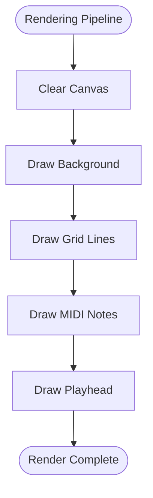
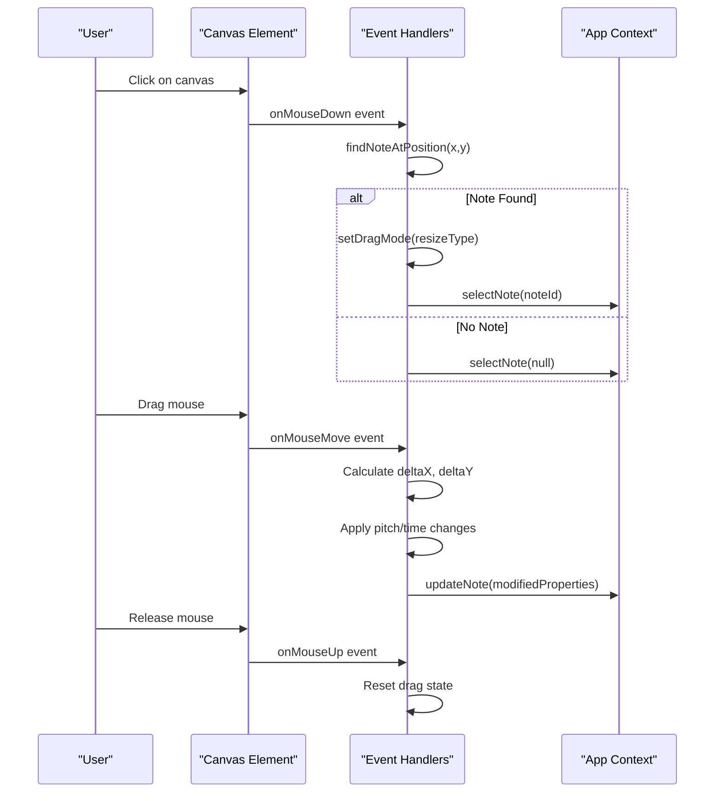
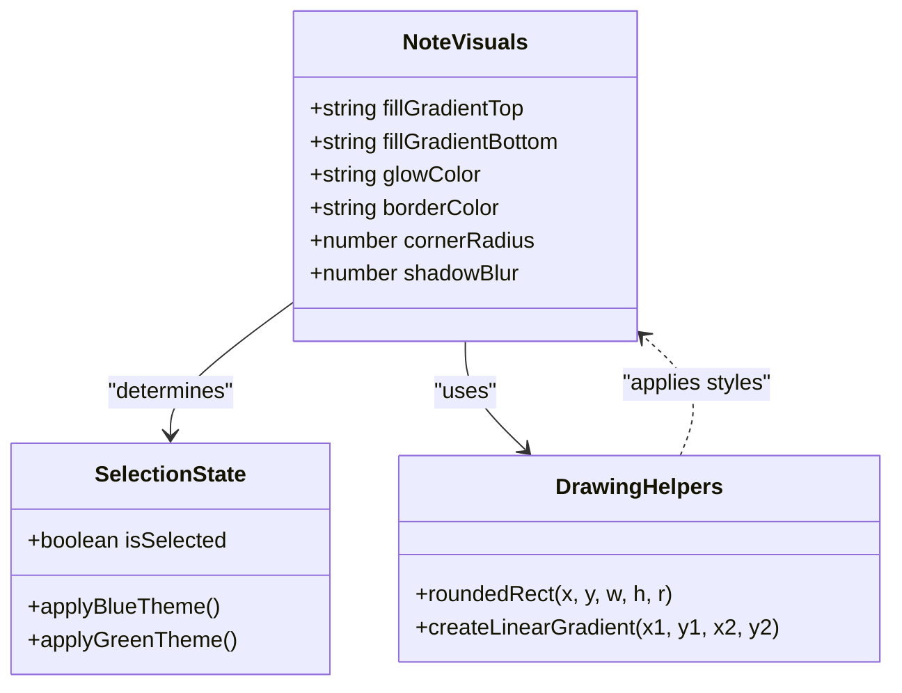
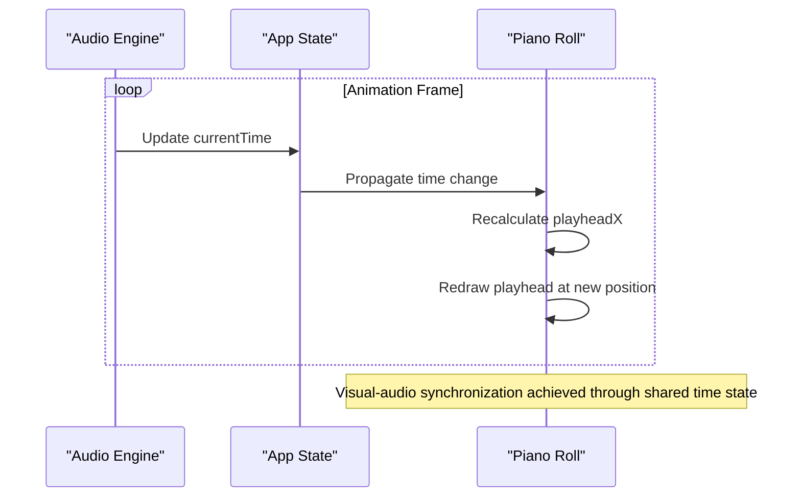

<cite>
**Referenced Files in This Document**
- [PianoRoll.tsx](file://src/components/PianoRoll.tsx)
- [midiUtils.ts](file://src/utils/midiUtils.ts)
- [index.tsx](file://src/pages/index.tsx)
- [PianoRollPreview.tsx](file://src/components/PianoRollPreview.tsx)
</cite>

# Piano Roll Editor

## Table of Contents
1. [Introduction](#introduction)
2. [Canvas-Based Rendering Implementation](#canvas-based-rendering-implementation)
3. [Event Handling System](#event-handling-system)
4. [Visual Design Elements](#visual-design-elements)
5. [Coordinate Mapping System](#coordinate-mapping-system)
6. [Keyboard Shortcut Support and Accessibility](#keyboard-shortcut-support-and-accessibility)
7. [Real-Time Playhead Visualization](#real-time-playhead-visualization)
8. [UI Overlay Hints](#ui-overlay-hints)
9. [Performance Optimization Techniques](#performance-optimization-techniques)
10. [Common Issues and Solutions](#common-issues-and-solutions)

## Introduction

The Piano Roll Editor component in korysmiditoolbox provides a high-performance MIDI note visualization and editing interface using HTML5 Canvas API. It enables users to create, manipulate, and visualize musical notes through an intuitive graphical interface that mimics traditional piano roll editors found in digital audio workstations. The component renders MIDI notes on a grid system where the horizontal axis represents time (measured in beats and seconds) and the vertical axis represents pitch (mapped to MIDI note numbers). This document details the implementation aspects of this component, focusing on its rendering pipeline, interaction model, visual design, and performance characteristics.

**Section sources**
- [PianoRoll.tsx](file://src/components/PianoRoll.tsx#L0-L439)

## Canvas-Based Rendering Implementation

The Piano Roll Editor implements canvas-based rendering using the HTML5 Canvas API to achieve high-performance visualization of MIDI notes. The rendering process is encapsulated within the `draw()` function, which is memoized using React's `useCallback` hook to prevent unnecessary re-creation. The canvas element is referenced through a React ref (`canvasRef`) and its 2D context is obtained for drawing operations.

The rendering pipeline follows a structured approach: first clearing the canvas, then drawing the background and grid system, followed by rendering individual MIDI notes with their visual properties, and finally drawing the playhead during playback. The component uses a fixed coordinate system where screen coordinates are mapped to musical time and pitch values. The grid system consists of horizontal lines representing different pitches (semitones) and vertical lines representing time divisions (beats and bars), creating a matrix that helps users align notes rhythmically and melodically.

**Diagram sources**
- [PianoRoll.tsx](file://src/components/PianoRoll.tsx#L64-L150)

**Section sources**
- [PianoRoll.tsx](file://src/components/PianoRoll.tsx#L64-L150)

## Event Handling System

The Piano Roll Editor implements a comprehensive event handling system to support various mouse interactions for note manipulation. The system handles three primary interaction modes: double-click to create new notes, drag operations to move existing notes, and edge-dragging to resize note duration. These interactions are managed through React event handlers attached directly to the canvas element: `handleMouseDown`, `handleMouseMove`, `handleMouseUp`, and `handleDoubleClick`.

When a user clicks on the canvas, the `findNoteAtPosition` function determines whether the click occurred on an existing note and identifies the appropriate interaction mode (move, resize-start, or resize-end) based on proximity to the note's edges. The `dragMode` state variable tracks the current interaction type, while `dragOriginRef` maintains information about the initial drag position and the original note properties. During drag operations, the system calculates delta values from the original position and applies transformations to the note's pitch and timing accordingly, with optional snapping to scale and grid based on user preferences and modifier keys.

**Diagram sources**
- [PianoRoll.tsx](file://src/components/PianoRoll.tsx#L243-L318)

**Section sources**
- [PianoRoll.tsx](file://src/components/PianoRoll.tsx#L243-L383)

## Visual Design Elements

The Piano Roll Editor employs several visual design elements to enhance usability and aesthetic appeal. MIDI notes are rendered with gradient fills that transition from lighter to darker shades vertically, creating a sense of depth. Selected notes use a blue gradient (`#60a5fa` to `#3b82f6`) while unselected notes use a green gradient (`#22c55e` to `#16a34a`), providing clear visual feedback about selection state. Notes feature rounded corners implemented through the `roundedRect` helper function, which creates smooth corner radii using quadratic curves.

A glow effect is applied to notes using the canvas context's shadow properties, with selected notes having a more pronounced blue glow (`rgba(59,130,246,0.45)`) and unselected notes having a green glow (`rgba(34,197,94,0.35)`). A thin border outlines each note, with colors matching the selection state (blue for selected, green for unselected). The piano keyboard sidebar displays note names and visually distinguishes black keys from white keys through contrasting background colors, maintaining consistency with traditional piano layouts.

**Diagram sources**
- [PianoRoll.tsx](file://src/components/PianoRoll.tsx#L110-L150)
- [PianoRoll.tsx](file://src/components/PianoRoll.tsx#L27-L66)

**Section sources**
- [PianoRoll.tsx](file://src/components/PianoRoll.tsx#L110-L150)

## Coordinate Mapping System

The Piano Roll Editor implements a coordinate mapping system that converts screen coordinates to musical time (seconds) and pitch (MIDI number). The vertical axis maps pixel positions to MIDI pitch values, with each semitone occupying a fixed height (`noteHeight` pixels). The mapping uses the formula `pitch = maxNote - Math.floor(y / noteHeight)`, where `maxNote` is C6 (MIDI 84), establishing C4 (MIDI 60) as the lowest visible note. This creates a piano range from C4 to C6, displayed with proper octave relationships.

The horizontal axis maps pixel positions to time in seconds, with the conversion factor determined by `beatWidth / 2`. Given that one beat corresponds to 0.5 seconds (assuming 120 BPM), the system calculates time as `startTime = x / (beatWidth / 2)`. The implementation includes quantization logic that snaps note positions to rhythmic subdivisions (by default, 16th notes) unless disabled by user settings. Scale snapping is also implemented, ensuring that newly created or moved notes conform to the currently selected musical scale unless the Alt key is held for chromatic input.

**Section sources**
- [PianoRoll.tsx](file://src/components/PianoRoll.tsx#L211-L244)
- [PianoRoll.tsx](file://src/components/PianoRoll.tsx#L181-L212)

## Keyboard Shortcut Support and Accessibility

The Piano Roll Editor provides keyboard shortcut support to enhance accessibility and workflow efficiency. The primary keyboard functionality allows users to delete selected notes using either the Delete or Backspace key. This is implemented through the `handleKeyDown` event handler attached to the canvas element, which listens for key events when the canvas has focus (indicated by the `tabIndex={0}` attribute).

The implementation checks both 'Delete' and 'Backspace' key values to ensure compatibility across different keyboard layouts and operating systems. The deletion operation is only executed when a note is currently selected (`state.selectedNoteId` is not null), preventing accidental data loss. While the current implementation focuses on deletion, the event handling structure could be extended to support additional keyboard shortcuts for common operations like copy, paste, or navigation, further improving accessibility for users who prefer keyboard-driven workflows over mouse interactions.

**Section sources**
- [PianoRoll.tsx](file://src/components/PianoRoll.tsx#L381-L383)

## Real-Time Playhead Visualization

The Piano Roll Editor features real-time playhead visualization that moves horizontally across the canvas during audio playback, synchronized with the underlying audio engine. The playhead is drawn as a vertical red line (`#f43f5e`) with a width of 2 pixels, positioned according to the current playback time. The horizontal position is calculated using the formula `playheadX = state.currentTime * (beatWidth / 2)`, which converts the current time in seconds to pixel coordinates based on the established time-to-pixel ratio.

The playhead rendering is conditional on the `state.isPlaying` flag, ensuring it only appears during active playback. The synchronization between the visual playhead and audio playback is maintained through the application's state management system, where the `currentTime` value is updated via `requestAnimationFrame` in the main application component. This creates a seamless integration between the visual representation and auditory feedback, allowing users to precisely track the current playback position relative to their composed notes.

**Diagram sources**
- [PianoRoll.tsx](file://src/components/PianoRoll.tsx#L146-L150)
- [index.tsx](file://src/pages/index.tsx#L143-L184)

**Section sources**
- [PianoRoll.tsx](file://src/components/PianoRoll.tsx#L146-L150)

## UI Overlay Hints

The Piano Roll Editor incorporates UI overlay hints to provide immediate user guidance on available interaction methods. A persistent information overlay is displayed in the top-right corner of the canvas area, listing the primary interaction techniques: "Double-click to add notes • Drag to move • Resize edges". This text-based hint serves as a quick reference for new users, reducing the learning curve associated with the editor's functionality.

Additionally, the editor provides transient visual feedback when users create new notes. Upon double-clicking to add a note, a temporary blue overlay briefly pulses at the note's location, created using `requestAnimationFrame