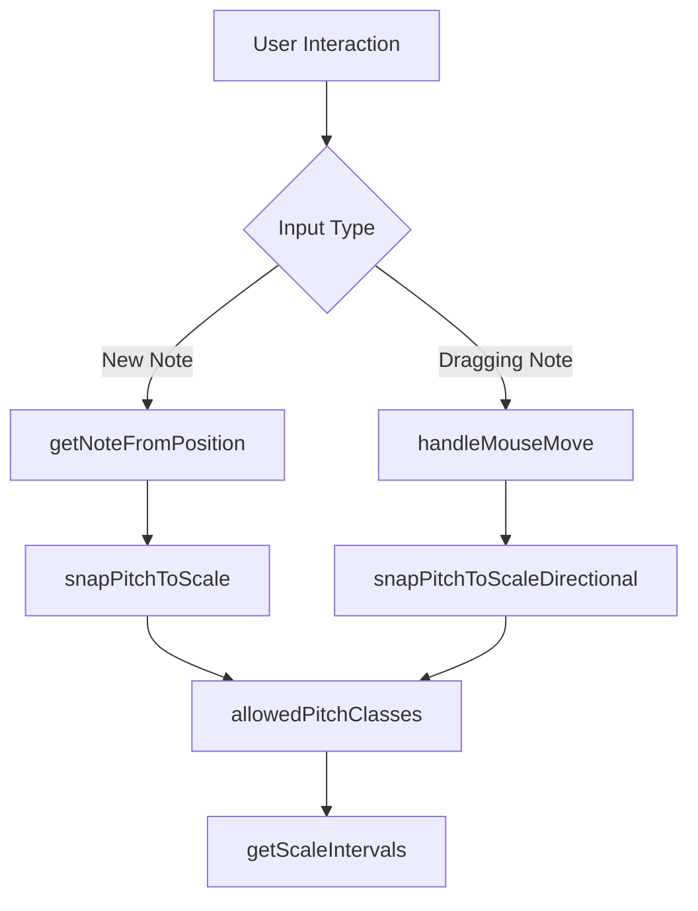
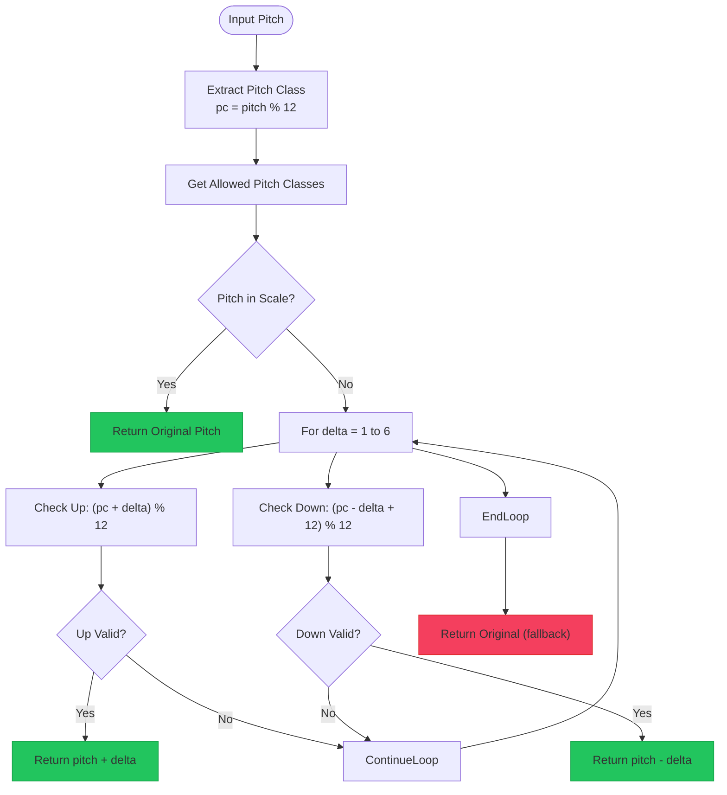
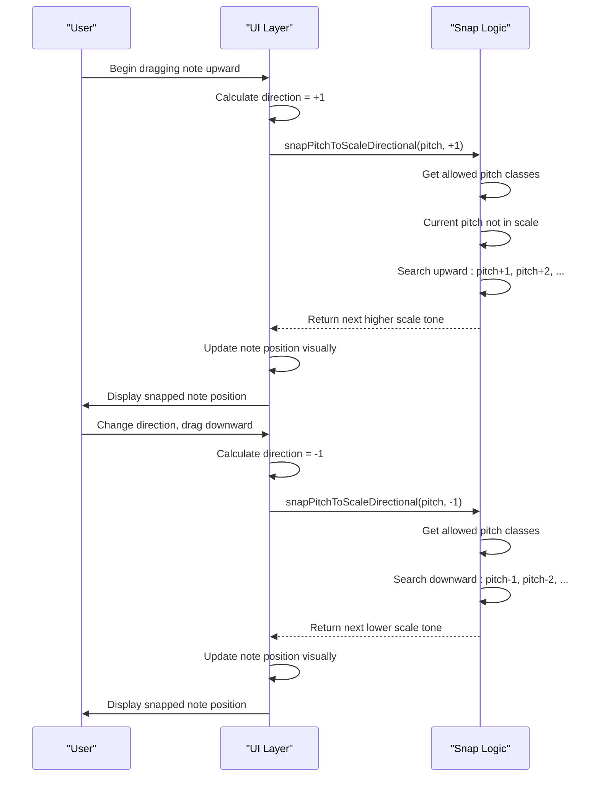
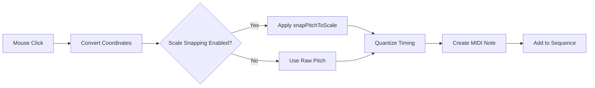

# Scale Snapping Implementation

<cite>
**Referenced Files in This Document**  
- [PianoRoll.tsx](file://src/components/PianoRoll.tsx)
- [midiUtils.ts](file://src/utils/midiUtils.ts)
</cite>

## Table of Contents
1. [Introduction](#introduction)
2. [Core Components](#core-components)
3. [Music Theory Foundation](#music-theory-foundation)
4. [Scale Snapping Algorithm](#scale-snapping-algorithm)
5. [Directional Snapping for Note Dragging](#directional-snapping-for-note-dragging)
6. [Integration with Piano Roll Input System](#integration-with-piano-roll-input-system)
7. [Visual Feedback and User Interface](#visual-feedback-and-user-interface)
8. [Performance Considerations](#performance-considerations)

## Introduction

The scale snapping implementation in korysmiditoolbox provides a music theory-guided note placement system that constrains user input to valid pitches within the selected musical scale. This feature enables users to create harmonically correct melodies and chord progressions without requiring advanced music theory knowledge. The system combines algorithmic pitch correction with real-time visual feedback, allowing both beginners and experienced musicians to compose efficiently within specific tonal frameworks.

The implementation leverages fundamental music theory concepts where each scale type (e.g., Major, Minor, Dorian) is defined by specific interval patterns relative to the root note. When users interact with the piano roll interface—either by adding new notes or dragging existing ones—the system automatically snaps pitches to the nearest valid scale degree, preserving melodic intent while ensuring harmonic correctness.

**Section sources**
- [PianoRoll.tsx](file://src/components/PianoRoll.tsx#L331-L396)
- [midiUtils.ts](file://src/utils/midiUtils.ts#L29-L40)

## Core Components

The scale snapping system consists of several interconnected components that work together to provide seamless pitch quantization:

- `allowedPitchClasses`: Calculates the set of permitted pitch classes (0-11) based on the current root note and scale type
- `snapPitchToScale`: Finds the nearest scale-appropriate pitch when a user places a note outside the scale
- `snapPitchToScaleDirectional`: Directional variant used during note dragging that preserves melodic direction
- `getNoteFromPosition`: Integrates scale snapping with the piano roll's quantization system
- `handleMouseMove`: Implements real-time snapping during note dragging operations

These functions are implemented as memoized callbacks using React's `useCallback` hook to optimize performance by preventing unnecessary re-creations during component re-renders.



**Diagram sources**
- [PianoRoll.tsx](file://src/components/PianoRoll.tsx#L331-L396)
- [midiUtils.ts](file://src/utils/midiUtils.ts#L29-L40)

**Section sources**
- [PianoRoll.tsx](file://src/components/PianoRoll.tsx#L331-L396)
- [midiUtils.ts](file://src/utils/midiUtils.ts#L29-L40)

## Music Theory Foundation

The scale snapping system is built upon fundamental music theory principles that define scales as specific patterns of intervals relative to a root note. Each scale type is represented as an array of semitone distances from the tonic (root) note, calculated using modulo 12 arithmetic to represent pitch classes within the chromatic octave.

The implementation supports multiple common scale types, each with its characteristic interval pattern:

```mermaid
erDiagram
SCALE_TYPES ||--o{ INTERVALS : "defines"
SCALE_TYPES {
string name PK
string description
}
INTERVALS {
int offset PK
string interval_name
string scale_type FK
}
SCALE_TYPES ||--o{ MAJOR : "Major"
SCALE_TYPES ||--o{ MINOR : "Minor"
SCALE_TYPES ||--o{ DORIAN : "Dorian"
SCALE_TYPES ||--o{ PHRYGIAN : "Phrygian"
SCALE_TYPES ||--o{ LYDIAN : "Lydian"
SCALE_TYPES ||--o{ MIXOLYDIAN : "Mixolydian"
SCALE_TYPES ||--o{ HARMONIC_MINOR : "Harmonic Minor"
}
```

The `getScaleIntervals` function in midiUtils.ts returns the appropriate interval pattern based on the selected scale type, serving as the foundation for all scale-based calculations. For example:
- **Major**: [0, 2, 4, 5, 7, 9, 11] (whole-whole-half-whole-whole-whole-half)
- **Minor**: [0, 2, 3, 5, 7, 8, 10] (whole-half-whole-whole-half-whole-whole)
- **Dorian**: [0, 2, 3, 5, 7, 9, 10] (whole-half-whole-whole-whole-half-whole)

These interval patterns are combined with the current root note to determine the complete set of allowed pitches in the selected key.

**Diagram sources**
- [midiUtils.ts](file://src/utils/midiUtils.ts#L29-L40)

**Section sources**
- [midiUtils.ts](file://src/utils/midiUtils.ts#L29-L40)

## Scale Snapping Algorithm

The core of the scale snapping system is the `snapPitchToScale` function, which implements an efficient algorithm to find the nearest valid pitch within the current scale. The algorithm operates in several stages:

1. **Current Pitch Class Calculation**: Extracts the pitch class (0-11) from the input MIDI pitch using modulo 12 arithmetic
2. **Allowed Pitch Classes Retrieval**: Obtains the set of valid pitch classes for the current scale and root note
3. **Direct Match Check**: Returns the original pitch if it already belongs to the scale
4. **Nearest Neighbor Search**: Searches outward from the input pitch in semitone increments up to a tritone distance (6 semitones)

The search process examines both upward and downward directions simultaneously, checking each candidate pitch class against the allowed set. The algorithm prioritizes the closest match, ensuring minimal pitch alteration while maintaining harmonic integrity.



The algorithm limits its search to a maximum of six semitones (a tritone) in either direction, which represents the maximum possible distance between any chromatic pitch and its nearest diatonic neighbor in a heptatonic scale. This constraint ensures optimal performance while guaranteeing that a valid scale tone will always be found.

**Diagram sources**
- [PianoRoll.tsx](file://src/components/PianoRoll.tsx#L340-L352)

**Section sources**
- [PianoRoll.tsx](file://src/components/PianoRoll.tsx#L340-L352)

## Directional Snapping for Note Dragging

When users drag notes vertically in the piano roll, the system employs a specialized directional snapping algorithm (`snapPitchToScaleDirectional`) that preserves the melodic direction of the movement. Unlike the bidirectional `snapPitchToScale` function, this variant searches exclusively in the direction of the drag operation, maintaining the user's intended melodic contour.

The directional snapping algorithm takes two parameters:
- `pitch`: The target MIDI pitch value
- `direction`: Movement direction (+1 for upward, -1 for downward)

The function first determines the search step direction based on the input parameter, then iterates through candidate pitches in that direction only. This approach prevents unexpected pitch inversions that could occur with bidirectional snapping during dragging operations.



This directional preservation is particularly important for creating coherent melodies, as it allows users to smoothly navigate scale degrees in their intended direction without accidentally jumping to distant scale tones. The algorithm continues searching until it finds the first valid pitch in the specified direction, ensuring predictable and musically meaningful results.

**Diagram sources**
- [PianoRoll.tsx](file://src/components/PianoRoll.tsx#L354-L366)

**Section sources**
- [PianoRoll.tsx](file://src/components/PianoRoll.tsx#L354-L366)

## Integration with Piano Roll Input System

The scale snapping functionality is tightly integrated with the piano roll's input handling system through two primary entry points: `getNoteFromPosition` for new note creation and `handleMouseMove` for note dragging operations.

### New Note Creation

When users double-click to add a new note, the `getNoteFromPosition` function processes the mouse coordinates and applies scale snapping based on the current settings:



The function respects the `state.settings.snapToScale` configuration flag and can be temporarily overridden using the Alt key,