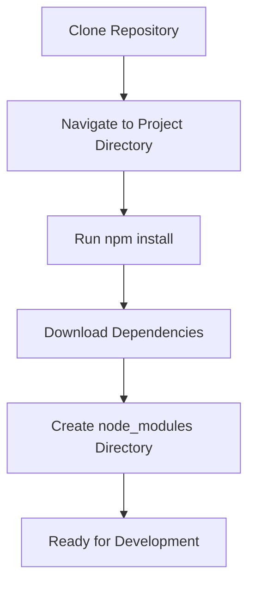
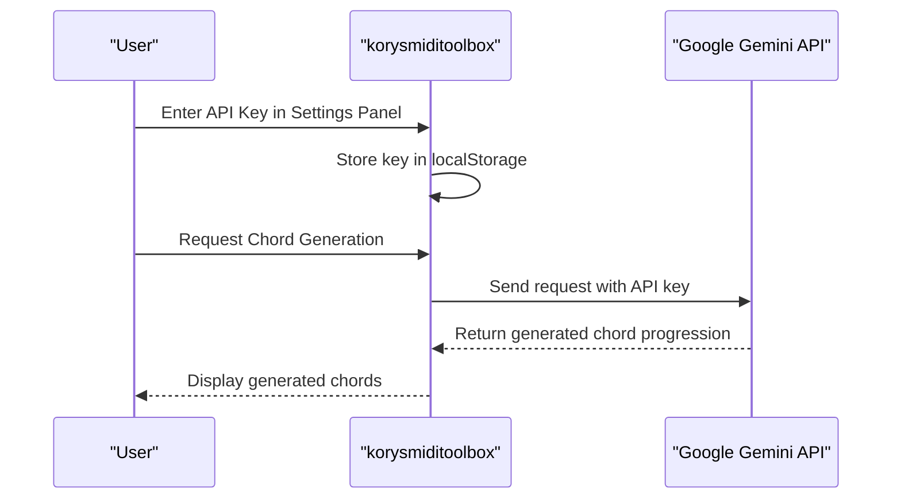
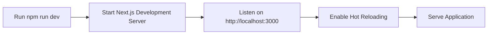
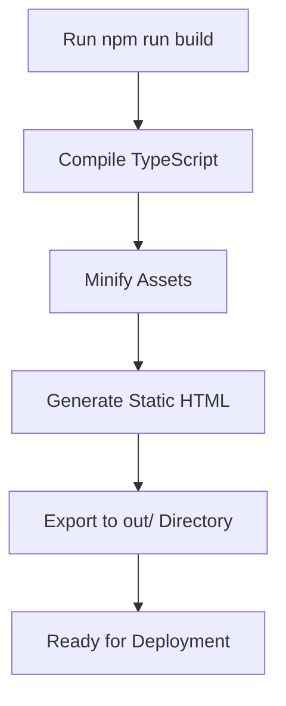
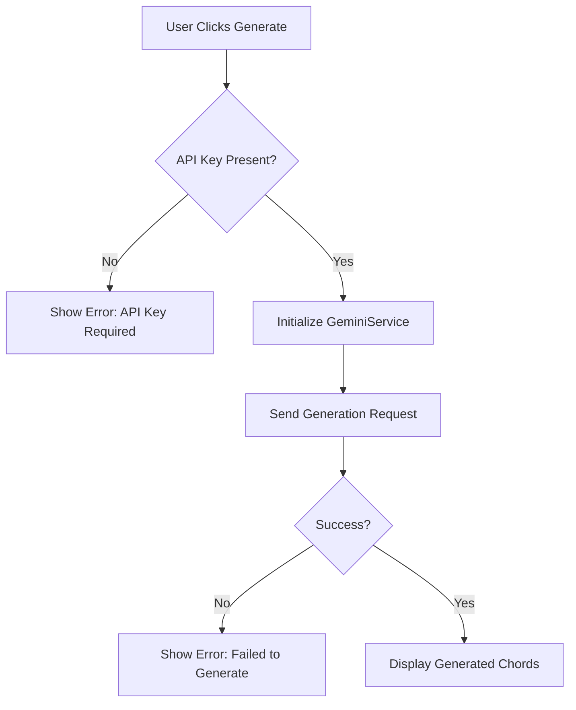

# Getting Started

<cite>
**Referenced Files in This Document**  
- [package.json](file://package.json)
- [next.config.ts](file://next.config.ts)
- [tsconfig.json](file://tsconfig.json)
- [README.md](file://README.md)
- [geminiService.ts](file://src/services/geminiService.ts)
- [SettingsPanel.tsx](file://src/components/SettingsPanel.tsx)
- [ControlBar.tsx](file://src/components/ControlBar.tsx)
</cite>

## Table of Contents
1. [Development Environment Setup](#development-environment-setup)
2. [Repository Installation](#repository-installation)
3. [Dependency Management](#dependency-management)
4. [Configuration Requirements](#configuration-requirements)
5. [Running the Development Server](#running-the-development-server)
6. [Production Build Process](#production-build-process)
7. [Configuration File Reference](#configuration-file-reference)
8. [Troubleshooting Common Issues](#troubleshooting-common-issues)

## Development Environment Setup

Before beginning development with korysmiditoolbox, ensure your system meets the required prerequisites. The application requires Node.js version 18 or higher to function properly due to its use of modern JavaScript features and Next.js 15 framework requirements.

To verify your Node.js version, open a terminal and run:
```bash
node --version
```

If Node.js is not installed or your version is below 18, download and install the latest LTS version from the official Node.js website. The installation includes npm (Node Package Manager), which will be used to manage project dependencies.

**Section sources**
- [README.md](file://README.md#L20-L25)

## Repository Installation

To begin working with the korysmiditoolbox project, clone the repository from its source location. This creates a local copy of the codebase on your machine for development and customization.

Execute the following commands in your terminal:
```bash
git clone <repository-url>
cd korysmiditoolbox
```

Replace `<repository-url>` with the actual URL of the korysmiditoolbox repository. This could be from GitHub, GitLab, or another source control platform. After cloning, navigate into the project directory to access all configuration files and source code.

The repository contains a complete Next.js application structure with TypeScript support, organized into logical directories for components, services, and configuration files.

**Section sources**
- [README.md](file://README.md#L28-L32)

## Dependency Management

After cloning the repository, install all required dependencies using npm. The package.json file defines both production and development dependencies necessary for the application to function correctly.

Run the installation command:
```bash
npm install
```

This command reads the package.json file and downloads all specified packages into the node_modules directory. Key dependencies include:

- **@google/generative-ai**: Enables AI-powered chord progression generation via Google Gemini API
- **Next.js 15**: Modern React framework providing server-side rendering and static site generation
- **React 19**: Latest version of the React library for building user interfaces
- **Tailwind CSS**: Utility-first CSS framework for styling components
- **Tone.js**: Web Audio framework for real-time audio playback and synthesis
- **midi-writer-js**: Library for generating MIDI files from musical data

The installation process also sets up development tools including ESLint for code quality enforcement and TypeScript compilation.



**Diagram sources**
- [package.json](file://package.json#L1-L33)

**Section sources**
- [package.json](file://package.json#L1-L33)

## Configuration Requirements

### Google Gemini API Key

The korysmiditoolbox application requires a Google Gemini API key to enable AI-powered chord progression generation. This key must be obtained separately from the Google AI Studio console.

To configure your API key:

1. Visit [Google AI Studio](https://aistudio.google.com/) and create an account if you don't have one
2. Create a new project or select an existing one
3. Navigate to the API keys section and generate a new API key
4. Copy the generated key for use in the application

The API key is stored locally in your browser's localStorage when entered through the application interface. It is never transmitted to any external servers beyond Google's API endpoints, ensuring your credentials remain secure.



**Diagram sources**
- [geminiService.ts](file://src/services/geminiService.ts#L1-L70)
- [SettingsPanel.tsx](file://src/components/SettingsPanel.tsx#L53-L85)

**Section sources**
- [geminiService.ts](file://src/services/geminiService.ts#L1-L70)
- [SettingsPanel.tsx](file://src/components/SettingsPanel.tsx#L53-L85)

## Running the Development Server

Once dependencies are installed, start the development server using the predefined npm script. This launches the Next.js development environment with hot reloading capabilities.

Execute the following command:
```bash
npm run dev
```

This command runs the `next dev` script defined in package.json, which starts the development server. By default, Next.js applications run on port 3000. After the server starts successfully, open your web browser and navigate to:

[http://localhost:3000](http://localhost:3000)

The development server provides several helpful features:
- **Hot Module Replacement (HMR)**: Changes to code are instantly reflected in the browser without full page reloads
- **Error Overlay**: Compilation errors are displayed directly in the browser interface
- **API Route Support**: Backend API endpoints are accessible under the `/api` path
- **Static File Serving**: Files in the public directory are served at the root URL



**Diagram sources**
- [package.json](file://package.json#L6-L7)
- [README.md](file://README.md#L40-L43)

**Section sources**
- [package.json](file://package.json#L6-L7)
- [README.md](file://README.md#L40-L43)

## Production Build Process

When ready to deploy the application, create a production-optimized build using the build script. This generates static files suitable for hosting on any static web server.

Run the build command:
```bash
npm run build
```

This executes `next build`, which performs several optimization steps:
- Compiles TypeScript to JavaScript
- Minifies CSS and JavaScript assets
- Generates static HTML pages
- Optimizes images (though unoptimized in this configuration)
- Creates the output directory structure

After successful completion, the built files are exported to the `out/` directory as configured in next.config.ts. This directory contains all static assets needed for deployment, including HTML, JavaScript, CSS, and media files.

To serve the production build locally for testing:
```bash
npm run start
```

This command serves the static files from the `out/` directory using a minimal HTTP server.



**Diagram sources**
- [next.config.ts](file://next.config.ts#L3-L5)
- [package.json](file://package.json#L7-L8)

**Section sources**
- [next.config.ts](file://next.config.ts#L3-L5)
- [package.json](file://package.json#L7-L8)

## Configuration File Reference

### next.config.ts

The next.config.ts file contains essential configuration for the Next.js framework. Key settings include:

- **output: 'export'**: Configures the application for static site generation, producing standalone HTML/CSS/JS files in the `out/` directory
- **trailingSlash: true**: Ensures all routes include a trailing slash for consistent URL structure
- **images.unoptimized: true**: Disables Next.js image optimization since the application primarily deals with audio/MIDI data rather than complex imagery
- **reactStrictMode: true**: Enables strict mode for React, helping identify potential issues in components

This configuration supports the application's goal of being deployable as a static site on platforms like GitHub Pages, Netlify, or Vercel without requiring server-side rendering capabilities.

**Section sources**
- [next.config.ts](file://next.config.ts#L1-L12)

### tsconfig.json

The tsconfig.json file defines TypeScript compilation options for the project:

- **target: "ES2017"**: Specifies the ECMAScript version to compile down to, ensuring compatibility with modern browsers
- **module: "esnext"**: Uses the latest module syntax for optimal tree-shaking and bundling
- **jsx: "preserve"**: Preserves JSX syntax for processing by the Next.js build system
- **strict: true**: Enables all strict type-checking options for improved code quality
- **paths: {"@/*": ["./src/*"]}**: Sets up absolute imports from the src directory using the @ alias

These settings ensure type safety across the codebase while maintaining compatibility with the Next.js framework's expectations.

**Section sources**
- [tsconfig.json](file://tsconfig.json#L1-L22)

## Troubleshooting Common Issues

### Version Mismatches

Ensure you are using Node.js 18 or higher, as earlier versions may cause compatibility issues with Next.js 15 and its dependencies. Check your version with `node --version`. If using a version manager like nvm, switch to a compatible version:

```bash
nvm install 18
nvm use 18
```

Clear npm cache and reinstall dependencies if encountering strange behavior:
```bash
npm cache clean --force
rm -rf node_modules package-lock.json
npm install
```

### API Key Validation

If chord generation fails despite entering an API key:

1. Verify the key format appears correct (typically starting with "AIza")
2. Ensure no extra spaces were copied with the key
3. Confirm the key has permissions enabled for the Gemini API
4. Check browser developer tools console for specific error messages
5. Try regenerating the API key in Google AI Studio

The application validates the API key presence before making requests, displaying appropriate error messages when missing or invalid.



**Diagram sources**
- [geminiService.ts](file://src/services/geminiService.ts#L28-L69)
- [ControlBar.tsx](file://src/components/ControlBar.tsx#L98-L128)

**Section sources**
- [geminiService.ts](file://src/services/geminiService.ts#L28-L69)
- [ControlBar.tsx](file://src/components/ControlBar.tsx#L98-L128)

### Port Conflicts

If port 3000 is already in use by another application, the development server will fail to start. Resolve this by either:

1. Terminating the process using port 3000:
```bash
# On Windows
netstat -ano | findstr :3000
taskkill /PID <process-id> /F

# On macOS/Linux
lsof -i :3000
kill -9 <process-id>
```

2. Or starting Next.js on an alternative port:
```bash
npm run dev -- -p 3001
```

This starts the development server on port 3001 instead. Access the application at [http://localhost:3001](http://localhost:3001).

**Section sources**
- [README.md](file://README.md#L42-L43)