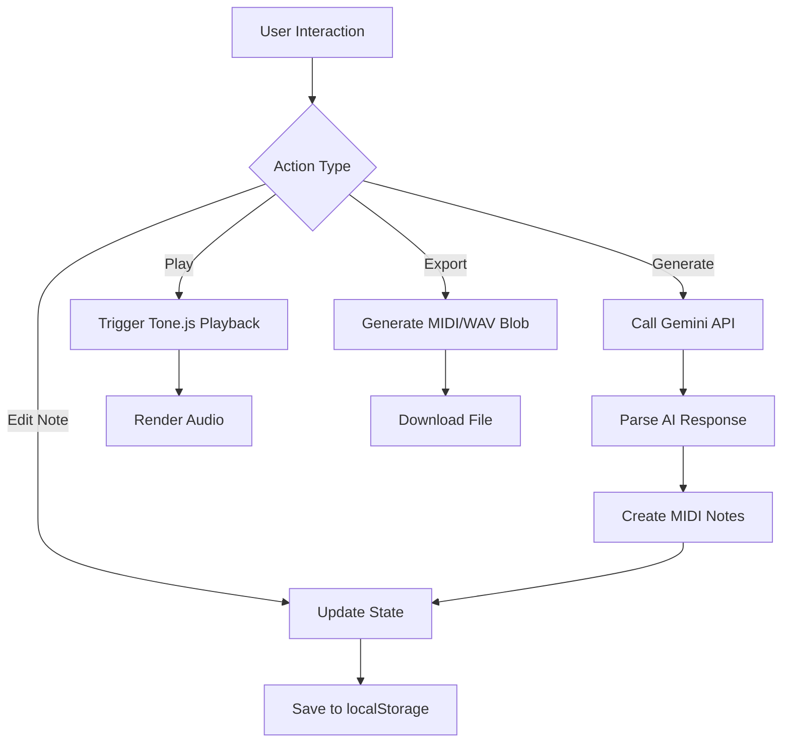
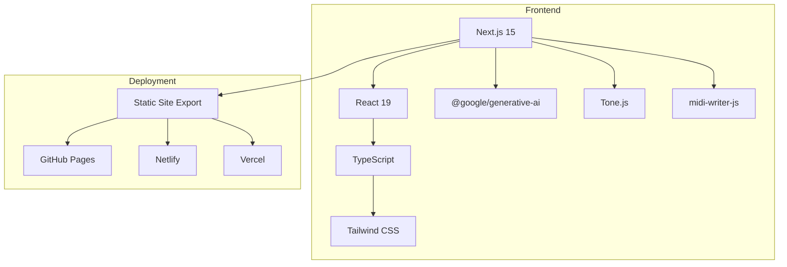
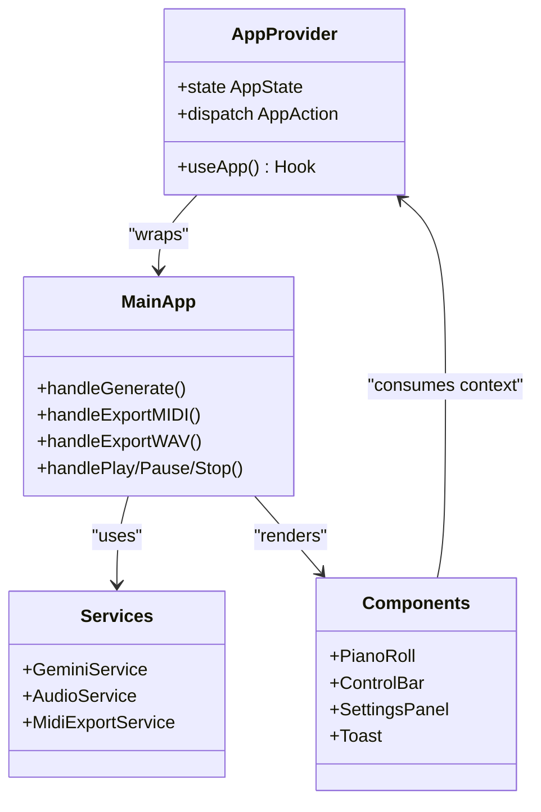

# Project Overview

<cite>
**Referenced Files in This Document**   
- [README.md](file://README.md)
- [package.json](file://package.json)
- [next.config.ts](file://next.config.ts)
- [src/pages/index.tsx](file://src/pages/index.tsx)
- [src/services/geminiService.ts](file://src/services/geminiService.ts)
- [src/services/audioService.ts](file://src/services/audioService.ts)
- [src/services/midiExportService.ts](file://src/services/midiExportService.ts)
- [src/context/AppContext.tsx](file://src/context/AppContext.tsx)
- [src/components/PianoRoll.tsx](file://src/components/PianoRoll.tsx)
- [src/components/SettingsPanel.tsx](file://src/components/SettingsPanel.tsx)
- [src/types/index.ts](file://src/types/index.ts)
</cite>

## Table of Contents
1. [Introduction](#introduction)
2. [Core Functionality](#core-functionality)
3. [Technology Stack](#technology-stack)
4. [Architecture Overview](#architecture-overview)
5. [Key Features](#key-features)
6. [AI Integration](#ai-integration)
7. [Audio and MIDI Processing](#audio-and-midi-processing)
8. [State Management](#state-management)
9. [Deployment Model](#deployment-model)
10. [Security Considerations](#security-considerations)

## Introduction

The Korys MIDI Toolbox is a modern web-based application designed for music creators seeking an intuitive interface for composing, editing, and exporting MIDI chord progressions. Unlike traditional Digital Audio Workstations (DAWs) that require extensive technical knowledge and often come with high costs, this tool provides a streamlined experience focused specifically on chord progression creation enhanced by artificial intelligence.

Built as a contemporary alternative to applications like ChordChord, the toolbox combines visual piano roll editing with AI-powered generation capabilities using Google's Gemini API. The application enables users to generate musical ideas quickly, edit them visually, preview audio in real time, and export compositions in standard formats—all within a browser environment without requiring installation or complex setup.

This documentation provides a comprehensive overview of the project's architecture, functionality, and implementation details, serving both developers interested in extending the tool and musicians wanting to understand its capabilities and limitations.

**Section sources**
- [README.md](file://README.md#L1-L20)
- [package.json](file://package.json#L1-L5)

## Core Functionality

The Korys MIDI Toolbox delivers a complete workflow for MIDI composition through several integrated components:

- **Interactive Piano Roll Editing**: Users can create and modify musical notes through a visual interface where they can add, move, resize, and delete notes via mouse interactions. Double-clicking adds new notes, dragging moves them across time and pitch axes, and edge-dragging adjusts duration.
  
- **Real-time Audio Playback**: Integrated with Tone.js, the application allows immediate auditioning of compositions directly in the browser. Notes are synthesized using a polyphonic synthesizer with configurable attack, decay, sustain, and release parameters.

- **Multi-format Export**: Compositions can be exported in two industry-standard formats:
  - **MIDI (.mid)**: Preserves note data for further editing in other DAWs
  - **WAV (.wav)**: Renders the composition as an audio file suitable for sharing or mixing

- **Persistent Local Storage**: All user work—including notes, settings, and preferences—is automatically saved to `localStorage`, ensuring continuity between sessions without requiring account creation or cloud storage.

- **Responsive Design**: The interface adapts to various screen sizes, supporting both desktop and tablet usage scenarios.

These functions are orchestrated through the main application component, which coordinates state changes, service calls, and UI updates in response to user actions such as generating progressions, playing back sequences, or exporting files.

**Diagram sources**
- [src/pages/index.tsx](file://src/pages/index.tsx#L100-L150)
- [src/services/audioService.ts](file://src/services/audioService.ts#L50-L80)
- [src/services/midiExportService.ts](file://src/services/midiExportService.ts#L10-L30)

**Section sources**
- [README.md](file://README.md#L25-L50)
- [src/pages/index.tsx](file://src/pages/index.tsx#L100-L150)

## Technology Stack

The application leverages a modern JavaScript ecosystem optimized for performance, developer experience, and static deployment:

- **Framework**: Next.js 15 with static site export (`output: 'export'`), enabling zero-server infrastructure requirements
- **Runtime**: React 19 for component-based UI development with concurrent rendering features
- **Language**: TypeScript for type safety and improved code maintainability
- **Styling**: Tailwind CSS with dark mode support via class-based theming
- **AI Integration**: `@google/generative-ai` SDK for interfacing with Google Gemini API
- **Audio Engine**: Tone.js for Web Audio API abstraction and synthesis
- **MIDI Export**: `midi-writer-js` for generating standard MIDI files from note data
- **UI Components**: Custom-built with Heroicons for SVG icons and clsx/tailwind-merge for conditional class handling

The stack emphasizes client-side execution, minimizing server dependencies and making the application suitable for hosting on any static file server including GitHub Pages, Netlify, or Vercel.

**Diagram sources**
- [package.json](file://package.json#L10-L20)
- [next.config.ts](file://next.config.ts#L1-L5)

**Section sources**
- [README.md](file://README.md#L60-L80)
- [package.json](file://package.json#L10-L25)

## Architecture Overview

The application follows a modular, component-driven architecture centered around React's Context API for global state management. The core structure consists of three primary layers:

1. **Presentation Layer**: UI components organized under `/components` including layout elements, interactive controls, and visualization tools
2. **Service Layer**: Business logic encapsulated in `/services` for external integrations (Gemini, audio, MIDI export)
3. **Data Layer**: State management via React Context with persistence to `localStorage`

The entry point at `index.tsx` initializes the AppProvider context and orchestrates major application flows including AI generation, playback control, and export operations. Services are instantiated conditionally based on configuration (e.g., only initializing GeminiService when an API key exists).

Component hierarchy flows from top-level layout containers (`Header`, `Main`, `Footer`) down to specialized editors (`PianoRoll`, `SettingsPanel`). User interactions trigger dispatches to the central reducer, which updates state and propagates changes throughout the connected components.

**Diagram sources**
- [src/pages/index.tsx](file://src/pages/index.tsx#L1-L50)
- [src/context/AppContext.tsx](file://src/context/AppContext.tsx#L1-L30)

**Section sources**
- [src/pages/index.tsx](file://src/pages/index.tsx#L1-L100)
- [src/context/AppContext.tsx](file://src/context/AppContext.tsx#L1-L50)

## Key Features

### Interactive Piano Roll Editor
The piano roll interface provides a tactile way to compose music through direct manipulation of note blocks on a grid representing time (horizontal axis) and pitch (vertical axis). Implemented as a canvas-based component, it supports:

- Adding notes via double-click
- Moving notes by drag-and-drop
- Resizing note durations by edge-dragging
- Visual feedback for selected notes with glow effects
- Playhead tracking during playback

Keyboard shortcuts include Delete/Backspace for removing selected notes, while modifier keys enable fine-grained control (Shift for finer grid snapping, Alt for chromatic input).

### Settings