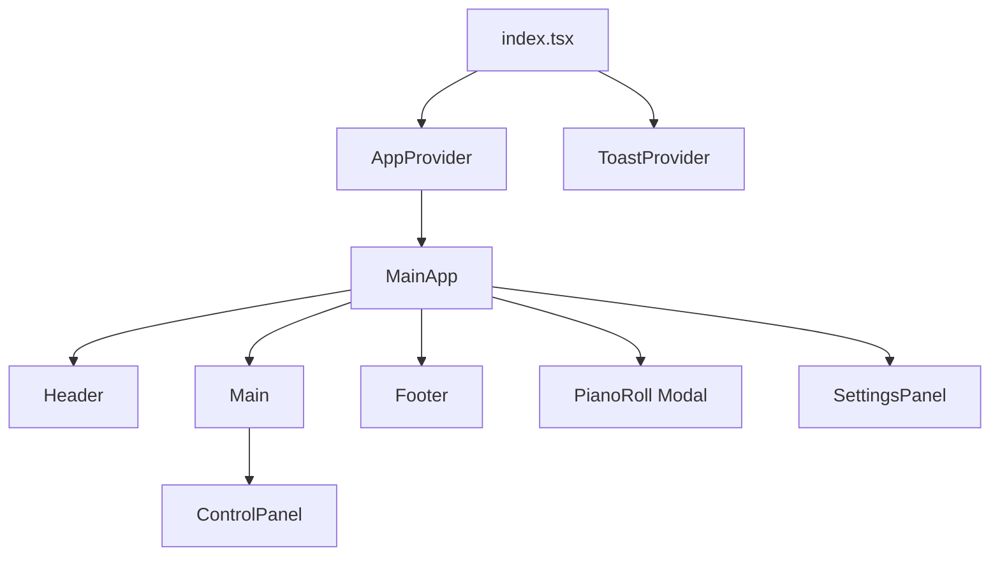
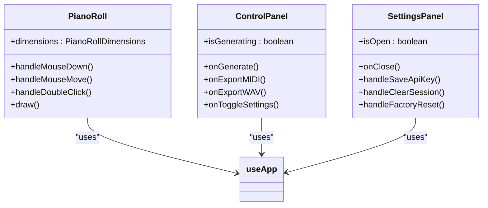
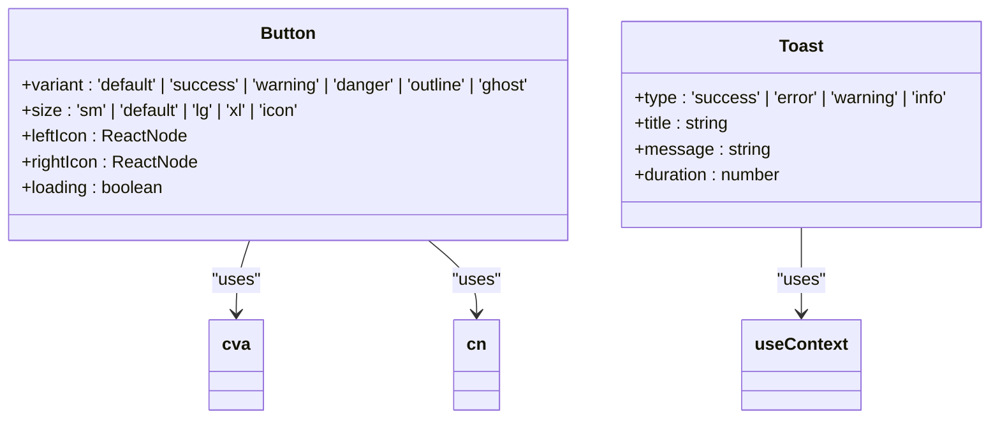
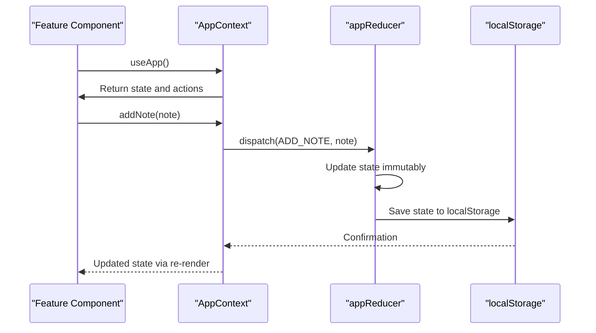
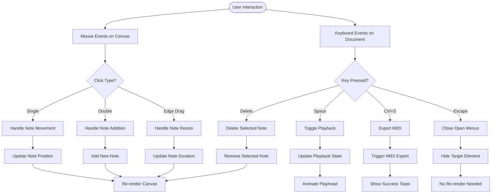

# Component Architecture

<cite>
**Referenced Files in This Document**
- [index.tsx](file://src/pages/index.tsx)
- [Header.tsx](file://src/components/layout/Header.tsx)
- [Main.tsx](file://src/components/layout/Main.tsx)
- [Footer.tsx](file://src/components/layout/Footer.tsx)
- [ControlPanel.tsx](file://src/components/layout/ControlPanel.tsx)
- [PianoRoll.tsx](file://src/components/PianoRoll.tsx)
- [SettingsPanel.tsx](file://src/components/SettingsPanel.tsx)
- [AppContext.tsx](file://src/context/AppContext.tsx)
- [Button.tsx](file://src/components/ui/Button.tsx)
- [Toast.tsx](file://src/components/ui/Toast.tsx)
</cite>

## Table of Contents
1. [Introduction](#introduction)
2. [Component Hierarchy](#component-hierarchy)
3. [Layout Components](#layout-components)
4. [Interactive Music Editing Components](#interactive-music-editing-components)
5. [UI Primitives and Reusable Components](#ui-primitives-and-reusable-components)
6. [State Management and Context Providers](#state-management-and-context-providers)
7. [Canvas-Based Rendering Strategy](#canvas-based-rendering-strategy)
8. [Event Handling and User Interaction](#event-handling-and-user-interaction)
9. [Performance Optimization Techniques](#performance-optimization-techniques)
10. [Conclusion](#conclusion)

## Introduction
The korysmiditoolbox application implements a React component architecture centered around music composition and MIDI editing. The component structure follows a clear separation of concerns between layout, interactive editing features, and reusable UI primitives. Starting from the root index.tsx file, the application composes layout components (Header, Main, Footer) with feature components (ControlBar, PianoRoll, SettingsPanel) to create a cohesive music editing interface. The architecture leverages React Context providers for global state management and employs canvas-based rendering for performance-critical note visualization in the PianoRoll component.

**Section sources**
- [index.tsx](file://src/pages/index.tsx#L1-L50)

## Component Hierarchy
The component hierarchy begins with index.tsx as the root component, which serves as the entry point for the application. This root component wraps the entire application in AppProvider and ToastProvider context providers, establishing the foundation for global state and notification services. The main application structure consists of three primary layout components: Header, Main, and Footer, which provide the overall page structure.

Within this layout, feature components are strategically placed:
- ControlPanel is rendered within the Main component to provide user controls
- PianoRoll is conditionally rendered as a modal when the user opens the editor
- SettingsPanel is rendered at the root level but conditionally displayed based on user interaction

This hierarchical organization creates a clear separation between structural elements and functional components, allowing for modular development and maintenance.

**Diagram sources**
- [index.tsx](file://src/pages/index.tsx#L1-L50)
- [Main.tsx](file://src/components/layout/Main.tsx#L1-L20)

## Layout Components
The application's layout is managed by three primary components that define the visual structure: Header, Main, and Footer. These components work together to create a consistent user interface across the application.

The Header component displays the application title and export controls, providing immediate access to key functionality. The Main component serves as the central content area, implementing a responsive grid layout that adapts to different screen sizes. It contains two primary sections: a control panel on the left and a piano roll preview on the right. The Footer component houses transport controls (play, pause, stop), volume and BPM adjustments, and key signature information, creating a dedicated space for playback controls.

These layout components follow a strict separation from functional components, focusing solely on presentation and structure rather than business logic or state management.

**Section sources**
- [Header.tsx](file://src/components/layout/Header.tsx#L1-L20)
- [Main.tsx](file://src/components/layout/Main.tsx#L1-L20)
- [Footer.tsx](file://src/components/layout/Footer.tsx#L1-L20)

## Interactive Music Editing Components
The core interactive components of the application enable users to create and edit musical compositions. The PianoRoll component serves as the primary editing interface, providing a canvas-based representation of musical notes that users can manipulate directly. This component supports multiple interaction modes including adding notes (via double-click), moving notes (via drag), and resizing notes (via edge handles).

The ControlPanel component provides controls for generating chord progressions, exporting MIDI/WAV files, and accessing settings. It integrates with external services like Gemini for AI-powered music generation. The SettingsPanel component offers configuration options for the application, including API key management and data clearing functionality.

These components implement sophisticated event handling to support keyboard shortcuts (spacebar for play/pause, Ctrl+S for export) and mouse interactions with modifier keys (Alt for chromatic input, Shift for fine grid snapping).

**Diagram sources**
- [PianoRoll.tsx](file://src/components/PianoRoll.tsx#L1-L50)
- [ControlPanel.tsx](file://src/components/layout/ControlPanel.tsx#L1-L20)
- [SettingsPanel.tsx](file://src/components/SettingsPanel.tsx#L1-L20)

## UI Primitives and Reusable Components
The application includes a collection of reusable UI primitives designed for consistency and maintainability. The Button component is a versatile UI element used throughout the application, supporting multiple variants (default, success, warning, danger, etc.) and sizes. It accepts TypeScript interfaces that define its props, ensuring type safety and predictable behavior.

The Toast component provides a notification system for user feedback, with different types (success, error, warning, info) and automatic dismissal. Both components are designed with accessibility in mind, including proper ARIA attributes and keyboard navigation support.

These UI primitives follow a composable pattern, allowing developers to extend their functionality while maintaining a consistent design language across the application. They leverage utility functions like cn() for conditional class name composition and are styled using a dark theme palette.

**Diagram sources**
- [Button.tsx](file://src/components/ui/Button.tsx#L1-L20)
- [Toast.tsx](file://src/components/ui/Toast.tsx#L1-L20)

## State Management and Context Providers
The application employs React Context for global state management through two primary providers: AppProvider and ToastProvider. The AppProvider manages the core application state including notes, playback status, selected notes, and user settings. It exposes a comprehensive API through the useApp hook, providing methods for adding, updating, and deleting notes, as well as managing application settings.

The ToastProvider handles notification state, allowing components to display transient messages to users. It exposes convenience hooks like useToastActions that provide typed functions for different notification types (success, error, warning, info).

Both providers implement persistence by saving state to localStorage, ensuring that user data and preferences survive page reloads. The context providers follow best practices by minimizing re-renders through careful memoization of values and actions.

**Diagram sources**
- [AppContext.tsx](file://src/context/AppContext.tsx#L1-L50)
- [Toast.tsx](file://src/components/ui/Toast.tsx#L1-L50)

## Canvas-Based Rendering Strategy
The PianoRoll component utilizes HTML5 canvas for rendering musical notes, enabling high-performance visualization of potentially large numbers of notes. The canvas approach allows for efficient drawing operations and smooth user interactions, even with complex compositions.

The rendering strategy involves several optimizations:
- Notes are drawn with gradients, rounded corners, and glow effects to enhance visual appeal
- Selected notes are highlighted with distinct colors and borders
- A playhead indicator moves smoothly during playback
- Grid lines and bar markers provide rhythmic context
- Keyboard and mouse interactions are handled directly on the canvas

The draw function is implemented as a useCallback memoized function to prevent unnecessary re-creation, and it's called whenever relevant state changes. The canvas coordinates are calculated based on musical timing (seconds) and pitch (MIDI note numbers), with appropriate scaling to match the visual dimensions.

**Section sources**
- [PianoRoll.tsx](file://src/components/PianoRoll.tsx#L64-L183)

## Event Handling and User Interaction
The application implements comprehensive event handling to support various user interactions. The PianoRoll component captures mouse events (mousedown, mousemove, mouseup, doubleclick) to enable direct manipulation of musical notes. It distinguishes between different interaction modes (moving, resizing start/end) based on cursor position relative to note boundaries.

Keyboard events are captured at the document level to support global shortcuts, including:
- Spacebar for play/pause toggle
- Ctrl+S for MIDI export
- Delete/Backspace for removing selected notes
- Escape to close dropdowns

The event handling system prevents default browser behaviors when appropriate and includes safeguards against unintended actions. For example, the export menu closes when clicking outside or pressing Escape, and form submissions are prevented when using keyboard shortcuts.

**Diagram sources**
- [PianoRoll.tsx](file://src/components/PianoRoll.tsx#L270-L421)
- [index.tsx](file://src/pages/index.tsx#L270-L320)

## Performance Optimization Techniques
The application implements several performance optimizations to ensure smooth operation, particularly in the canvas-intensive PianoRoll component. Memoization is extensively used through useCallback and useMemo hooks to prevent unnecessary re-renders and function recreations.

The animation loop for the playhead uses requestAnimationFrame for smooth 60fps updates, with throttling to avoid excessive state updates. The draw function is optimized to minimize canvas operations and uses efficient path construction for note rendering.

Additional optimizations include:
- Event delegation to minimize event listeners
- Local refs to store mutable values without triggering re-renders
- Conditional rendering of modal components only when needed
- Efficient state updates that preserve referential equality when possible
- Debounced or throttled operations for intensive tasks

These techniques work together to create a responsive user interface even when handling complex musical compositions with numerous notes.

**Section sources**
- [PianoRoll.tsx](file://src/components/PianoRoll.tsx#L27-L66)
- [index.tsx](file://src/pages/index.tsx#L150-L200)

## Conclusion
The korysmiditoolbox component architecture demonstrates a well-structured React application with clear separation of concerns between layout, interactive features, and reusable UI components. By leveraging React Context for global state management and employing canvas-based rendering for performance-critical operations, the application achieves both maintainability and responsiveness. The thoughtful composition of components, combined with effective optimization techniques, creates a robust foundation for a music editing tool that can handle complex user interactions while maintaining a smooth user experience.