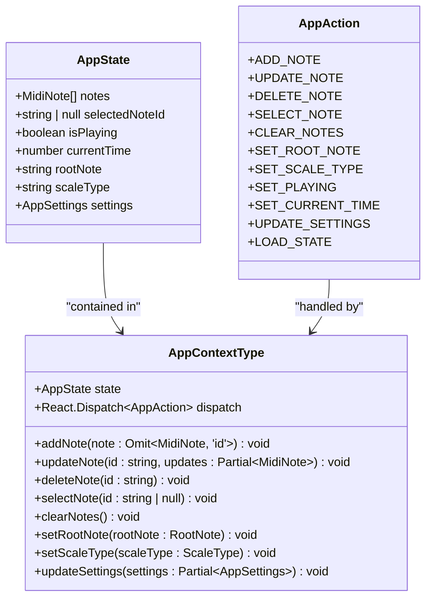
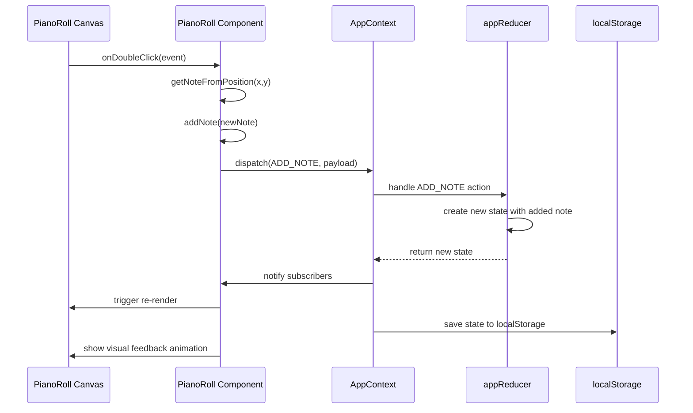
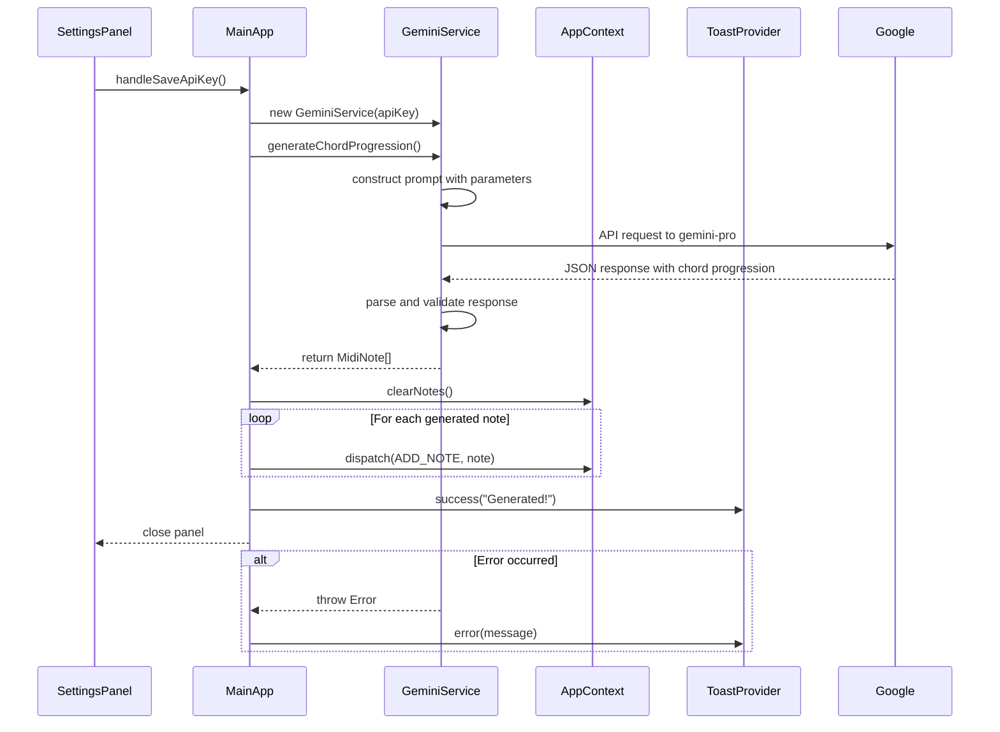
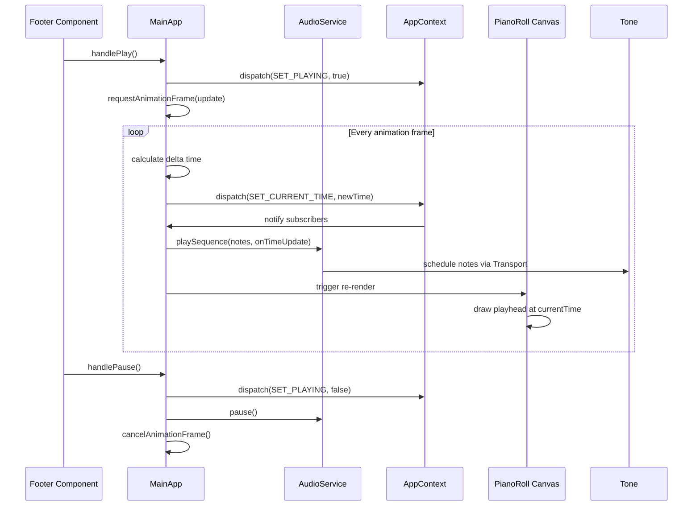
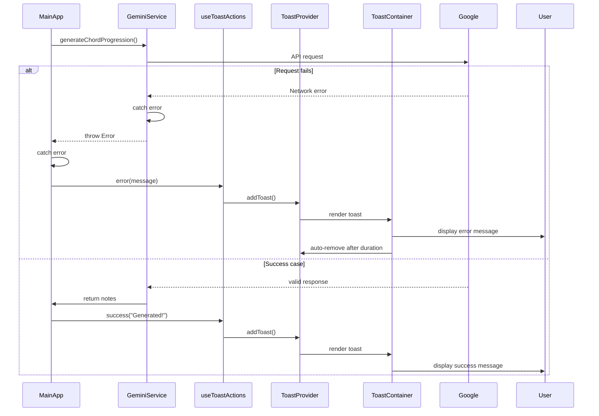
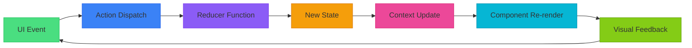

# Data Flow Diagrams

<cite>
**Referenced Files in This Document**   
- [AppContext.tsx](file://src/context/AppContext.tsx)
- [PianoRoll.tsx](file://src/components/PianoRoll.tsx)
- [SettingsPanel.tsx](file://src/components/SettingsPanel.tsx)
- [geminiService.ts](file://src/services/geminiService.ts)
- [audioService.ts](file://src/services/audioService.ts)
- [ControlBar.tsx](file://src/components/ControlBar.tsx)
- [index.tsx](file://src/pages/index.tsx)
- [Toast.tsx](file://src/components/ui/Toast.tsx)
</cite>

## Table of Contents
1. [Introduction](#introduction)
2. [Core State Management](#core-state-management)
3. [User Interaction Flow](#user-interaction-flow)
4. [AI Generation Workflow](#ai-generation-workflow)
5. [Real-Time Playback Loop](#real-time-playback-loop)
6. [Side Effects and Lifecycle Management](#side-effects-and-lifecycle-management)
7. [Error Handling and Notifications](#error-handling-and-notifications)
8. [Unidirectional Data Flow Principles](#unidirectional-data-flow-principles)

## Introduction
This document provides a comprehensive analysis of the data flow architecture in korysmiditoolbox, a MIDI composition tool with AI-powered generation capabilities. The application follows React's unidirectional data flow pattern, centered around a global AppContext that manages state and dispatches actions. User interactions trigger action dispatches that update immutable state, which then propagates changes through the component tree via React's re-rendering mechanism. The system integrates real-time audio playback, AI-driven content generation, and persistent storage while maintaining predictable state transitions through Redux-like patterns.

## Core State Management
The application's state management is implemented through React Context and useReducer, providing a centralized store for all application state. The AppContext maintains the complete state of the MIDI composition environment including notes, playback status, musical parameters, and user preferences.



**Diagram sources**
- [AppContext.tsx](file://src/context/AppContext.tsx#L10-L220)

**Section sources**
- [AppContext.tsx](file://src/context/AppContext.tsx#L10-L220)

## User Interaction Flow
User interactions in the piano roll interface follow a precise event handling sequence that transforms UI events into state mutations. When users double-click on the piano roll canvas, the interaction triggers a series of coordinated operations across multiple components.



**Diagram sources**
- [PianoRoll.tsx](file://src/components/PianoRoll.tsx#L500-L550)
- [AppContext.tsx](file://src/context/AppContext.tsx#L100-L120)

**Section sources**
- [PianoRoll.tsx](file://src/components/PianoRoll.tsx#L500-L550)
- [AppContext.tsx](file://src/context/AppContext.tsx#L100-L120)

## AI Generation Workflow
The AI generation flow begins with user input in the SettingsPanel and proceeds through service invocation, response processing, and state updates. This workflow demonstrates how external API calls are integrated into the application's data flow while maintaining error resilience.



**Diagram sources**
- [SettingsPanel.tsx](file://src/components/SettingsPanel.tsx#L40-L90)
- [geminiService.ts](file://src/services/geminiService.ts#L20-L70)
- [index.tsx](file://src/pages/index.tsx#L140-L180)

**Section sources**
- [SettingsPanel.tsx](file://src/components/SettingsPanel.tsx#L40-L90)
- [geminiService.ts](file://src/services/geminiService.ts#L20-L70)
- [index.tsx](file://src/pages/index.tsx#L140-L180)

## Real-Time Playback Loop
The real-time playback system synchronizes visual elements with audio output using requestAnimationFrame for precise timing. This implementation ensures that the playhead position in the piano roll accurately reflects the current playback time.



**Diagram sources**
- [index.tsx](file://src/pages/index.tsx#L200-L250)
- [audioService.ts](file://src/services/audioService.ts#L48-L80)
- [Footer.tsx](file://src/components/layout/Footer.tsx#L50-L80)

**Section sources**
- [index.tsx](file://src/pages/index.tsx#L200-L250)
- [audioService.ts](file://src/services/audioService.ts#L48-L80)

## Side Effects and Lifecycle Management
The application employs useEffect hooks to manage various side effects including audio initialization, animation frames, and persistent storage. These effects are carefully orchestrated to ensure proper resource management and data consistency.

```mermaid
flowchart TD
A[Component Mount] --> B{Load Saved State}
B --> C[localStorage.getItem('state')]
C --> D{Parse Success?}
D --> |Yes| E[dispatch LOAD_STATE]
D --> |No| F[Use defaultState]
E --> G
F --> G
G[State Change Detected] --> H{Which Property Changed?}
H --> |notes, rootNote, scaleType| I[Save to korysmiditoolbox-state]
H --> |settings| J[Save to korysmiditoolbox-settings]
I --> K[localStorage.setItem()]
J --> K
L[Audio Service] --> M{initialize()}
M --> N[Tone.start()]
N --> O[Create PolySynth]
O --> P[Set isInitialized=true]
Q[Animation Frame] --> R{isPlaying?}
R --> |Yes| S[requestAnimationFrame(update)]
S --> T[Calculate delta time]
T --> U[dispatch SET_CURRENT_TIME]
U --> V[Schedule next frame]
R --> |No| W[Cancel animation frame]
X[Cleanup] --> Y[Remove event listeners]
Y --> Z[Cancel animation frames]
Z --> AA[Clear intervals/timers]
```

**Diagram sources**
- [AppContext.tsx](file://src/context/AppContext.tsx#L150-L180)
- [audioService.ts](file://src/services/audioService.ts#L10-L30)
- [index.tsx](file://src/pages/index.tsx#L200-L250)

**Section sources**
- [AppContext.tsx](file://src/context/AppContext.tsx#L150-L180)
- [audioService.ts](file://src/services/audioService.ts#L10-L30)

## Error Handling and Notifications
Error propagation and user feedback are managed through a toast notification system that provides immediate visual feedback for both successful operations and error conditions. Errors from service calls are caught and transformed into user-friendly messages.



**Diagram sources**
- [geminiService.ts](file://src/services/geminiService.ts#L50-L70)
- [Toast.tsx](file://src/components/ui/Toast.tsx#L100-L150)
- [index.tsx](file://src/pages/index.tsx#L160-L180)

**Section sources**
- [geminiService.ts](file://src/services/geminiService.ts#L50-L70)
- [Toast.tsx](file://src/components/ui/Toast.tsx#L100-L150)

## Unidirectional Data Flow Principles
The application strictly adheres to unidirectional data flow principles, ensuring predictable state transitions and maintainable code structure. All state changes occur through explicit action dispatches, preventing arbitrary mutations and making the application's behavior more debuggable and testable.



The immutability principle is enforced through object spreading in the reducer, ensuring that each state transition creates a new state object rather than modifying the existing one. This approach enables reliable change detection in React components and facilitates features like time-travel debugging and state persistence.

**Diagram sources**
- [AppContext.tsx](file://src/context/AppContext.tsx#L100-L140)
- [PianoRoll.tsx](file://src/components/PianoRoll.tsx#L50-L100)

**Section sources**
- [AppContext.tsx](file://src/context/AppContext.tsx#L100-L140)