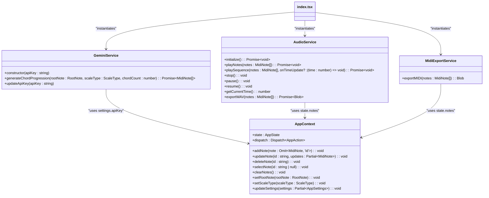

# Service Layer Design

<cite>
**Referenced Files in This Document **   
- [geminiService.ts](file://src/services/geminiService.ts)
- [audioService.ts](file://src/services/audioService.ts)
- [midiExportService.ts](file://src/services/midiExportService.ts)
- [AppContext.tsx](file://src/context/AppContext.tsx)
- [index.tsx](file://src/pages/index.tsx)
</cite>

## Table of Contents
1. [Introduction](#introduction)
2. [Project Structure](#project-structure)
3. [Core Components](#core-components)
4. [Architecture Overview](#architecture-overview)
5. [Detailed Component Analysis](#detailed-component-analysis)
6. [Dependency Analysis](#dependency-analysis)
7. [Performance Considerations](#performance-considerations)
8. [Troubleshooting Guide](#troubleshooting-guide)
9. [Conclusion](#conclusion)

## Introduction
The korysmiditoolbox application implements a modular service layer design that encapsulates business logic and external integrations for music generation and audio processing. The service layer consists of three primary classes: geminiService for AI-generated chord progressions via Google's Generative AI API, audioService for Web Audio synthesis and WAV export using Tone.js, and midiExportService for generating downloadable MIDI files via midi-writer-js. These services interact with the global AppState managed by AppContext, providing a clean separation between state management and business logic. The services expose asynchronous methods for key operations such as generating chord progressions, playing notes in real-time, and exporting audio files, with comprehensive error handling patterns to manage failures in external API calls and browser APIs.

## Project Structure
The project follows a well-organized structure with clear separation of concerns. The service layer components are located in the `src/services` directory, which contains three dedicated TypeScript files for each service class. These services depend on the global state management system implemented in `src/context/AppContext.tsx`, which uses React Context and useReducer for state management. The main application page at `src/pages/index.tsx` initializes and coordinates these services, while UI components access them through functional calls rather than dependency injection containers. The type definitions in `src/types/index.ts` provide shared interfaces across the application, ensuring type safety in service interactions.

**Diagram sources **
- [geminiService.ts](file://src/services/geminiService.ts)
- [audioService.ts](file://src/services/audioService.ts)
- [midiExportService.ts](file://src/services/midiExportService.ts)
- [AppContext.tsx](file://src/context/AppContext.tsx)
- [index.tsx](file://src/pages/index.tsx)

**Section sources**
- [geminiService.ts](file://src/services/geminiService.ts)
- [audioService.ts](file://src/services/audioService.ts)
- [midiExportService.ts](file://src/services/midiExportService.ts)
- [AppContext.tsx](file://src/context/AppContext.tsx)
- [index.tsx](file://src/pages/index.tsx)

## Core Components
The core components of the service layer include three specialized service classes that handle distinct aspects of music generation and audio processing. The geminiService class manages interactions with Google's Generative AI API to create chord progressions based on musical parameters like root note and scale type. The audioService class handles real-time audio synthesis and offline rendering using Tone.js, providing both playback and WAV export capabilities. The midiExportService class specializes in generating standard MIDI files from the application's internal note representation, enabling users to download their compositions in a widely compatible format. All services depend on the global AppState from AppContext for configuration and data access, but maintain their own internal state for service-specific concerns like audio context initialization.

**Section sources**
- [geminiService.ts](file://src/services/geminiService.ts#L1-L70)
- [audioService.ts](file://src/services/audioService.ts#L1-L199)
- [midiExportService.ts](file://src/services/midiExportService.ts#L1-L80)

## Architecture Overview
The service layer architecture follows a dependency inversion principle where high-level modules (services) define abstractions that low-level modules (external libraries) implement. Each service encapsulates its specific domain logic and external integrations while depending on the global AppState for shared configuration and data. The services are instantiated and managed in the main application component (`index.tsx`) using useRef hooks, allowing them to persist across renders while maintaining reactivity to state changes. This design enables functional dependency injection where services are passed to UI components through props rather than relying on DI containers. The architecture promotes loose coupling between components, making it easy to extend the application with new services or replace existing implementations.

**Diagram sources **
- [geminiService.ts](file://src/services/geminiService.ts)
- [audioService.ts](file://src/services/audioService.ts)
- [midiExportService.ts](file://src/services/midiExportService.ts)
- [AppContext.tsx](file://src/context/AppContext.tsx)
- [index.tsx](file://src/pages/index.tsx)

## Detailed Component Analysis

### GeminiService Analysis
The GeminiService class provides an interface to Google's Generative AI API for creating AI-generated chord progressions based on musical theory parameters. It encapsulates the complexity of API authentication, request formatting, and response parsing, exposing a simple method for generating chord progressions.

#### For Object-Oriented Components:

**Diagram sources **
- [geminiService.ts](file://src/services/geminiService.ts#L1-L70)

#### For API/Service Components:

**Diagram sources **
- [geminiService.ts](file://src/services/geminiService.ts#L1-L70)

**Section sources**
- [geminiService.ts](file://src/services/geminiService.ts#L1-L70)
- [index.tsx](file://src/pages/index.tsx#L61-L104)

### AudioService Analysis
The AudioService class manages all audio-related functionality including real-time synthesis with Tone.js and offline rendering for WAV export. It handles the lifecycle of the audio context and provides methods for playing sequences and exporting audio files.

#### For Object-Oriented Components:

**Diagram sources **
- [audioService.ts](file://src/services/audioService.ts#L1-L199)

#### For API/Service Components:

**Diagram sources **
- [audioService.ts](file://src/services/audioService.ts#L1-L199)

**Section sources**
- [audioService.ts](file://src/services/audioService.ts#L1-L199)
- [index.tsx](file://src/pages/index.tsx#L101-L146)

### MidiExportService Analysis
The MidiExportService class handles the generation of downloadable MIDI files from the application's internal note representation. It converts the application's time-based note data into the tick-based timing system used by MIDI files.

#### For Object-Oriented Components:

**Diagram sources **
- [midiExportService.ts](file://src/services/midiExportService.ts#L1-L80)

#### For API/Service Components:

**Diagram sources **
- [midiExportService.ts](file://src/services/midiExportService.ts#L1-L80)

**Section sources**
- [midiExportService.ts](file://src/services/midiExportService.ts#L1-L80)
- [index.tsx](file://src/pages/index.tsx#L61-L104)

### Conceptual Overview
The service layer design follows a functional approach to dependency management, avoiding traditional dependency injection containers in favor of direct instantiation and prop passing. This pattern simplifies the architecture while maintaining good separation of concerns. Services are stateful objects that manage their own internal state (like audio context initialization) while depending on the global AppState for shared configuration and data. The asynchronous nature of many operations reflects the underlying web APIs they wrap, with proper error handling to manage network failures and API limitations.

## Dependency Analysis
The service layer components have well-defined dependencies that follow the dependency inversion principle. Each service depends on abstractions provided by external libraries rather than concrete implementations, making them easier to test and maintain. The geminiService depends on @google/generative-ai for API communication, audioService depends on tone for audio synthesis, and midiExportService depends on midi-writer-js for MIDI file generation. All services depend on the global AppState from AppContext for configuration and data access, creating a unidirectional data flow from state management to service logic. The main application component (index.tsx) acts as a composition root, instantiating the services and passing them to UI components as needed.

**Diagram sources **
- [package.json](file://package.json#L1-L33)
- [geminiService.ts](file://src/services/geminiService.ts)
- [audioService.ts](file://src/services/audioService.ts)
- [midiExportService.ts](file://src/services/midiExportService.ts)
- [AppContext.tsx](file://src/context/AppContext.tsx)
- [index.tsx](file://src/pages/index.tsx)

**Section sources**
- [package.json](file://package.json#L1-L33)
- [geminiService.ts](file://src/services/geminiService.ts)
- [audioService.ts](file://src/services/audioService.ts)
- [midiExportService.ts](file://src/services/midiExportService.ts)
- [AppContext.tsx](file://src/context/AppContext.tsx)
- [index.tsx](file://src/pages/index.tsx)

## Performance Considerations
The service layer design incorporates several performance considerations for client-side music applications. The audioService uses Tone.js's OfflineAudioContext for WAV export, which renders audio off the main thread to prevent UI blocking during potentially long rendering processes. The geminiService implements prompt engineering to guide the AI toward producing valid JSON output, reducing the need for extensive post-processing. The midiExportService efficiently groups notes by start time to create chords in the MIDI output, minimizing the number of events in the generated file. All services implement lazy initialization patterns, with audioService initializing the audio context only when needed and geminiService creating the API client only when an API key is provided. These optimizations ensure responsive user experience even during intensive operations like AI generation and audio rendering.

**Section sources**
- [audioService.ts](file://src/services/audioService.ts#L149-L197)
- [geminiService.ts](file://src/services/geminiService.ts#L20-L45)
- [midiExportService.ts](file://src/services/midiExportService.ts#L15-L25)

## Troubleshooting Guide
Common issues in the service layer typically relate to API key configuration, browser permissions, and audio context initialization. For geminiService, ensure the API key is properly set in the settings panel and stored in localStorage. The application checks for API key presence before making requests and provides appropriate error messages. For audioService, browser security policies require a user gesture (like a button click) to initialize the audio context, so playback operations must be triggered by user interaction. The service implements graceful error handling for failed audio initialization, logging errors to the console while allowing the application to continue functioning. For midiExportService, the main consideration is ensuring the input notes array is properly formatted with valid MIDI note numbers, start times, durations, and velocities. All services implement comprehensive error handling with descriptive messages to aid debugging.

**Section sources**
- [geminiService.ts](file://src/services/geminiService.ts#L50-L70)
- [audioService.ts](file://src/services/audioService.ts#L15-L25)
- [midiExportService.ts](file://src/services/midiExportService.ts#L10-L15)
- [SettingsPanel.tsx](file://src/components/SettingsPanel.tsx#L53-L85)

## Conclusion
The service layer design in korysmidit