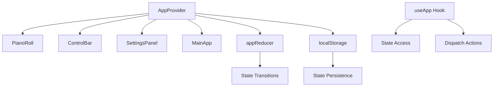
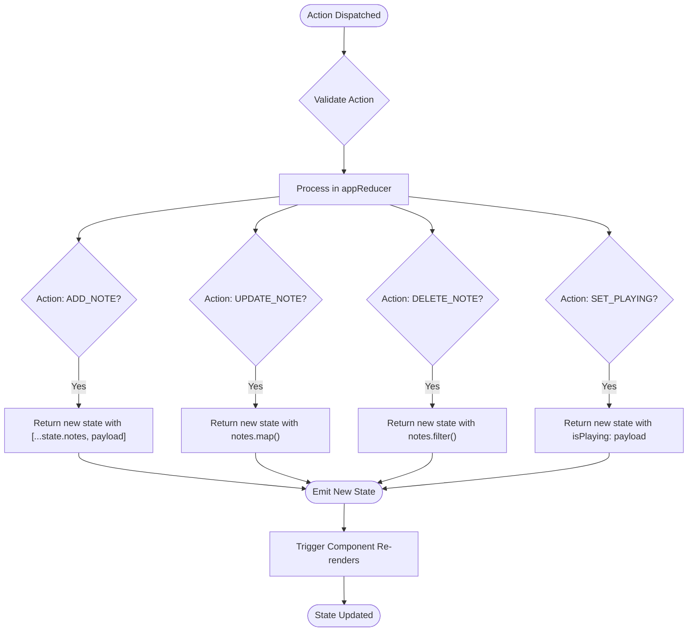
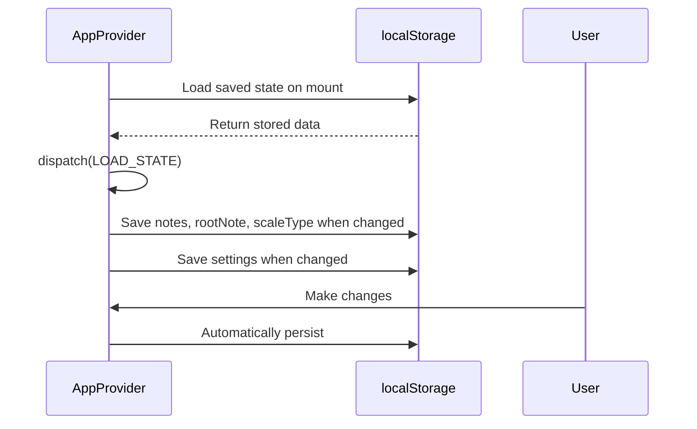
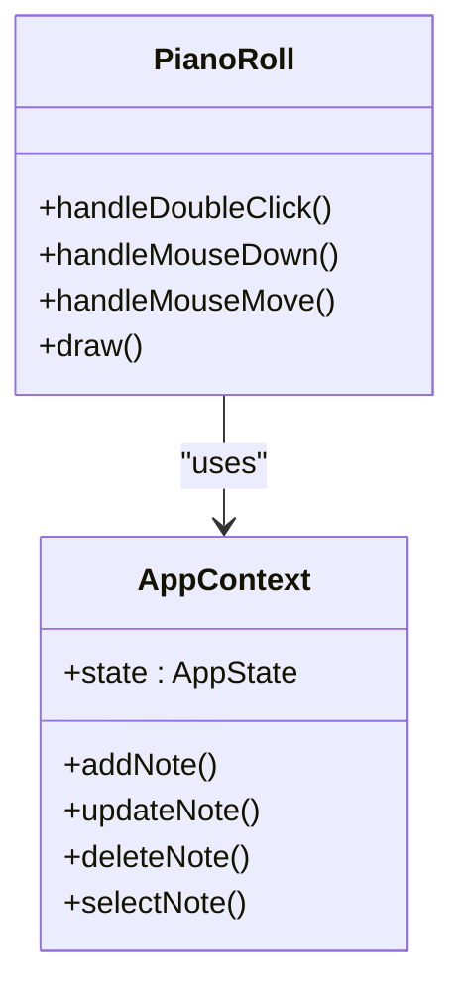

# State Management System

<cite>
**Referenced Files in This Document**   
- [AppContext.tsx](file://src/context/AppContext.tsx)
- [index.ts](file://src/types/index.ts)
- [PianoRoll.tsx](file://src/components/PianoRoll.tsx)
- [ControlBar.tsx](file://src/components/ControlBar.tsx)
- [SettingsPanel.tsx](file://src/components/SettingsPanel.tsx)
- [index.tsx](file://src/pages/index.tsx)
</cite>

## Table of Contents
1. [Introduction](#introduction)
2. [Core Architecture](#core-architecture)
3. [AppState Interface and Properties](#appstate-interface-and-properties)
4. [Reducer Pattern and Immutable State Updates](#reducer-pattern-and-immutable-state-updates)
5. [Action Types and Dispatch Mechanism](#action-types-and-dispatch-mechanism)
6. [Persistence with localStorage](#persistence-with-localstorage)
7. [Custom useApp Hook](#custom-useapp-hook)
8. [Component Integration Examples](#component-integration-examples)
9. [Context API vs External Libraries](#context-api-vs-external-libraries)
10. [Optimization Strategies](#optimization-strategies)

## Introduction
The state management system in this application implements a robust pattern using React Context API combined with the useReducer hook to manage complex application state. This architecture centralizes state for MIDI notes, playback controls, musical parameters, and user preferences while maintaining type safety through TypeScript interfaces. The system enables components throughout the application to access and modify shared state without prop drilling, providing a clean separation between state logic and UI presentation.

## Core Architecture
The state management system follows a unidirectional data flow pattern where all state changes are triggered by dispatched actions processed through a reducer function. The AppProvider component wraps the application tree, making state and update functions available to all descendants via context. This approach combines the simplicity of React's built-in state management with the predictability of Redux-style reducers, creating a maintainable solution for managing complex state interactions in a music production interface.



**Diagram sources**
- [AppContext.tsx](file://src/context/AppContext.tsx#L1-L220)

**Section sources**
- [AppContext.tsx](file://src/context/AppContext.tsx#L1-L220)

## AppState Interface and Properties
The AppState interface defines the complete shape of the application's state, encompassing both musical data and user interface settings. This typed structure ensures consistency across the codebase and provides autocomplete support for developers working with the state.

### Key Properties of AppState
| Property | Type | Description |
|--------|------|-------------|
| **notes** | MidiNote[] | Array of MIDI note objects containing pitch, timing, and velocity information |
| **selectedNoteId** | string \| null | Identifier of the currently selected note for editing operations |
| **isPlaying** | boolean | Playback status flag controlling the animation and audio engine |
| **currentTime** | number | Current playback position in seconds, updated during playback |
| **rootNote** | string | Root note of the current scale (e.g., 'C', 'G#') |
| **scaleType** | string | Scale/mode type (e.g., 'Major', 'Minor', 'Dorian') |
| **settings** | AppSettings | User preferences including theme, snapping options, and API credentials |

**Section sources**
- [index.ts](file://src/types/index.ts#L15-L23)

## Reducer Pattern and Immutable State Updates
The system employs a reducer pattern that ensures all state updates are performed immutably, preventing unintended side effects and enabling predictable state transitions. Each action type corresponds to a specific state transformation implemented through object spreading and array methods that create new references rather than modifying existing ones.



**Diagram sources**
- [AppContext.tsx](file://src/context/AppContext.tsx#L81-L133)

**Section sources**
- [AppContext.tsx](file://src/context/AppContext.tsx#L81-L133)

## Action Types and Dispatch Mechanism
The system defines a comprehensive set of action types that cover all possible state modifications, from basic CRUD operations on MIDI notes to updates of playback status and application settings. These actions are dispatched using React's built-in dispatch function provided by the useReducer hook.

### Available Action Types
- **ADD_NOTE**: Adds a new MIDI note to the sequence
- **UPDATE_NOTE**: Modifies properties of an existing note
- **DELETE_NOTE**: Removes a note from the sequence
- **SELECT_NOTE**: Sets the currently selected note for editing
- **CLEAR_NOTES**: Removes all notes from the sequence
- **SET_ROOT_NOTE**: Changes the root note of the current scale
- **SET_SCALE_TYPE**: Changes the scale/mode type
- **SET_PLAYING**: Toggles playback state
- **SET_CURRENT_TIME**: Updates the current playback position
- **UPDATE_SETTINGS**: Modifies user preferences
- **LOAD_STATE**: Restores state from persistence

Each action creator function encapsulates the dispatch call with the appropriate action type and payload, providing a clean API for components to interact with the state management system.

**Section sources**
- [AppContext.tsx](file://src/context/AppContext.tsx#L167-L219)

## Persistence with localStorage
The system implements automatic persistence of critical state data using localStorage, ensuring users don't lose their work between sessions. Two separate useEffect hooks handle the saving and loading of different state segments with appropriate dependencies.

### Persistence Strategy


The implementation separates state persistence into two categories:
1. **Musical State**: Notes, root note, and scale type are saved together under 'korysmiditoolbox-state'
2. **User Settings**: Application preferences are saved separately under 'korysmiditoolbox-settings'

This separation allows settings to persist independently of musical content and enables selective restoration of different state aspects.

**Section sources**
- [AppContext.tsx](file://src/context/AppContext.tsx#L128-L172)

## Custom useApp Hook
The custom useApp hook provides type-safe access to the application context throughout the component tree, eliminating the need for direct useContext calls and improving developer experience through autocompletion and type checking.

```typescript
export function useApp() {
  const context = useContext(AppContext);
  if (context === undefined) {
    throw new Error('useApp must be used within an AppProvider');
  }
  return context;
}
```

The hook returns an object containing:
- **state**: The current application state
- **dispatch**: Function to dispatch actions
- **addNote**: Convenience method for adding notes
- **updateNote**: Convenience method for updating notes
- **deleteNote**: Convenience method for removing notes
- **selectNote**: Method for selecting notes
- **clearNotes**: Method for clearing all notes
- **setRootNote**: Method for changing the root note
- **setScaleType**: Method for changing the scale type
- **updateSettings**: Method for updating application settings

This abstraction simplifies component code by providing direct access to commonly used state manipulation functions.

**Section sources**
- [AppContext.tsx](file://src/context/AppContext.tsx#L213-L219)

## Component Integration Examples
Multiple components throughout the application integrate with the state management system to provide interactive functionality for users.

### PianoRoll Integration
The PianoRoll component uses the context to access notes and selection state while providing callbacks for note manipulation:



User interactions in the piano roll trigger state updates:
- Double-click adds a new note via `addNote`
- Drag operations update note position/duration via `updateNote`
- Clicking selects notes via `selectNote`
- Delete key removes selected notes via `deleteNote`

**Diagram sources**
- [PianoRoll.tsx](file://src/components/PianoRoll.tsx#L0-L438)

**Section sources**
- [PianoRoll.tsx](file://src/components/PianoRoll.tsx#L0-L438)

### ControlBar Integration
The ControlBar component allows users to modify musical parameters through dropdown selectors:

```mermaid
sequenceDiagram
    participant User as User
    participant ControlBar as ControlBar
    participant Context as AppContext
    
    User->>ControlBar: