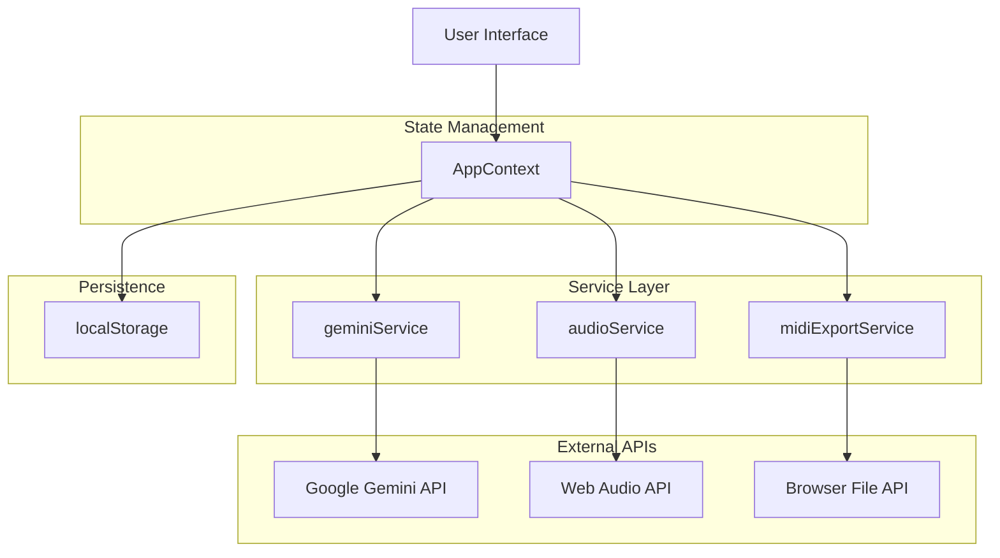
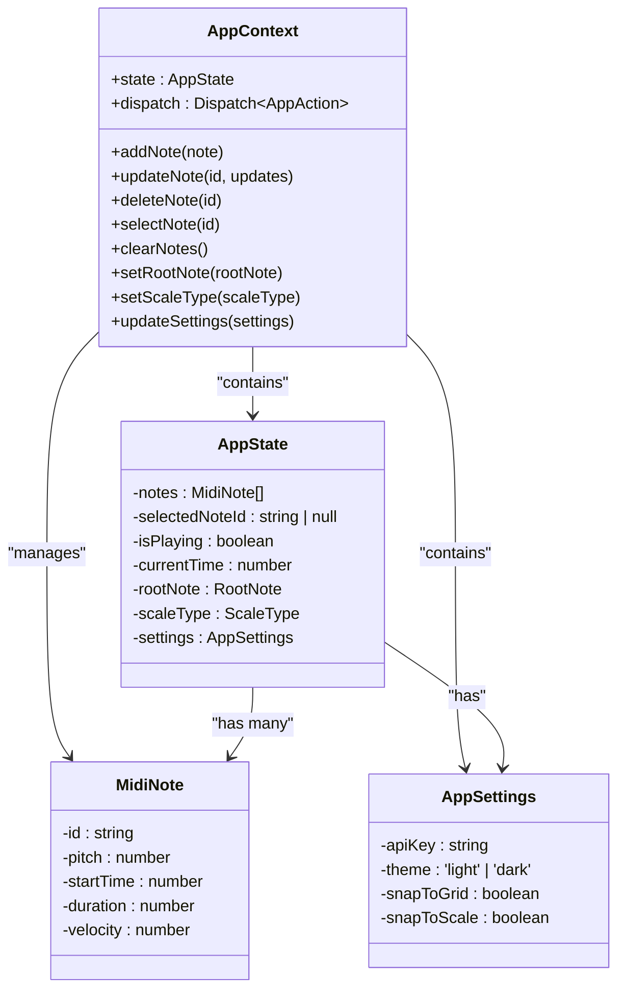
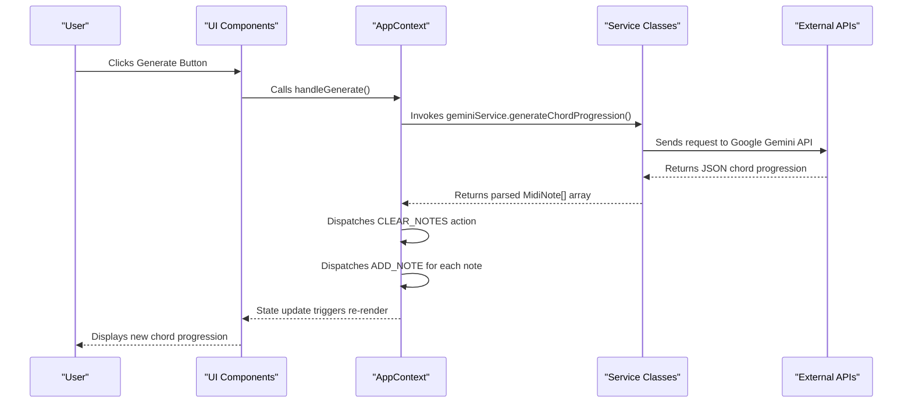
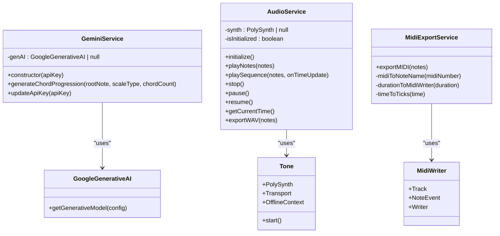
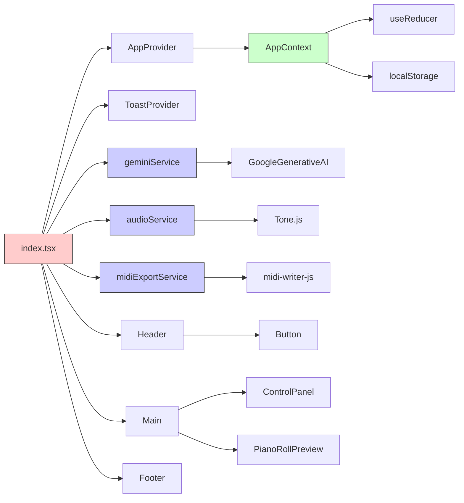

# Technical Architecture

<cite>
**Referenced Files in This Document**   
- [AppContext.tsx](file://src/context/AppContext.tsx)
- [geminiService.ts](file://src/services/geminiService.ts)
- [audioService.ts](file://src/services/audioService.ts)
- [midiExportService.ts](file://src/services/midiExportService.ts)
- [index.tsx](file://src/pages/index.tsx)
- [Main.tsx](file://src/components/layout/Main.tsx)
- [types/index.ts](file://src/types/index.ts)
</cite>

## Table of Contents
1. [Introduction](#introduction)
2. [Project Structure](#project-structure)
3. [Core Components](#core-components)
4. [Architecture Overview](#architecture-overview)
5. [Detailed Component Analysis](#detailed-component-analysis)
6. [Dependency Analysis](#dependency-analysis)
7. [Performance Considerations](#performance-considerations)
8. [Troubleshooting Guide](#troubleshooting-guide)
9. [Conclusion](#conclusion)

## Introduction
The korysmiditoolbox application is a web-based MIDI composition tool that leverages AI-powered chord progression generation, real-time audio playback, and file export capabilities. Built with React and Next.js, the application integrates Google's Gemini API for AI music generation, Tone.js for Web Audio synthesis, and midi-writer-js for MIDI file creation. The architecture emphasizes client-side state management, secure API key handling, and responsive UI components organized in a hierarchical structure.

## Project Structure

```mermaid
graph TB
subgraph "src"
subgraph "components"
layout["layout/"]
ui["ui/"]
ControlBar["ControlBar.tsx"]
PianoRoll["PianoRoll.tsx"]
SettingsPanel["SettingsPanel.tsx"]
end
subgraph "context"
AppContext["AppContext.tsx"]
end
subgraph "pages"
index["index.tsx"]
end
subgraph "services"
gemini["geminiService.ts"]
audio["audioService.ts"]
midiExport["midiExportService.ts"]
end
subgraph "types"
types["index.ts"]
end
subgraph "utils"
utils["defaultProgression.ts"]
end
end
AppContext --> index
gemini --> index
audio --> index
midiExport --> index
types --> AppContext
types --> services
```

**Diagram sources**
- [AppContext.tsx](file://src/context/AppContext.tsx#L0-L220)
- [index.tsx](file://src/pages/index.tsx#L0-L330)
- [types/index.ts](file://src/types/index.ts#L0-L41)

**Section sources**
- [AppContext.tsx](file://src/context/AppContext.tsx#L0-L220)
- [index.tsx](file://src/pages/index.tsx#L0-L330)

## Core Components

The application's core functionality revolves around three main service classes and a global state management system. The AppContext provides centralized state using React's Context API with a reducer pattern, while specialized services handle AI generation, audio processing, and file export operations. User interactions flow through a hierarchy of React components that consume context state and trigger service methods.

**Section sources**
- [AppContext.tsx](file://src/context/AppContext.tsx#L0-L220)
- [geminiService.ts](file://src/services/geminiService.ts#L0-L70)
- [audioService.ts](file://src/services/audioService.ts#L0-L198)
- [midiExportService.ts](file://src/services/midiExportService.ts#L0-L79)

## Architecture Overview



**Diagram sources**
- [AppContext.tsx](file://src/context/AppContext.tsx#L0-L220)
- [geminiService.ts](file://src/services/geminiService.ts#L0-L70)
- [audioService.ts](file://src/services/audioService.ts#L0-L198)
- [midiExportService.ts](file://src/services/midiExportService.ts#L0-L79)

## Detailed Component Analysis

### AppContext State Management



**Diagram sources**
- [AppContext.tsx](file://src/context/AppContext.tsx#L0-L220)
- [types/index.ts](file://src/types/index.ts#L0-L41)

#### Data Flow Sequence



**Diagram sources**
- [index.tsx](file://src/pages/index.tsx#L61-L104)
- [geminiService.ts](file://src/services/geminiService.ts#L0-L70)
- [AppContext.tsx](file://src/context/AppContext.tsx#L0-L220)

### Service Layer Architecture

```mermaid
graph TD
A[geminiService] --> |Generates| B[MidiNote[]]
C[audioService] --> |Plays| D[Web Audio]
C --> |Exports| E[WAV Blob]
F[midiExportService] --> |Exports| G[MIDI Blob]
B --> C
B --> F
H[AppContext] --> A
H --> C
H --> F
style A fill:#f9f,stroke:#333
style C fill:#f9f,stroke:#333
style F fill:#f9f,stroke:#333
```

**Diagram sources**
- [geminiService.ts](file://src/services/geminiService.ts#L0-L70)
- [audioService.ts](file://src/services/audioService.ts#L0-L198)
- [midiExportService.ts](file://src/services/midiExportService.ts#L0-L79)

#### Service Class Relationships



**Diagram sources**
- [geminiService.ts](file://src/services/geminiService.ts#L0-L70)
- [audioService.ts](file://src/services/audioService.ts#L0-L198)
- [midiExportService.ts](file://src/services/midiExportService.ts#L0-L79)

## Dependency Analysis



**Diagram sources**
- [index.tsx](file://src/pages/index.tsx#L0-L330)
- [AppContext.tsx](file://src/context/AppContext.tsx#L0-L220)
- [services/*.ts](file://src/services/)

**Section sources**
- [index.tsx](file://src/pages/index.tsx#L0-L330)
- [AppContext.tsx](file://src/context/AppContext.tsx#L0-L220)

## Performance Considerations

The application implements several performance optimizations including canvas-based rendering for the piano roll component, efficient state updates through React's useReducer hook, and lazy