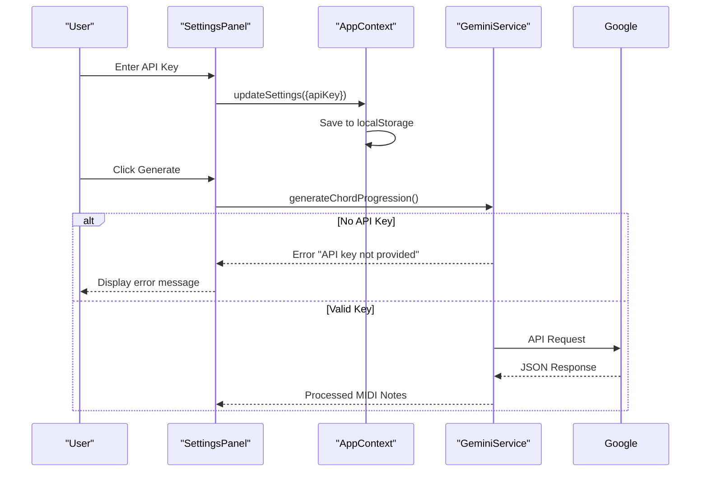
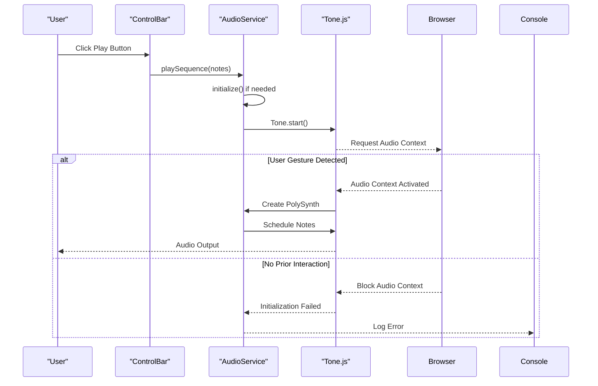
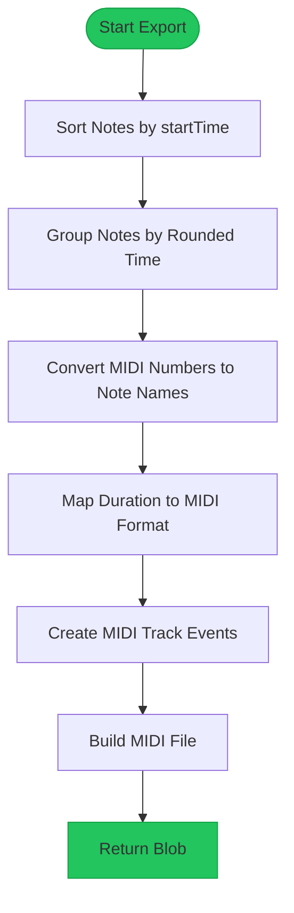

# Troubleshooting

<cite>
**Referenced Files in This Document**   
- [geminiService.ts](file://src/services/geminiService.ts)
- [audioService.ts](file://src/services/audioService.ts)
- [midiExportService.ts](file://src/services/midiExportService.ts)
- [AppContext.tsx](file://src/context/AppContext.tsx)
- [SettingsPanel.tsx](file://src/components/SettingsPanel.tsx)
- [PianoRoll.tsx](file://src/components/PianoRoll.tsx)
- [midiUtils.ts](file://src/utils/midiUtils.ts)
</cite>

## Table of Contents
1. [API Key and Gemini Integration Issues](#api-key-and-gemini-integration-issues)
2. [Audio Playback Problems](#audio-playback-problems)
3. [MIDI Export Failures](#midi-export-failures)
4. [LocalStorage Persistence and Browser Compatibility](#localstorage-persistence-and-browser-compatibility)
5. [Debugging Strategies](#debugging-strategies)
6. [Performance Optimization](#performance-optimization)
7. [Known Limitations and Edge Cases](#known-limitations-and-edge-cases)

## API Key and Gemini Integration Issues

### API Key Validation Errors
When the Google Gemini API key is missing or invalid, users encounter generation failures. The application validates the API key through the `GeminiService` class constructor and `generateChordProgression` method. If no key is provided during service initialization, the method throws an error with the message "API key not provided". When users attempt to generate chord progressions without a valid key, they receive the user-facing error: "Failed to generate chord progression. Please check your API key and try again."

The API key is stored in the application settings within `AppContext` and persisted in localStorage under the key 'korysmiditoolbox-settings'. Users can input or update their API key through the SettingsPanel component, which securely stores the key as a password field to prevent visual exposure.

**Diagram sources**
- [SettingsPanel.tsx](file://src/components/SettingsPanel.tsx#L53-L85)
- [AppContext.tsx](file://src/context/AppContext.tsx#L0-L37)
- [geminiService.ts](file://src/services/geminiService.ts#L0-L36)

**Section sources**
- [geminiService.ts](file://src/services/geminiService.ts#L0-L70)
- [SettingsPanel.tsx](file://src/components/SettingsPanel.tsx#L53-L85)

### Network Issues and Quota Limits
Network connectivity problems or Google API quota limitations can cause the `generateContent` method to fail. The application handles these issues through try-catch blocks in the `generateChordProgression` method, logging detailed errors to the console while presenting a generic error message to users. Network timeouts, CORS restrictions, or quota exhaustion will trigger the catch block, resulting in the same user-facing error about checking the API key.

CORS considerations are handled automatically by the Google Generative AI client library, which makes requests from the browser directly to Google's API endpoints. However, ad blockers or strict content security policies may interfere with these requests. The application does not implement specific retry logic for network failures, so transient connectivity issues require manual regeneration attempts by the user.

**Section sources**
- [geminiService.ts](file://src/services/geminiService.ts#L32-L69)

## Audio Playback Problems

### Browser Autoplay Policies
Modern browsers enforce strict autoplay policies that prevent audio playback without a direct user interaction. The korysmiditoolbox application addresses this by initializing the Tone.js audio context only after a user gesture (such as clicking the play button). The `AudioService` class implements an `initialize` method that calls `Tone.start()` - this method must be triggered by a user action to comply with browser autoplay policies.

If users attempt to play audio immediately after loading the page without first interacting with the interface, playback will fail silently. The application should guide users to initiate playback through explicit controls rather than attempting automatic playback on load.

**Diagram sources**
- [audioService.ts](file://src/services/audioService.ts#L0-L55)
- [PianoRoll.tsx](file://src/components/PianoRoll.tsx#L380-L400)

**Section sources**
- [audioService.ts](file://src/services/audioService.ts#L0-L198)

### Tone.js Initialization and Polyfill Requirements
The application relies on Tone.js version 15.1.22 for audio synthesis and sequencing, which in turn depends on the standardized-audio-context library. These Web Audio API polyfills ensure compatibility across different browsers. The `AudioService` class manages the lifecycle of the Tone.js synthesizer, creating a PolySynth with sawtooth oscillators and ADSR envelopes configured with attack: 0.1, decay: 0.2, sustain: 0.5, and release: 0.8 seconds.

Initialization failures may occur in browsers with limited Web Audio API support or when multiple audio contexts conflict. The service implementation includes error handling that logs initialization failures to the console but does not provide fallback audio options. Users experiencing persistent audio issues should verify their browser supports Web Audio API and check for conflicting extensions or system audio settings.

**Section sources**
- [audioService.ts](file://src/services/audioService.ts#L0-L55)
- [package-lock.json](file://package-lock.json#L5840-L5877)

## MIDI Export Failures

### Timing Issues in MIDI Export
The `MidiExportService` converts the application's internal note representation to standard MIDI files using the midi-writer-js library. Timing issues can arise from the conversion process that maps floating-point second values to MIDI ticks. The service uses a fixed tempo assumption of 120 BPM with 480 ticks per quarter note, converting time values through the `timeToTicks` method.

Inaccuracies may occur when notes have very precise timing (sub-16th note resolution) due to the rounding of startTime values to the nearest millisecond in the grouping process. The export algorithm groups notes by start time using `Math.round(note.startTime * 1000)` to create chords, which can cause micro-timing discrepancies in the exported MIDI file compared to the original sequence.

**Diagram sources**
- [midiExportService.ts](file://src/services/midiExportService.ts#L0-L38)
- [PianoRoll.tsx](file://src/components/PianoRoll.tsx#L250-L270)

**Section sources**
- [midiExportService.ts](file://src/services/midiExportService.ts#L0-L79)

### Invalid Note Data Handling
When exporting MIDI files, the service validates note data during the conversion process. The `exportMIDI` method sorts notes by start time and groups them into chords based on identical start times. Each note's pitch is converted from MIDI number to scientific notation (e.g., "C4") using the `midiToNoteName` utility function.

Invalid note data such as out-of-range pitches (not 0-127) or malformed objects may cause the export to fail. The current implementation assumes well-formed input from the application state and does not include extensive validation or sanitization of note data before export. Users who manually edit note properties through developer tools may introduce data that cannot be properly converted to MIDI format.

**Section sources**
- [midiExportService.ts](file://src/services/midiExportService.ts#L0-L79)
- [midiUtils.ts](file://src/utils/midiUtils.ts#L0-L50)

## LocalStorage Persistence and Browser Compatibility

### Persistence Problems
The application uses localStorage to persist both the main application state and user settings. Two separate keys store this information: 'korysmiditoolbox-state' for notes, root note, and scale type, and 'korysmiditoolbox-settings' for user