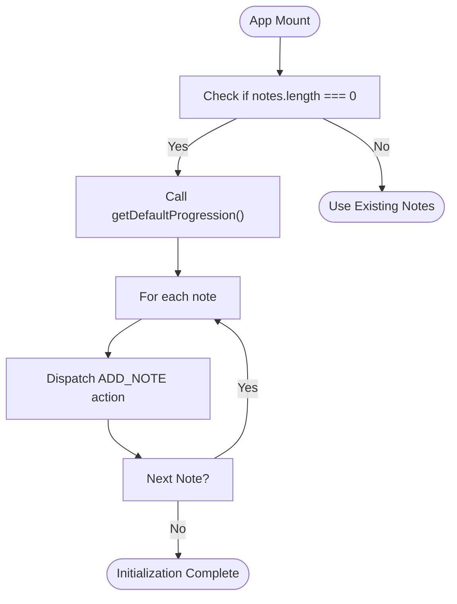

# Composition Workflow

<cite>
**Referenced Files in This Document**   
- [ControlBar.tsx](file://src/components/ControlBar.tsx)
- [index.tsx](file://src/pages/index.tsx)
- [geminiService.ts](file://src/services/geminiService.ts)
- [midiUtils.ts](file://src/utils/midiUtils.ts)
- [defaultProgression.ts](file://src/utils/defaultProgression.ts)
- [AppContext.tsx](file://src/context/AppContext.tsx)
</cite>

## Table of Contents
1. [Introduction](#introduction)
2. [Root Note and Scale Selection](#root-note-and-scale-selection)
3. [AI Generation Trigger and Flow](#ai-generation-trigger-and-flow)
4. [Gemini Service Integration](#gemini-service-integration)
5. [State Management and Note Processing](#state-management-and-note-processing)
6. [Default Progression Initialization](#default-progression-initialization)
7. [Error Handling and User Feedback](#error-handling-and-user-feedback)
8. [Music Theory and MIDI Mapping](#music-theory-and-midi-mapping)
9. [Best Practices for Gemini API Usage](#best-practices-for-gemini-api-usage)
10. [Conclusion](#conclusion)

## Introduction
The composition workflow in korysmiditoolbox enables users to generate musical chord progressions using AI through a streamlined interface. The process begins with selecting a root note and scale type via dropdown controls, which update the application state. When the user triggers generation, the app communicates with Google's Gemini API to create a structured chord progression based on music theory principles. The response is parsed into MIDI-compatible notes, replacing the current sequence in the state. This document details each stage of this workflow, including UI interactions, service integration, state management, and theoretical foundations.

## Root Note and Scale Selection
Users configure the tonal foundation of their composition through two dropdown menus in the ControlBar component: one for selecting the root note and another for choosing the scale type. These selections are bound to the global application state via the AppContext, ensuring consistency across components.

When a user changes either dropdown value, React event handlers invoke context actions (`setRootNote` and `setScaleType`) that dispatch state updates. The available options are derived from constants defined in `midiUtils.ts`: `ROOT_NOTES` provides all twelve chromatic notes, while `SCALE_TYPES` includes seven common modal and harmonic scales.

This configuration directly influences the prompt sent to the AI model, shaping the generated output according to standard Western music theory conventions.

**Section sources**
- [ControlBar.tsx](file://src/components/ControlBar.tsx#L30-L50)
- [midiUtils.ts](file://src/utils/midiUtils.ts#L1-L15)
- [AppContext.tsx](file://src/context/AppContext.tsx#L150-L160)

## AI Generation Trigger and Flow
The AI generation process is initiated by clicking the "Generate" button in the ControlBar, which calls the `handleGenerate` function defined in `index.tsx`. This asynchronous handler orchestrates the entire generation pipeline.

Before proceeding, it validates the presence of a valid Gemini API key stored in `state.settings.apiKey`. If missing, a toast notification prompts the user to configure their settings. Upon successful validation, the function sets `isGenerating` to true, disabling the button and displaying a loading spinner to prevent duplicate requests.

The core logic uses an async/await pattern to call `generateChordProgression` on the GeminiService instance, passing the current `rootNote`, `scaleType`, and a fixed chord count of 4. Once the promise resolves, the existing notes are cleared and the new sequence is added to the state via `ADD_NOTE` actions.

```mermaid
sequenceDiagram
participant UI as ControlBar (UI)
participant Main as MainApp (Logic)
participant Service as GeminiService
participant Context as AppContext (State)
UI->>Main : onClick Generate
Main->>Main : validate apiKey
alt No API Key
Main->>UI : show error toast
stop
end
Main->>Main : setIsGenerating(true)
Main->>Service : generateChordProgression(root, scale, 4)
Service->>Gemini : POST /generateContent
Gemini-->>Service : JSON response
Service-->>Main : Promise<MidiNote[]>
Main->>Context : clearNotes()
loop Each New Note
Main->>Context : dispatch(ADD_NOTE)
end
Main->>Main : success toast
Main->>Main : setIsGenerating(false)
```

**Diagram sources**
- [index.tsx](file://src/pages/index.tsx#L80-L120)
- [ControlBar.tsx](file://src/components/ControlBar.tsx#L100-L110)

**Section sources**
- [index.tsx](file://src/pages/index.tsx#L80-L120)
- [ControlBar.tsx](file://src/components/ControlBar.tsx#L100-L110)

## Gemini Service Integration
The `GeminiService` class encapsulates communication with Google’s Generative AI API. It accepts an API key during instantiation and initializes the `GoogleGenerativeAI` client from the official SDK.

The `generateChordProgression` method constructs a detailed natural language prompt specifying:
- Desired chord count
- Key signature (root + scale)
- Output format (JSON array of MIDI note objects)
- Structural constraints (2-second chords, 3–4 voices per chord)
- Pitch range (MIDI 36–84, corresponding to C2–C5)

After receiving the response, the service extracts the JSON portion using a regular expression, parses it, and validates each field (pitch, startTime, duration, velocity), clamping values to safe ranges. Invalid responses trigger a user-facing error.

This design ensures robustness against malformed AI outputs while maintaining flexibility for future prompt enhancements.

**Section sources**
- [geminiService.ts](file://src/services/geminiService.ts#L15-L70)

## State Management and Note Processing
The application uses React’s Context API with a reducer pattern (`AppContext`) to manage global state. All note modifications occur through dispatched actions, ensuring predictable state transitions.

When AI generation completes, two operations reset and populate the sequence:
1. `clearNotes()` dispatches a `CLEAR_NOTES` action, emptying the `notes` array and deselecting any active note.
2. Each generated note is individually dispatched via `ADD_NOTE`, preserving immutability and enabling fine-grained re-renders.

This approach supports undo/redo functionality (not currently implemented) and facilitates persistence, as the entire state can be serialized to localStorage after each change.

**Section sources**
- [AppContext.tsx](file://src/context/AppContext.tsx#L50-L100)
- [index.tsx](file://src/pages/index.tsx#L105-L115)

## Default Progression Initialization
When the app loads and no notes exist in state (e.g., first visit or cleared session), `useEffect` in `MainApp` invokes `getDefaultProgression()` from `defaultProgression.ts`. This utility returns a predefined four-chord sequence in C Major: C → Am → F → G.

Each chord consists of three notes spanning the middle octaves (C4–C6), with consistent 2-second durations and moderate velocity (0.8). These default notes provide immediate auditory feedback and serve as a template for expected structure before AI generation.

The initialization occurs only once per session unless notes are manually cleared, ensuring continuity during user interaction.



**Diagram sources**
- [defaultProgression.ts](file://src/utils/defaultProgression.ts#L1-L38)
- [index.tsx](file://src/pages/index.tsx#L60-L70)

**Section sources**
- [defaultProgression.ts](file://src/utils/defaultProgression.ts#L1-L38)
- [index.tsx](file://src/pages/index.tsx#L60-L70)

## Error Handling and User Feedback
Robust error handling is implemented at multiple levels. In `handleGenerate`, missing API keys result in descriptive toast notifications advising users to visit settings. During AI generation, try/catch blocks intercept network or parsing errors, logging details to the console and presenting simplified messages to users.

Toast notifications use semantic colors—success (green), error (red)—and auto-dismiss after a few seconds. This non-intrusive feedback mechanism maintains workflow continuity without blocking further interaction.

Additionally, disabled states on buttons prevent invalid operations (e.g., generating without a key), reinforcing usability.

**Section sources**
- [index.tsx](file://src/pages/index.tsx#L90-L100)
- [geminiService.ts](file://src/services/geminiService.ts#L50-L60)

## Music Theory and MIDI Mapping
The app integrates music theory through constants and utilities in `midiUtils.ts`. `ROOT_NOTES` defines all twelve pitch classes, mapped to their respective MIDI numbers via `getMidiNoteNumber`. Similarly, `SCALE_TYPES` correspond to interval