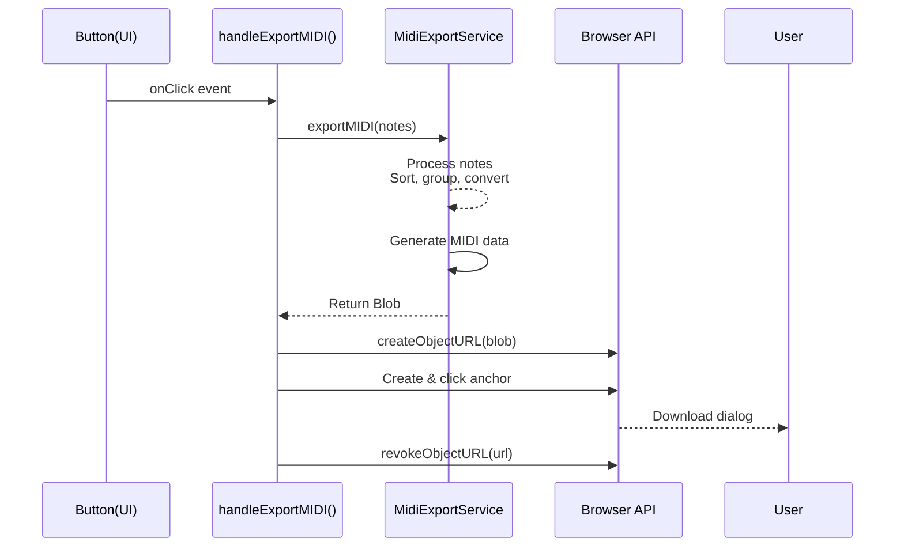
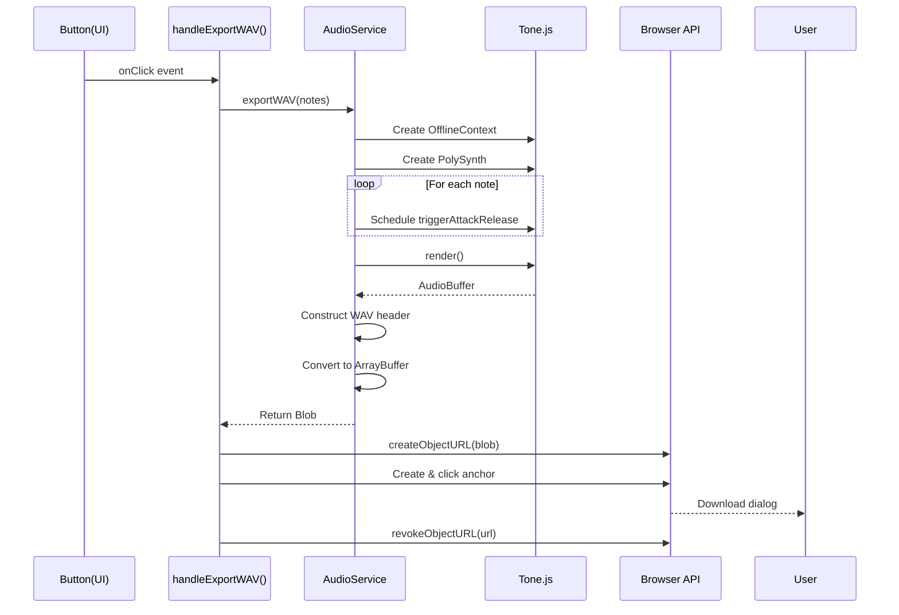
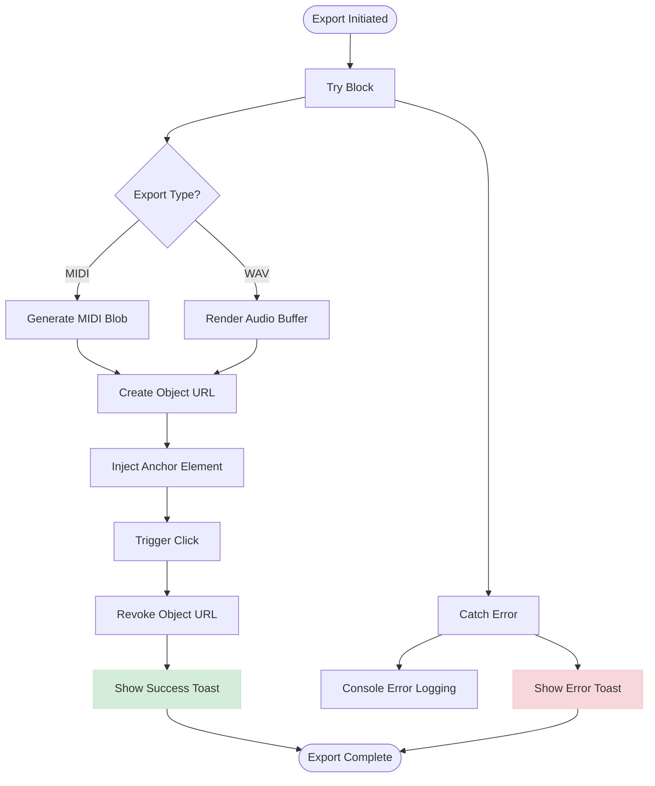

# Export Functionality

<cite>
**Referenced Files in This Document **   
- [index.tsx](file://src/pages/index.tsx)
- [Header.tsx](file://src/components/layout/Header.tsx)
- [ControlBar.tsx](file://src/components/ControlBar.tsx)
- [midiExportService.ts](file://src/services/midiExportService.ts)
- [audioService.ts](file://src/services/audioService.ts)
</cite>

## Table of Contents
1. [Introduction](#introduction)
2. [MIDI Export Flow](#midi-export-flow)
3. [WAV Export Flow](#wav-export-flow)
4. [Error Handling and User Feedback](#error-handaling-and-user-feedback)
5. [Client-Side Limitations](#client-side-limitations)
6. [Troubleshooting Guide](#troubleshooting-guide)

## Introduction
This document details the file export capabilities within Kory's MIDI Toolbox, focusing on both MIDI and WAV export functionalities. The system provides users with two distinct export options accessible through button interactions in the Header and ControlPanel components. These exports are implemented using specialized service classes that handle format-specific generation, leveraging browser APIs for file download initiation and user feedback mechanisms for status communication.

**Section sources**
- [index.tsx](file://src/pages/index.tsx#L60-L146)
- [Header.tsx](file://src/components/layout/Header.tsx#L0-L93)
- [ControlBar.tsx](file://src/components/ControlBar.tsx#L0-L181)

## MIDI Export Flow

The MIDI export functionality begins when a user clicks either the "Export MIDI" button in the Header component or selects "Export MIDI" from the dropdown menu in the ControlPanel. Both UI elements trigger the `handleExportMIDI` function defined in the main application component (`index.tsx`). 

This handler first ensures the `MidiExportService` singleton is initialized, then calls its `exportMIDI` method with the current state's notes array. The service processes these notes by sorting them by start time, grouping simultaneous notes into chords, and converting each note's pitch to standard notation (e.g., C4, D#5) using the `midiToNoteName` utility. Duration and timing information is converted to MIDI-compatible formats based on a 120 BPM assumption.

Once the MIDI data is generated using the midi-writer-js library, it is packaged into a Blob with MIME type 'audio/midi'. The browser's `URL.createObjectURL` creates a temporary URL for this Blob, which is then used to programmatically create and click an anchor element, triggering the download dialog. After the download initiates, the temporary URL is revoked via `URL.revokeObjectURL` to free memory resources.

**Diagram sources **
- [index.tsx](file://src/pages/index.tsx#L101-L117)
- [midiExportService.ts](file://src/services/midiExportService.ts#L0-L78)

**Section sources**
- [index.tsx](file://src/pages/index.tsx#L101-L117)
- [midiExportService.ts](file://src/services/midiExportService.ts#L0-L78)
- [Header.tsx](file://src/components/layout/Header.tsx#L58-L92)
- [ControlBar.tsx](file://src/components/ControlBar.tsx#L143-L162)

## WAV Export Flow

The WAV export process follows a similar initiation pattern but involves significantly more complex audio processing. When the user triggers export via either interface element, the `handleExportWAV` function is called, ensuring the `AudioService` is initialized before proceeding.

Unlike MIDI export, WAV generation requires offline audio rendering using Tone.js. The service creates an `OfflineContext` with specified parameters (2 channels, 10 seconds duration, 44.1kHz sample rate). A polyphonic synthesizer is instantiated within this context with sawtooth oscillator waveform and ADSR envelope settings (attack: 0.1s, decay: 0.2s, sustain: 0.5, release: 0.8s).

Each note from the current state is scheduled in the offline context using `triggerAttackRelease`, with frequency calculated from MIDI pitch values. The entire audio buffer is rendered asynchronously through `offlineContext.render()`. The resulting AudioBuffer is then converted to WAV format by constructing a proper WAV header with RIFF chunk identifiers, format specifications, and 16-bit PCM encoded audio data. The final ArrayBuffer is wrapped in a Blob with 'audio/wav' MIME type, following the same download initiation pattern as MIDI export with temporary URL creation and anchor injection.

**Diagram sources **
- [index.tsx](file://src/pages/index.tsx#L118-L146)
- [audioService.ts](file://src/services/audioService.ts#L101-L197)

**Section sources**
- [index.tsx](file://src/pages/index.tsx#L118-L146)
- [audioService.ts](file://src/services/audioService.ts#L101-L197)
- [Header.tsx](file://src/components/layout/Header.tsx#L58-L92)
- [ControlBar.tsx](file://src/components/ControlBar.tsx#L143-L162)

## Error Handling and User Feedback

Both export functions implement comprehensive error handling using try/catch blocks to capture any exceptions during the export process. Success notifications use the toast notification system with appropriate icons and messages: "MIDI file downloaded successfully!" or "WAV file downloaded successfully!". For failures, error toasts display "Failed to export [format] file." while logging detailed error information to the console.

The WAV export provides additional user feedback by showing a preparatory message ("Preparing your WAV file...") immediately upon initiation, acknowledging the potentially longer processing time required for audio rendering. Filename generation follows a consistent pattern for both formats: `chord-progression-{timestamp}.{extension}` where timestamp is generated using `Date.now()`, ensuring unique filenames for each export.

**Diagram sources **
- [index.tsx](file://src/pages/index.tsx#L101-L146)
- [Toast.tsx](file://src/components/ui/Toast.tsx#L0-L168)

**Section sources**
- [index.tsx](file://src/pages/index.tsx#L101-L146)
- [Toast.tsx](file://src/components/ui/Toast.tsx#L0-L168)

## Client-Side Limitations

The current implementation faces several client-side limitations inherent to browser-based audio processing. WAV rendering performance is constrained by the length and complexity of the chord progression, as longer sequences require more memory and processing time in the offline audio context. Extremely long compositions may exceed browser memory limits or cause tab unresponsiveness during rendering.

Browser-specific behaviors affect export reliability: Safari has stricter autoplay policies that may interfere with audio context initialization, while some mobile browsers limit Web Audio API capabilities. The offline rendering approach assumes a maximum duration of 10 seconds in the current configuration, which may truncate longer compositions. Additionally, the fixed sample rate of 44.1kHz and 16-bit depth cannot be adjusted by users, limiting audio quality customization.

**Section sources**
- [audioService.ts](file://src/services/audioService.ts#L101-L153)

## Troubleshooting Guide

Common issues include failed exports due to CORS restrictions when loading external audio libraries, which can be resolved by ensuring all dependencies are served from the same origin or properly configured CDN. Memory exhaustion during WAV rendering typically manifests as browser tab crashes or unresponsive scripts; users should simplify their chord progressions or close other memory-intensive applications.

If MIDI files appear corrupted, verify that the `midi-writer-js` library is correctly imported and initialized. For silent WAV files, check that the synthesizer envelope settings are properly configured and that note frequencies fall within audible ranges. Users experiencing no response from export buttons should ensure JavaScript is enabled and check browser developer tools for console errors related to missing services or uninitialized audio contexts.

**Section sources**
- [audioService.ts](file://src/services/audioService.ts#L0-L198)
- [midiExportService.ts](file://src/services/midiExportService.ts#L0-L78)
- [index.tsx](file://src/pages/index.tsx#L60-L146)