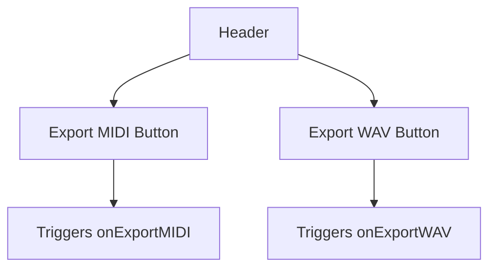
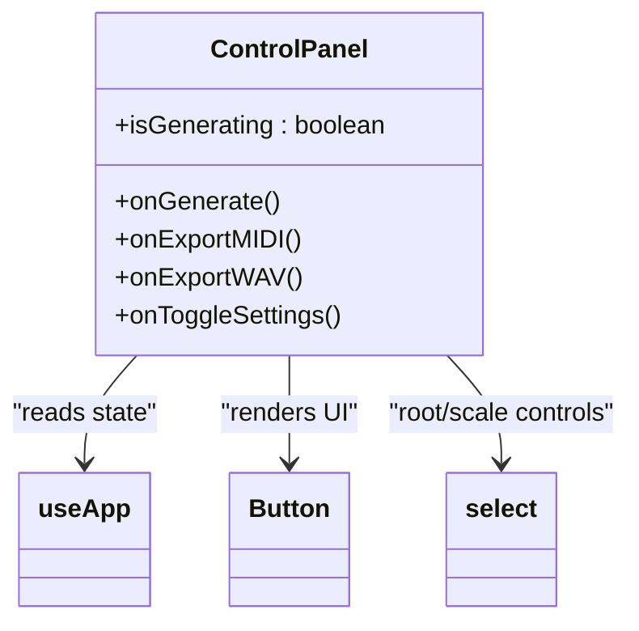
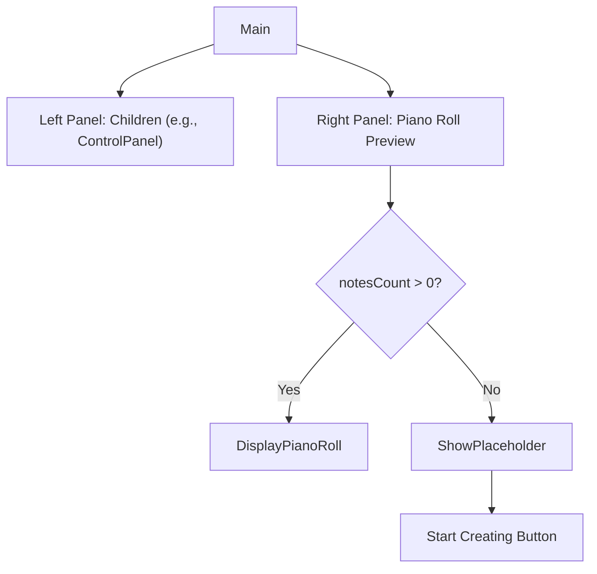
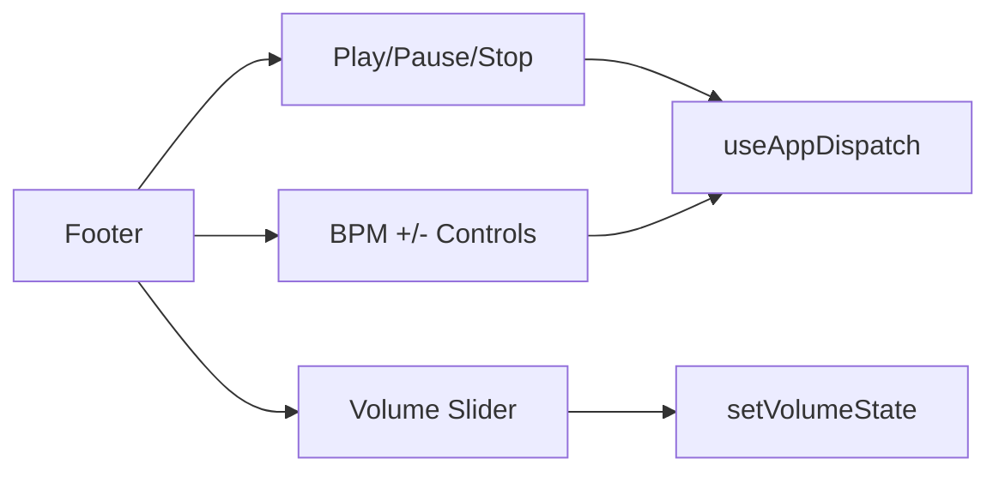
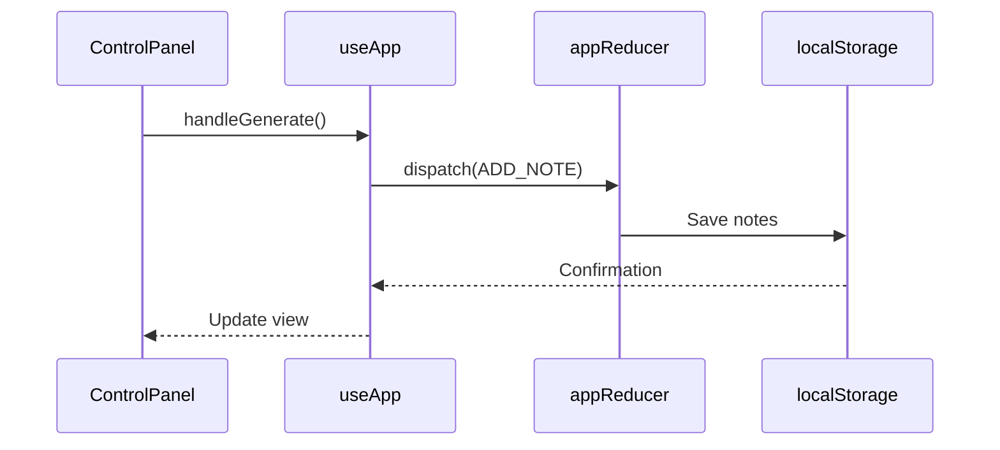
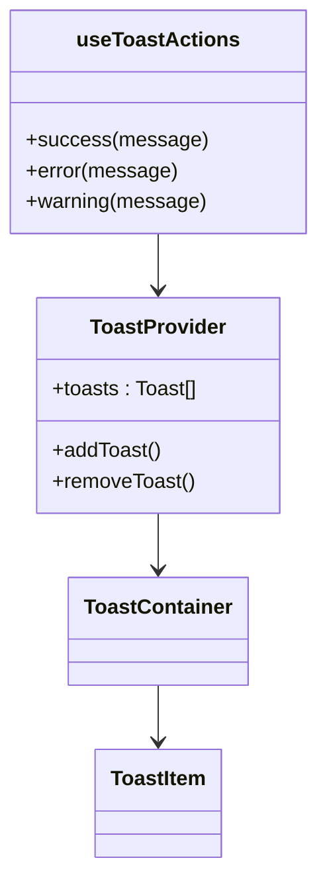

# Interface Overview

<cite>
**Referenced Files in This Document **  
- [index.tsx](file://src/pages/index.tsx)
- [AppContext.tsx](file://src/context/AppContext.tsx)
- [Header.tsx](file://src/components/layout/Header.tsx)
- [ControlPanel.tsx](file://src/components/layout/ControlPanel.tsx)
- [Main.tsx](file://src/components/layout/Main.tsx)
- [Footer.tsx](file://src/components/layout/Footer.tsx)
- [Toast.tsx](file://src/components/ui/Toast.tsx)
</cite>

## Table of Contents
1. [Layout Component Architecture](#layout-component-architecture)  
2. [State Management and Context Providers](#state-management-and-context-providers)  
3. [Visual Design and Accessibility Patterns](#visual-design-and-accessibility-patterns)  
4. [UI Integration Challenges](#ui-integration-challenges)

## Layout Component Architecture

The korysmiditoolbox user interface is structured into four primary layout components: Header, ControlPanel, Main, and Footer. These components are composed within the `index.tsx` file using a hierarchical structure that ensures consistent state sharing and responsive behavior.

### Header (Export Controls)
The Header component provides export functionality for MIDI and WAV files. It renders at the top of the viewport with a dark backdrop and contains action buttons for exporting audio and MIDI data. The component receives callback functions via props (`onExportMIDI`, `onExportWAV`) which are bound to button click handlers.



**Diagram sources**  
- [Header.tsx](file://src/components/layout/Header.tsx#L1-L67)  
- [index.tsx](file://src/pages/index.tsx#L205-L210)

**Section sources**  
- [Header.tsx](file://src/components/layout/Header.tsx#L1-L67)

### ControlPanel (AI Generation and Export Triggers)
The ControlPanel offers AI-driven chord progression generation, export options, and access to application settings. It includes dropdowns for selecting root note and scale type, which directly update global state via `useApp` hooks. The panel also displays real-time status including API key configuration, note count, and musical key signature.

A nested export menu provides additional control over file export types (MIDI/WAV), implemented with click-outside and keyboard dismissal logic to enhance usability.



**Diagram sources**  
- [ControlPanel.tsx](file://src/components/layout/ControlPanel.tsx#L1-L200)  
- [AppContext.tsx](file://src/context/AppContext.tsx#L1-L221)

**Section sources**  
- [ControlPanel.tsx](file://src/components/layout/ControlPanel.tsx#L1-L200)

### Main (Primary Content Container)
The Main component serves as the central content area, divided into two columns on larger screens: left for controls and right for the piano roll preview. It conditionally renders either a welcome state (when no notes exist) or the active piano roll visualization. The component accepts children via React props, enabling composition with the ControlPanel.

Interaction with the piano roll is managed through a modal dialog triggered by the "Open Editor" button, which overlays the main interface with full editing capabilities.



**Diagram sources**  
- [Main.tsx](file://src/components/layout/Main.tsx#L1-L75)  
- [index.tsx](file://src/pages/index.tsx#L212-L218)

**Section sources**  
- [Main.tsx](file://src/components/layout/Main.tsx#L1-L75)

### Footer (Playback Controls, Volume, BPM, Key Signature)
The Footer houses playback transport controls (play, pause, stop), volume slider, BPM adjustment, and displays the current key signature. BPM can be incremented/decremented using arrow buttons or reset to default (120). The volume control uses an HTML range input styled with custom CSS.

Transport controls dispatch playback state updates to the global context, while BPM changes affect the timing loop used in the playback clock.



**Diagram sources**  
- [Footer.tsx](file://src/components/layout/Footer.tsx#L1-L131)  
- [index.tsx](file://src/pages/index.tsx#L220-L239)

**Section sources**  
- [Footer.tsx](file://src/components/layout/Footer.tsx#L1-L131)

## State Management and Context Providers

The application leverages React Context for global state management through two primary providers: `AppProvider` and `ToastProvider`.

### AppProvider and useApp Hook
`AppProvider` wraps the entire app and initializes state for notes, playback, musical parameters, and user settings. It persists critical data (note sequence, settings) to `localStorage`. The `useApp` hook exposes both the current state and action dispatchers for modifying it.

Key actions include:
- `handleGenerate`: Uses Gemini API to generate chord progressions
- `clearNotes`: Removes all notes from state
- `updateSettings`: Updates user preferences like API key

These actions are passed down through component props and invoked in response to UI events.



**Diagram sources**  
- [AppContext.tsx](file://src/context/AppContext.tsx#L1-L221)  
- [index.tsx](file://src/pages/index.tsx#L1-L330)

**Section sources**  
- [AppContext.tsx](file://src/context/AppContext.tsx#L1-L221)

### ToastProvider and useToastActions Hook
`ToastProvider` manages transient notifications (success, error, warning) displayed in the bottom-right corner. The `useToastActions` hook provides convenience methods (`success()`, `error()`) that abstract away toast creation details.

Toasts are automatically dismissed after 5 seconds unless overridden. Each toast includes appropriate icons and color coding based on type.



**Diagram sources**  
- [Toast.tsx](file://src/components/ui/Toast.tsx#L1-L170)  
- [index.tsx](file://src/pages/index.tsx#L3-L330)

**Section sources**  
- [Toast.tsx](file://src/components/ui/Toast.tsx#L1-L170)

## Visual Design and Accessibility Patterns

### Dark Theme Enforcement
The application enforces a dark theme by programmatically adding the `dark` class to the document root during initialization via `useEffect`. All UI components are designed with dark-mode-first styling using Tailwind’s dark variant classes.

```tsx
useEffect(() => {
  document.documentElement.classList.add('dark');
}, []);
```

This ensures consistent appearance regardless of system preferences.

**Section sources**  
- [index.tsx](file://src/pages/index.tsx#L105-L109)

### Responsive Spacing and Typography
The layout uses a responsive grid system with `max-w-7xl` container constraints and flexible column definitions (`lg:grid-cols-3`). Spacing follows a consistent rhythm using Tailwind’s spacing scale (p-6, space-y-6).

Typography classes are defined in `globals.css` and include semantic sizes such as `text-h6`, `text-body-sm`, and `text-caption`, ensuring visual hierarchy across devices.

**Section sources**  
- [Main.tsx](file://src/components/layout/Main.tsx#L1-L75)  
- [globals.css](file://src/styles/globals.css#L54-L119)

### Accessibility Attributes
Key accessibility features include:
- `role="dialog"` and `aria-modal="true"` on modal overlays
- `aria-label` on icon-only buttons (e.g., close, play)
- `aria-live="polite"` for toast notifications
- Proper form labels for select inputs
- Keyboard navigation support (Escape to close modals)

These attributes ensure screen reader compatibility and keyboard operability.

**Section sources**  
- [Header.tsx](file://src/components/layout/Header.tsx#L1-L67)  
- [Footer.tsx](file://src/components/layout/Footer.tsx#L1-L131)  
- [Toast.tsx](file://src/components/ui/Toast.tsx#L1-L170)

## UI Integration Challenges

### Z-Index Management for Modals
Modals (Piano Roll, Settings Panel) use high z-index values (`z-50`) to appear above other content. The backdrop uses `bg-black/70` with fixed positioning. Animation classes (`animate-fade-in-150`, `animate-scale-in-150`) provide smooth transitions without relying on JavaScript animation libraries.

Overlapping concerns between multiple modals are avoided by managing visibility through React state (`showPianoRoll`, `showSettings`), ensuring only one modal is active at a time.

**Section sources**  
- [index.tsx](file://src/pages/index.tsx#L240-L329)

### Event Propagation in Nested Interactive Elements
Nested interactive elements (e.g., dropdown menus inside ControlPanel) require careful event handling to prevent unintended closures. The export menu uses a `ref` to detect clicks outside its bounds:

```tsx
const onDocClick = (e: MouseEvent) => {
  if (exportMenuRef.current && !exportMenuRef.current.contains(e.target as Node)) {
    setShowExportMenu(false);
  }
};
```

Additionally, pressing Escape closes the menu, enhancing keyboard accessibility.

**Section sources**  
- [ControlPanel.tsx](file://src/components/layout/ControlPanel.tsx#L1-L200)