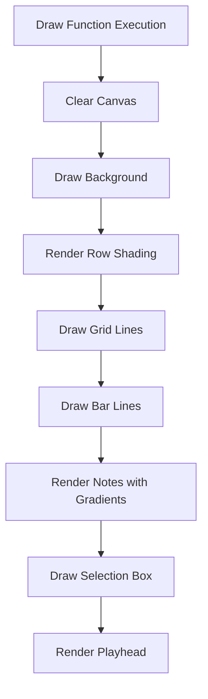
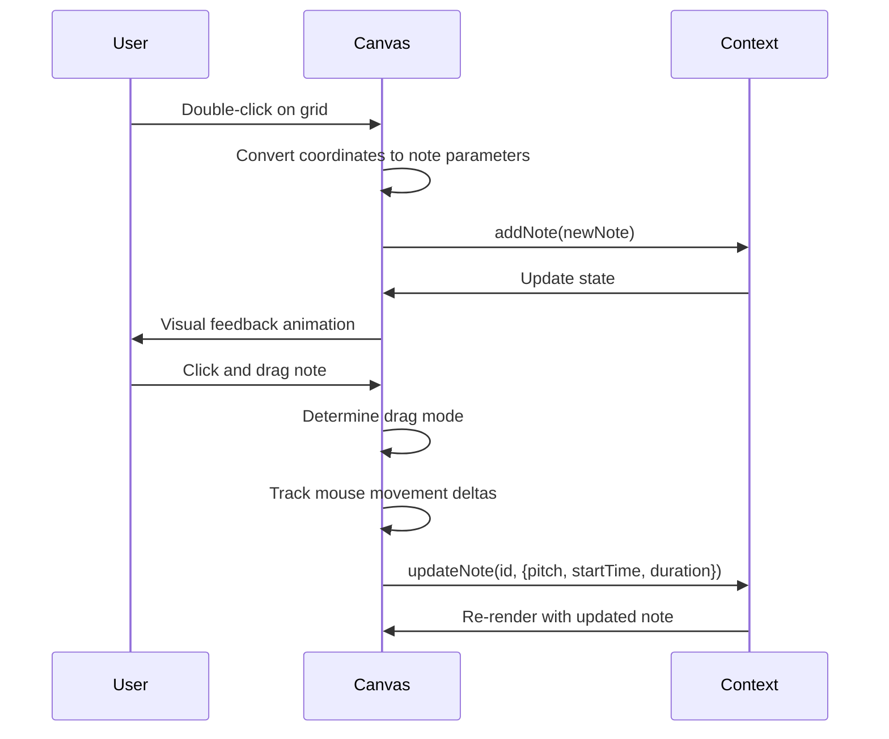
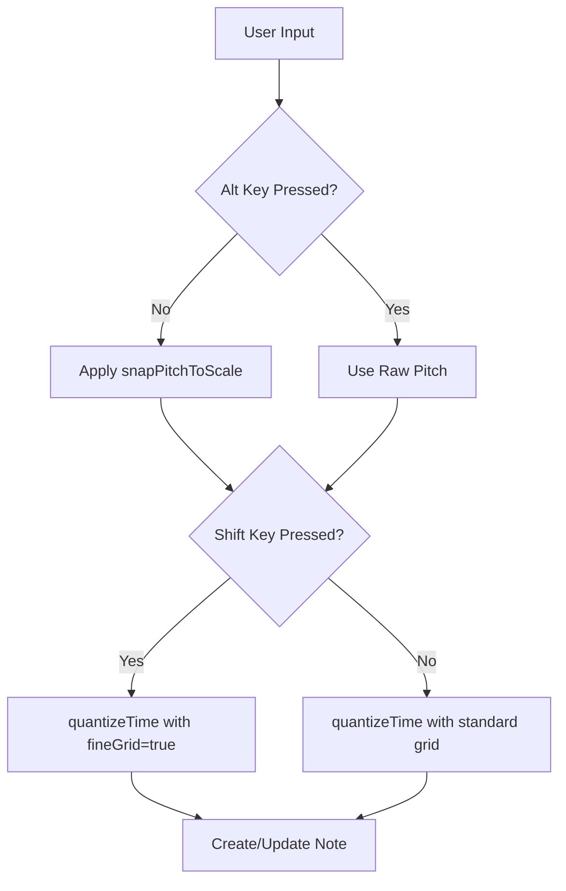
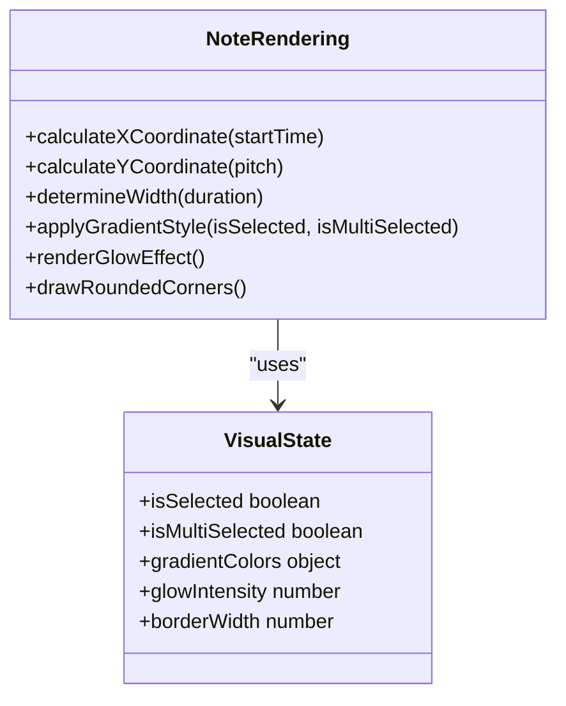

# Piano Roll Editing

<cite>
**Referenced Files in This Document**   
- [PianoRoll.tsx](file://src/components/PianoRoll.tsx)
- [midiUtils.ts](file://src/utils/midiUtils.ts)
- [AppContext.tsx](file://src/context/AppContext.tsx)
- [index.ts](file://src/types/index.ts)
</cite>

## Table of Contents
1. [Canvas-Based Rendering and Draw Loop](#canvas-based-rendering-and-draw-loop)
2. [Interaction Mechanics](#interaction-mechanics)
3. [Snapping Logic](#snapping-logic)
4. [Note State Mapping and Visual Feedback](#note-state-mapping-and-visual-feedback)
5. [Performance Considerations](#performance-considerations)

## Canvas-Based Rendering and Draw Loop

The piano roll rendering is implemented using HTML5 Canvas for high-performance visual updates. The core drawing logic is encapsulated within the `draw` function, which is memoized using React's `useCallback` hook to prevent unnecessary re-creations during component re-renders.

The draw loop is triggered through a `useEffect` hook that calls the `draw` function whenever it changes. This dependency on the memoized `draw` function ensures the canvas is redrawn only when necessary, optimizing performance by avoiding redundant executions.

The rendering process begins with clearing the canvas and establishing the background. It then draws horizontal row shading to visually distinguish between piano keys, using different colors for black and white keys based on MIDI pitch calculations. Grid lines are rendered at beat intervals, with thicker bar lines appearing every four beats to provide musical structure reference points.

**Diagram sources**
- [PianoRoll.tsx](file://src/components/PianoRoll.tsx#L68-L220)

**Section sources**
- [PianoRoll.tsx](file://src/components/PianoRoll.tsx#L68-L220)

## Interaction Mechanics

The piano roll supports multiple interaction modes for note manipulation, controlled through mouse events and keyboard shortcuts. These interactions are managed through state variables including `dragMode`, `dragOriginRef`, and selection tracking.

### Double-Click to Add Notes

Users can add new notes by double-clicking on empty areas of the piano roll. The `handleDoubleClick` event handler captures the click position, converts it to musical coordinates, and creates a new note via the `addNote` context function. A subtle visual feedback animation briefly highlights the added note location with a blue overlay that fades out.

### Drag Operations

Three primary drag modes enable comprehensive note editing:

- **Move Mode**: Activated when clicking on a note's body, allowing users to reposition notes in both pitch and time dimensions
- **Resize-Start Mode**: Triggered when clicking near a note's left edge (within 6px threshold), enabling adjustment of the note's start time
- **Resize-End Mode**: Activated when clicking near a note's right edge, allowing extension or shortening of the note duration

The `handleMouseDown` function determines the appropriate drag mode by checking the cursor position relative to existing notes using the `findNoteAtPosition` helper. During dragging operations, `handleMouseMove` calculates delta values from the original drag position and applies transformations accordingly.

### Keyboard Deletion

Notes can be deleted using the Delete or Backspace key when the canvas has focus. The `handleKeyDown` function intercepts these key events and removes either the currently selected single note or all notes in the multi-selection set.

**Diagram sources**
- [PianoRoll.tsx](file://src/components/PianoRoll.tsx#L421-L595)

**Section sources**
- [PianoRoll.tsx](file://src/components/PianoRoll.tsx#L421-L602)

## Snapping Logic

The piano roll implements sophisticated snapping behavior to assist users in creating musically coherent compositions. This includes both pitch snapping to scales and temporal quantization to rhythmic grids.

### Scale-Based Pitch Snapping

The snapping system uses three interconnected functions:

- `allowedPitchClasses`: Determines which pitch classes (0-11) are valid within the current root note and scale type by calculating intervals from the scale definition
- `snapPitchToScale`: Snaps a given pitch to the nearest valid pitch class in the current scale, searching symmetrically in both directions up to a semitone distance of 6
- `snapPitchToScaleDirectional`: Implements directional snapping that searches only in the specified direction (up or down), providing more predictable behavior during pitch adjustments

Pitch snapping is conditionally disabled when the Alt key is held, allowing chromatic input while maintaining scale adherence by default.

### Grid-Based Time Quantization

Temporal alignment is handled by the `quantizeTime` function, which rounds time values to the nearest grid division. The quantization resolution depends on user input:

- **Standard Grid**: Aligns to 16th notes (default quantization unit)
- **Fine Grid**: Activated when Shift is held, providing quarter-precision snapping for detailed timing adjustments

The quantization step is dynamically calculated based on the current BPM assumption (120 BPM, 0.5 seconds per beat) and divisions per beat. Both pitch and time snapping can be globally toggled via application settings stored in the AppContext.

**Diagram sources**
- [PianoRoll.tsx](file://src/components/PianoRoll.tsx#L318-L397)
- [midiUtils.ts](file://src/utils/midiUtils.ts#L37-L55)

**Section sources**
- [PianoRoll.tsx](file://src/components/PianoRoll.tsx#L318-L397)

## Note State Mapping and Visual Feedback

The visual representation of notes is determined by mapping their state properties to canvas coordinates and styling attributes. This mapping occurs within the main draw loop where each note in the application state is processed.

### Coordinate Transformation

Each note's position is calculated using:
- **X-coordinate**: Derived from `startTime` multiplied by `(beatWidth / 2)` to convert seconds to pixels
- **Y-coordinate**: Calculated as `(maxNote - pitch) * noteHeight` to position higher pitches at the top of the grid
- **Width**: Determined by `duration * (beatWidth / 2)` ensuring proper temporal representation
- **Height**: Set to `noteHeight - 2` pixels with minimum constraints for visibility

### Visual Differentiation

The interface provides clear visual feedback through multiple styling mechanisms:

- **Color Gradients**: Unselected notes use green gradients (`#22c55e` to `#16a34a`), while selected notes display blue gradients (`#60a5fa` to `#3b82f6`)
- **Multi-Selection Indication**: Notes in multi-selection sets show orange gradients with a checkmark indicator
- **Visual Effects**: Selected notes feature enhanced glow effects with increased shadow blur and border width
- **Rounded Corners**: All notes use rounded rectangle paths for a polished appearance

These visual cues help users quickly identify the state of each note and maintain spatial awareness during editing sessions.

**Diagram sources**
- [PianoRoll.tsx](file://src/components/PianoRoll.tsx#L149-L183)

**Section sources**
- [PianoRoll.tsx](file://src/components/PianoRoll.tsx#L149-L183)

## Performance Considerations

The implementation incorporates several optimization strategies to maintain smooth performance during intensive editing operations.

### Render Optimization

The `draw` function is wrapped in `useCallback` with a comprehensive dependency array that includes all variables affecting the rendering output. This prevents unnecessary function recreations while ensuring the draw function updates when relevant props or state change.

The `useEffect` that triggers drawing depends only on the `draw` function itself, not on individual state variables. This approach minimizes render triggers while still guaranteeing visual consistency with the underlying data.

### Event Handling Efficiency

Mouse move events are processed efficiently by maintaining drag state in refs rather than component state. The `dragOriginRef` stores the initial drag position and original note data, allowing continuous position calculations without triggering re-renders during the drag operation.

Selection box rendering is optimized by only updating the end coordinates in state during dragging, rather than recalculating the entire selection logic on each mouse move.

### Memory Management

The implementation avoids memory leaks by properly cleaning up event listeners in the keyboard shortcut effect. The clipboard functionality uses a module-level variable rather than component state, preventing duplication across instances while maintaining copy-paste functionality.

The fade-out animation for note addition uses `requestAnimationFrame` for smooth performance rather than setTimeout, ensuring synchronization with the browser's refresh cycle.

**Section sources**
- [PianoRoll.tsx](file://src/components/PianoRoll.tsx#L68-L220)
- [PianoRoll.tsx](file://src/components/PianoRoll.tsx#L221-L266)
- [PianoRoll.tsx](file://src/components/PianoRoll.tsx#L558-L602)