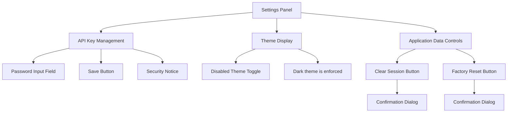
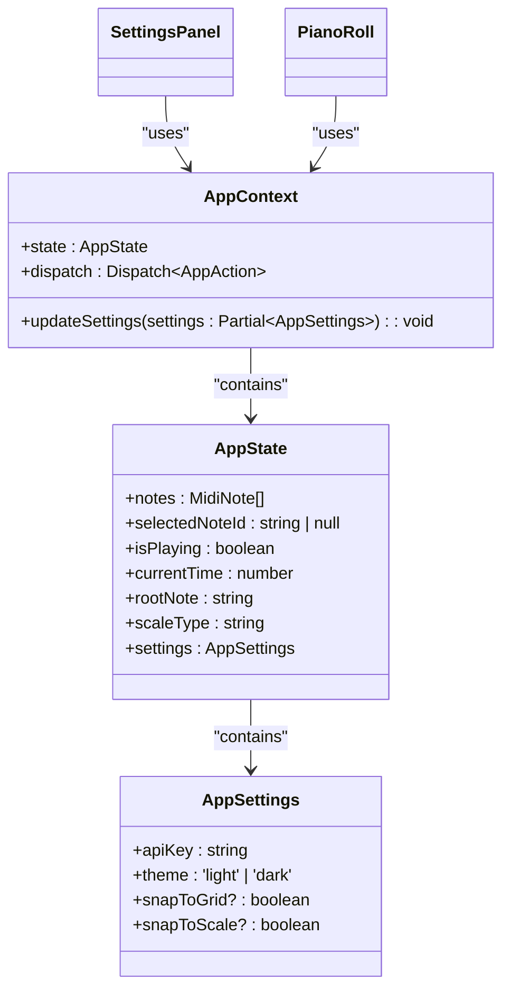
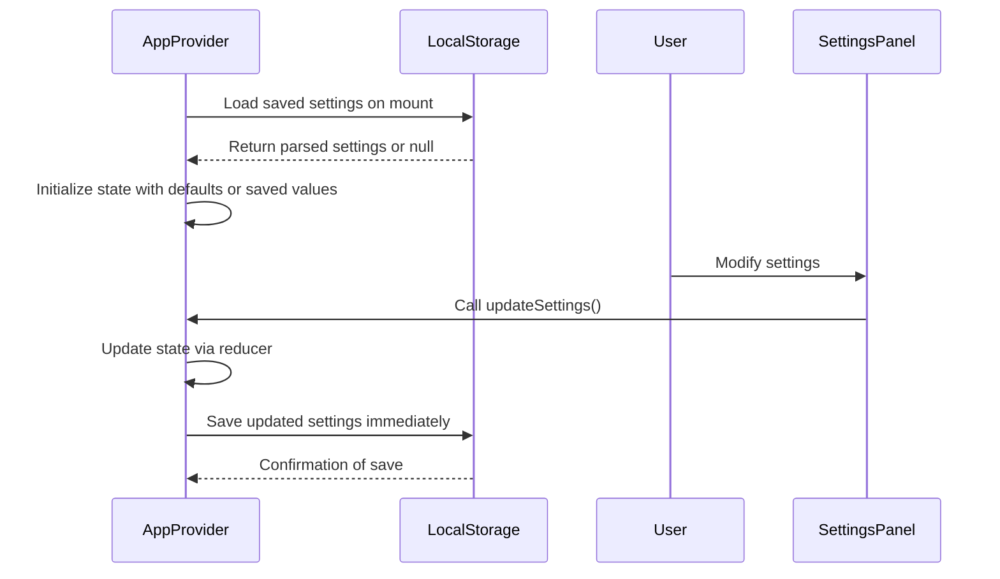
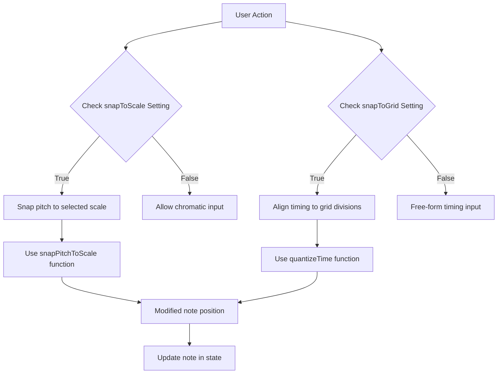

# Settings Management

<cite>
**Referenced Files in This Document**  
- [SettingsPanel.tsx](file://src/components/SettingsPanel.tsx)
- [AppContext.tsx](file://src/context/AppContext.tsx)
- [index.tsx](file://src/pages/index.tsx)
- [PianoRoll.tsx](file://src/components/PianoRoll.tsx)
- [index.ts](file://src/types/index.ts)
</cite>

## Table of Contents
1. [Introduction](#introduction)  
2. [Settings Panel Interface](#settings-panel-interface)  
3. [Settings State Management](#settings-state-management)  
4. [Persistence Mechanism](#persistence-mechanism)  
5. [Real-Time Toggles in Piano Roll](#real-time-toggles-in-piano-roll)  
6. [Conditional Behavior Based on Settings](#conditional-behavior-based-on-settings)  
7. [Security Considerations](#security-considerations)  
8. [UX Design Patterns](#ux-design-patterns)  
9. [Architecture Overview](#architecture-overview)  

## Introduction

The korysmiditoolbox application implements a comprehensive settings management system that controls core user preferences including API authentication, theme selection, and editor behavior. The system is built around React's context pattern for global state management, with localStorage persistence to maintain user preferences across sessions. This document details the implementation of the SettingsPanel component, the updateSettings action, real-time toggles in the piano roll interface, and the security implications of storing sensitive data in client-side storage.

## Settings Panel Interface

The SettingsPanel component provides a modal interface for users to configure their application preferences. It exposes controls for managing the Google Gemini API key, application data, and displays the currently enforced dark theme.



**Section sources**
- [SettingsPanel.tsx](file://src/components/SettingsPanel.tsx#L0-L204)

## Settings State Management

Application settings are managed through the AppContext system, which provides a centralized state container accessible throughout the component tree. The updateSettings action modifies the AppSettings object in context, triggering re-renders in all dependent components.



**Diagram sources**
- [AppContext.tsx](file://src/context/AppContext.tsx#L0-L220)
- [index.ts](file://src/types/index.ts#L8-L13)

**Section sources**
- [AppContext.tsx](file://src/context/AppContext.tsx#L0-L220)
- [index.ts](file://src/types/index.ts#L8-L13)

## Persistence Mechanism

Settings are persisted to localStorage using the keys `korysmiditoolbox-settings` for settings and `korysmiditoolbox-state` for application state. The system implements automatic saving whenever settings change and loads saved values during initialization.



**Diagram sources**
- [AppContext.tsx](file://src/context/AppContext.tsx#L81-L133)

**Section sources**
- [AppContext.tsx](file://src/context/AppContext.tsx#L81-L133)

## Real-Time Toggles in Piano Roll

The piano roll header contains real-time toggles for snapToScale and snapToGrid functionality. These UI elements directly call the updateSettings action when clicked, providing immediate feedback and behavioral changes without requiring a separate save operation.

```mermaid
flowchart LR
A[Piano Roll Header] --> B[Snap to Scale Toggle]
A --> C[Snap to Grid Toggle]
B --> D{Current State}
D --> |Enabled| E[Visual indicator: blue gradient]
D --> |Disabled| F[Visual indicator: gray]
B --> G[onClick: updateSettings({snapToScale: !currentValue})]
C --> H{Current State}
H --> |Enabled| I[Visual indicator: blue gradient]
H --> |Disabled| J[Visual indicator: gray]
C --> K[onClick: updateSettings({snapToGrid: !currentValue})]
```

**Diagram sources**
- [index.tsx](file://src/pages/index.tsx#L295-L318)

**Section sources**
- [index.tsx](file://src/pages/index.tsx#L295-L318)
- [PianoRoll.tsx](file://src/components/PianoRoll.tsx#L363-L397)

## Conditional Behavior Based on Settings

Settings drive conditional behavior throughout the application, particularly in the piano roll's note placement and movement logic. The snapToScale and snapToGrid settings control whether notes automatically align to musical scales and rhythmic grids.



**Section sources**
- [PianoRoll.tsx](file://src/components/PianoRoll.tsx#L363-L397)
- [PianoRoll.tsx](file://src/components/PianoRoll.tsx#L540-L569)

## Security Considerations

The application stores the Google Gemini API key in localStorage, which presents security implications that should be understood by users and developers alike.

### Current Implementation
- API keys are stored in plaintext in localStorage under the key `korysmiditoolbox-settings`
- Keys are only used client-side for direct API calls to Google Gemini
- No server-side transmission of API keys occurs
- Users are informed that "Your API key is stored securely in your browser and is never sent to our servers"

### Potential Risks
- **Cross-Site Scripting (XSS)**: Malicious scripts could potentially access localStorage contents
- **Physical Access**: Anyone with access to the device can retrieve stored API keys
- **Browser Extensions**: Malicious extensions may have access to localStorage data

### Mitigation Strategies
1. **Environment Variables**: For production deployments, consider using environment variables instead of client-side storage
2. **Token Expiration**: Implement short-lived tokens that require periodic re-authentication
3. **Encryption**: Encrypt sensitive values before storing in localStorage
4. **Alternative Storage**: Consider using more secure storage mechanisms like HTTP-only cookies (though less suitable for client-only applications)
5. **User Education**: Clearly communicate security implications to users

**Section sources**
- [SettingsPanel.tsx](file://src/components/SettingsPanel.tsx#L0-L204)
- [AppContext.tsx](file://src/context/AppContext.tsx#L0-L220)

## UX Design Patterns

The settings management system incorporates several user experience considerations to ensure intuitive interaction and immediate feedback.

### Immediate Visual Feedback
- Toggle switches use color transitions (gray ↔ blue gradient) to indicate state changes
- Button states reflect disabled/enabled conditions based on input validity
- Confirmation dialogs prevent accidental data loss

### Error States
- API key field validation disables the save button when empty
- Toast notifications provide feedback for successful operations and errors
- Clear visual hierarchy separates different setting categories

### Accessibility Features
- Proper ARIA labels for interactive elements
- Keyboard navigation support
- High contrast design for readability
- Semantic HTML structure

**Section sources**
- [SettingsPanel.tsx](file://src/components/SettingsPanel.tsx#L0-L204)
- [index.tsx](file://src/pages/index.tsx#L0-L392)

## Architecture Overview

The settings management architecture follows a unidirectional data flow pattern, with React Context serving as the single source of truth for application settings.

```mermaid
graph TB
subgraph "Persistence Layer"
LS[(localStorage)]
end
subgraph "State Management"
AC[AppContext]
Reducer[appReducer]
end
subgraph "UI Components"
SP[SettingsPanel]
PR[PianoRoll]
Main[MainApp]
end
SP --> AC : updateSettings()
PR --> AC : Read settings
Main --> AC : Read settings
AC --> LS : Save on change
LS --> AC : Load on init
AC --> Reducer : Dispatch actions
Reducer --> AC : Update state
```

**Diagram sources**
- [AppContext.tsx](file://src/context/AppContext.tsx#L0-L220)
- [SettingsPanel.tsx](file://src/components/SettingsPanel.tsx#L0-L204)
- [PianoRoll.tsx](file://src/components/PianoRoll.tsx#L0-L799)
- [index.tsx](file://src/pages/index.tsx#L0-L392)