# User Guide

<cite>
**Referenced Files in This Document**   
- [Header.tsx](file://src/components/layout/Header.tsx)
- [ControlPanel.tsx](file://src/components/layout/ControlPanel.tsx)
- [Footer.tsx](file://src/components/layout/Footer.tsx)
- [PianoRoll.tsx](file://src/components/PianoRoll.tsx)
- [SettingsPanel.tsx](file://src/components/SettingsPanel.tsx)
- [AppContext.tsx](file://src/context/AppContext.tsx)
- [geminiService.ts](file://src/services/geminiService.ts)
- [audioService.ts](file://src/services/audioService.ts)
- [midiExportService.ts](file://src/services/midiExportService.ts)
- [midiUtils.ts](file://src/utils/midiUtils.ts)
- [index.ts](file://src/types/index.ts)
- [index.tsx](file://src/pages/index.tsx)
- [defaultProgression.ts](file://src/utils/defaultProgression.ts)
</cite>

## Table of Contents
1. [Interface Overview](#interface-overview)
2. [Composition Workflow](#composition-workflow)
3. [Piano Roll Interactions](#piano-roll-interactions)
4. [Playback Controls](#playback-controls)
5. [Settings Management](#settings-management)
6. [Export Functionality](#export-functionality)

## Interface Overview

The korysmiditoolbox interface is organized into three primary layout components: Header, ControlPanel, and Footer. These components provide intuitive access to all core functionalities while maintaining a clean, focused workspace for music creation.

### Header Component

The Header component serves as the top navigation bar, providing global actions for sharing and exporting your musical compositions. It features a gradient logo with a musical note icon, clearly identifying the application.

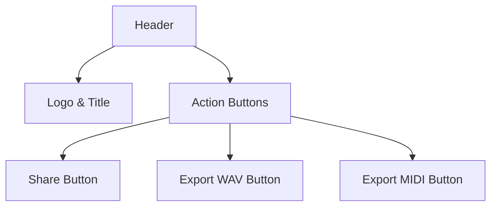

**Diagram sources**
- [Header.tsx](file://src/components/layout/Header.tsx#L1-L66)

**Section sources**
- [Header.tsx](file://src/components/layout/Header.tsx#L1-L66)

### Control Panel

The Control Panel, located on the left side of the main interface, organizes functionality into three distinct sections:

1. **Musical Parameters**: Allows selection of root note and scale type from dropdown menus.
2. **Actions**: Contains primary workflow buttons including "Generate Progression", "Export" (with dropdown), and "Settings".
3. **Status**: Displays real-time information about API key status, number of notes, and current key signature.

The panel uses a dark theme with subtle shadows and hover effects to enhance usability.

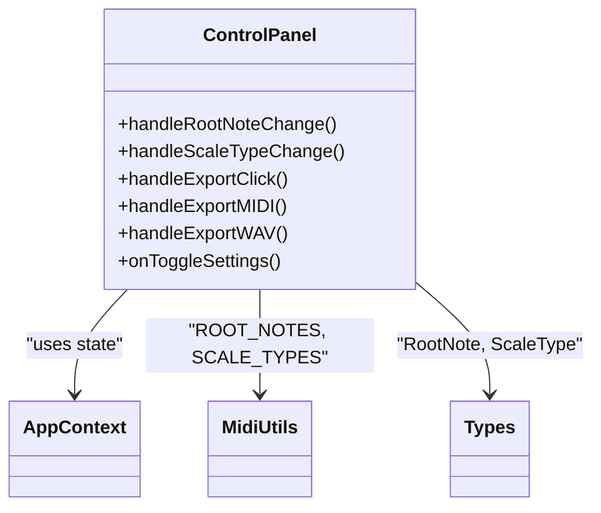

**Diagram sources**
- [ControlPanel.tsx](file://src/components/layout/ControlPanel.tsx#L1-L199)

**Section sources**
- [ControlPanel.tsx](file://src/components/layout/ControlPanel.tsx#L1-L199)

### Footer Component

The Footer provides playback controls and transport functions. It includes volume control with a slider, BPM adjustment with +/- buttons, and standard media controls (play, pause, stop). The center section displays the current BPM and key signature, while additional utility buttons are available on the right.

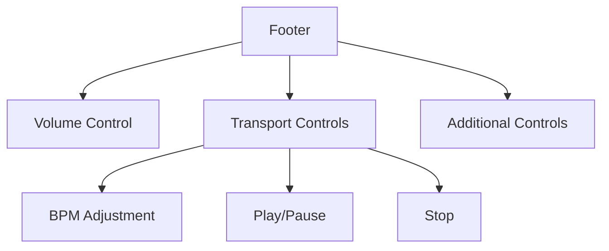

**Diagram sources**
- [Footer.tsx](file://src/components/layout/Footer.tsx#L1-L130)

**Section sources**
- [Footer.tsx](file://src/components/layout/Footer.tsx#L1-L130)

## Composition Workflow

The composition workflow in korysmiditoolbox follows a structured process from initial setup to AI-assisted generation and refinement.

### Setting Root Note and Scale

Users begin by selecting a root note and scale type from the Control Panel dropdowns. These selections define the harmonic framework for the composition. The available root notes include all chromatic pitches from C to B, while scale types encompass Major, Minor, Dorian, Phrygian, Lydian, Mixolydian, and Harmonic Minor.

When a selection is made, the application updates the global state through the AppContext, ensuring all components reflect the current musical parameters.

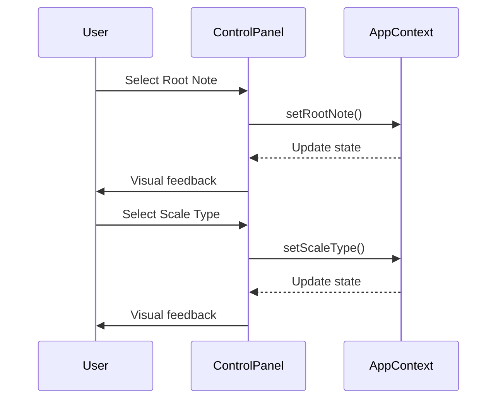

**Diagram sources**
- [ControlPanel.tsx](file://src/components/layout/ControlPanel.tsx#L78-L105)
- [AppContext.tsx](file://src/context/AppContext.tsx#L150-L171)

**Section sources**
- [ControlPanel.tsx](file://src/components/layout/ControlPanel.tsx#L78-L105)
- [AppContext.tsx](file://src/context/AppContext.tsx#L150-L171)

### Generating AI Chord Progressions via Gemini API

The core generative feature utilizes Google's Gemini API to create chord progressions based on the selected musical parameters. When the user clicks "Generate Progression," the following sequence occurs:

1. Validation checks ensure an API key is configured
2. The geminiService constructs a prompt specifying the root note, scale type, and desired chord count
3. The AI generates a JSON response containing MIDI note data
4. The application parses and validates the response, creating properly formatted MidiNote objects
5. Existing notes are cleared and the new progression is added to the state

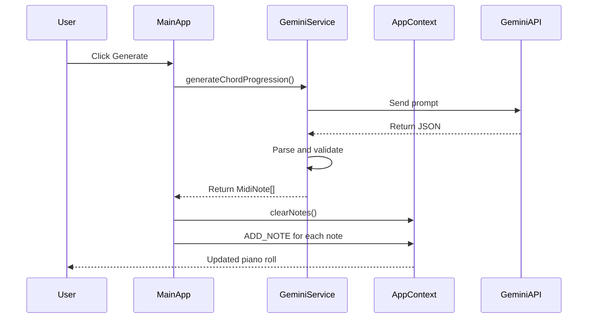

**Diagram sources**
- [index.tsx](file://src/pages/index.tsx#L100-L148)
- [geminiService.ts](file://src/services/geminiService.ts#L1-L70)

**Section sources**
- [index.tsx](file://src/pages/index.tsx#L100-L148)
- [geminiService.ts](file://src/services/geminiService.ts#L1-L70)

## Piano Roll Interactions

The piano roll editor provides a visual interface for precise note manipulation, accessible as a modal overlay.

### Adding Notes

Notes are added through double-click interactions on the canvas. The system calculates the corresponding pitch and start time based on the cursor position, applying snapping rules according to user preferences.

```mermaid
flowchart TD
A[Double-click on canvas] --> B[Calculate x,y position]
B --> C{Snap enabled?}
C --> |Yes| D[Snap to grid/scale]
C --> |No| E[Use raw position]
D --> F[Create MidiNote object]
E --> F
F --> G[Add to state via addNote()]
G --> H[Visual feedback animation]
```

**Diagram sources**
- [PianoRoll.tsx](file://src/components/PianoRoll.tsx#L348-L388)

**Section sources**
- [PianoRoll.tsx](file://src/components/PianoRoll.tsx#L348-L388)

### Moving and Resizing Notes

The piano roll supports three drag modes for note manipulation:
- **Move**: Drag the body of a note to reposition it in time and pitch
- **Resize-start**: Drag the left edge to adjust the note's start time
- **Resize-end**: Drag the right edge to adjust the note's duration

All operations respect the current snapping configuration (grid and scale).

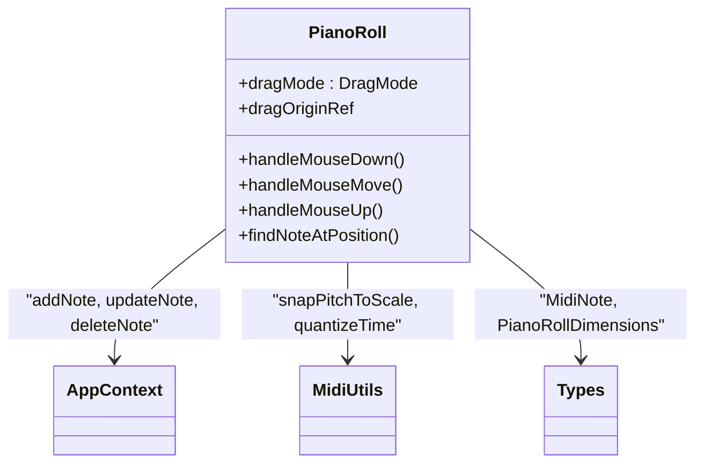

**Diagram sources**
- [PianoRoll.tsx](file://src/components/PianoRoll.tsx#L200-L347)

**Section sources**
- [PianoRoll.tsx](file://src/components/PianoRoll.tsx#L200-L347)

### Deleting Selections

Selected notes can be deleted using the Delete or Backspace key. The keyboard event handler in the piano roll component detects these inputs and triggers the deletion through the AppContext.

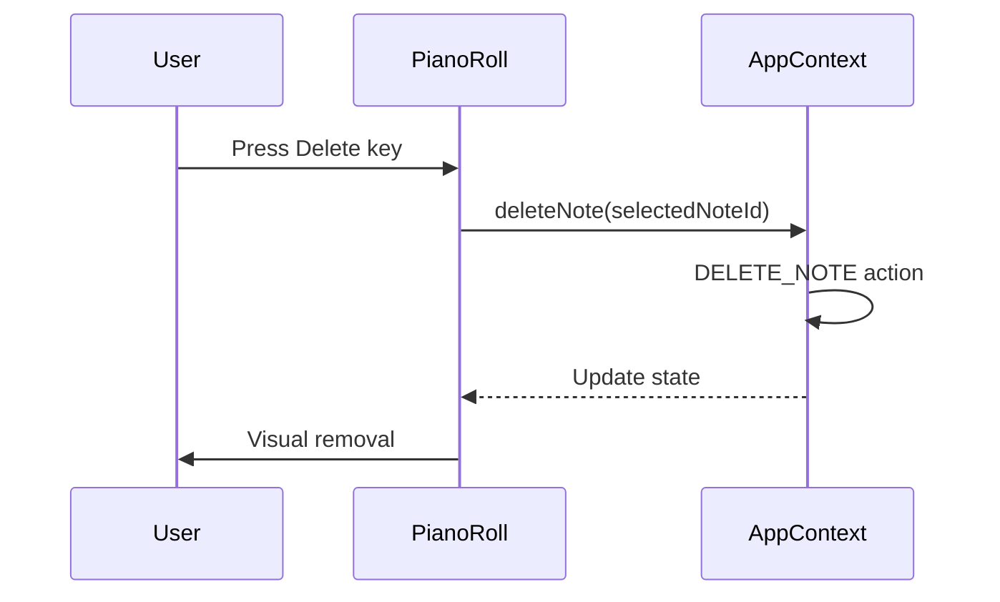

**Diagram sources**
- [PianoRoll.tsx](file://src/components/PianoRoll.tsx#L428-L432)

**Section sources**
- [PianoRoll.tsx](file://src/components/PianoRoll.tsx#L428-L432)

## Playback Controls

The playback system provides standard transport controls synchronized with visual feedback.

### Play, Pause, and Stop

The Footer component contains play/pause and stop buttons that control the audio playback state. When playing, a visual playhead moves across the piano roll, indicating the current playback position.

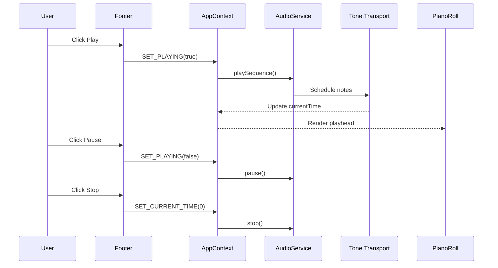

**Diagram sources**
- [Footer.tsx](file://src/components/layout/Footer.tsx#L100-L120)
- [index.tsx](file://src/pages/index.tsx#L170-L190)

**Section sources**
- [Footer.tsx](file://src/components/layout/Footer.tsx#L100-L120)
- [index.tsx](file://src/pages/index.tsx#L170-L190)

## Settings Management

The settings system allows users to configure application preferences and manage their session data.

### API Key Storage

The application requires a Google Gemini API key for AI generation capabilities. This key is stored securely in the browser's localStorage and never transmitted to external servers. Users enter their key in the Settings panel, where it's validated before use.

```mermaid
flowchart TD
A[User enters API key] --> B[SettingsPanel]
B --> C[updateSettings()]
C --> D[AppContext dispatch UPDATE_SETTINGS]
D --> E[localStorage.setItem()]
E --> F[GeminiService initialized]
```

**Diagram sources**
- [SettingsPanel.tsx](file://src/components/SettingsPanel.tsx#L48-L68)
- [AppContext.tsx](file://src/context/AppContext.tsx#L200-L210)

**Section sources**
- [SettingsPanel.tsx](file://src/components/SettingsPanel.tsx#L48-L68)
- [AppContext.tsx](file://src/context/AppContext.tsx#L200-L210)

### Theme Toggling

The application enforces a dark theme for optimal visibility during music production. While a theme toggle exists in the codebase, it is disabled in the UI to maintain consistency across user sessions.

### Snapping Preferences

Users can toggle two snapping behaviors directly from the piano roll header:
- **Snap to Scale**: Restricts note pitches to the currently selected scale
- **Snap to Grid**: Aligns note timing to rhythmic subdivisions (16th notes by default)

These preferences are also stored in localStorage for persistence.

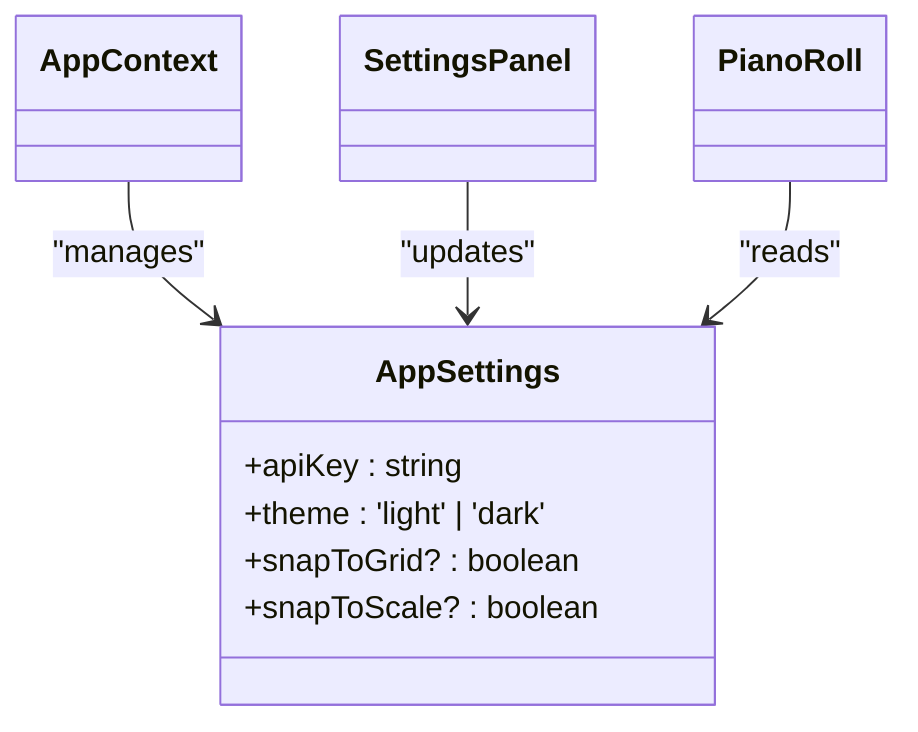

**Diagram sources**
- [index.ts](file://src/types/index.ts#L10-L15)
- [SettingsPanel.tsx](file://src/components/SettingsPanel.tsx#L100-L115)

**Section sources**
- [index.ts](file://src/types/index.ts#L10-L15)
- [SettingsPanel.tsx](file://src/components/SettingsPanel.tsx#L100-L115)

## Export Functionality

korysmiditoolbox supports exporting compositions in both MIDI and WAV formats, with client-side file generation.

### MIDI Export

The MIDI export process converts the current note collection into a standard MIDI file using the midi-writer-js library. Notes are grouped by start time to form chords, then converted from MIDI numbers to note names before being packaged into a downloadable blob.

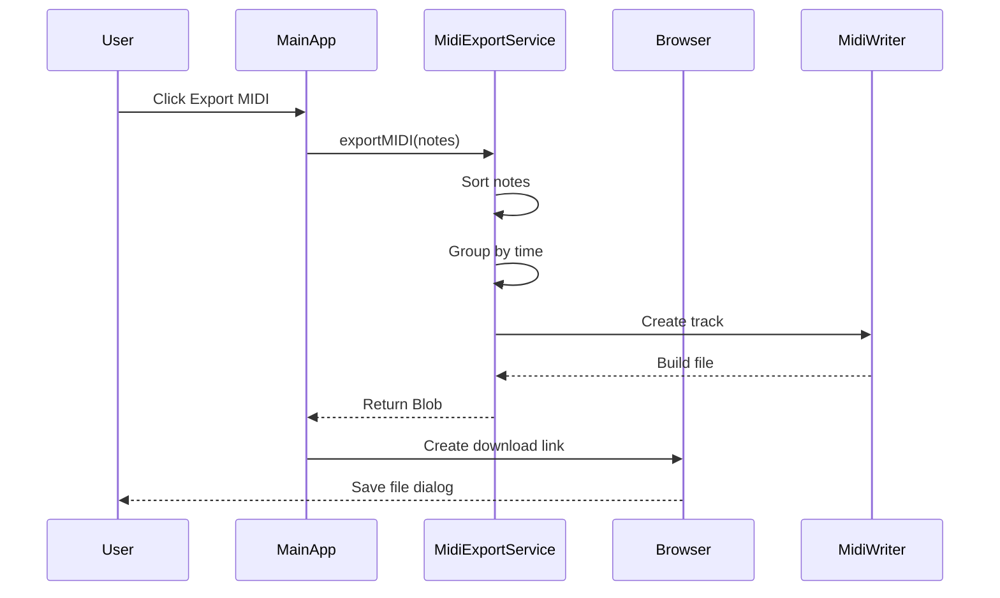

**Diagram sources**
- [midiExportService.ts](file://src/services/midiExportService.ts#L1-L79)
- [index.tsx](file://src/pages/index.tsx#L150-L168)

**Section sources**
- [midiExportService.ts](file://src/services/midiExportService.ts#L1-L79)
- [index.tsx](file://src/pages/index.tsx#L150-L168)

### WAV Export

WAV export renders the composition as high-quality audio using Tone.js's offline rendering capabilities. The process creates an OfflineContext, schedules all notes, renders the audio buffer, and converts it to WAV format with proper headers.

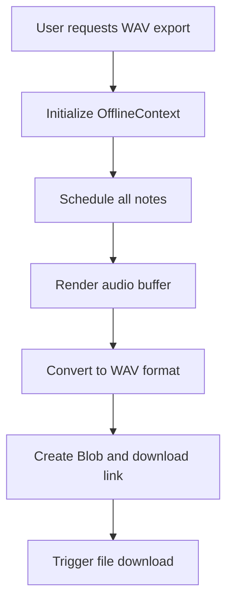

**Diagram sources**
- [audioService.ts](file://src/services/audioService.ts#L130-L198)
- [index.tsx](file://src/pages/index.tsx#L170-L190)

**Section sources**
- [audioService.ts](file://src/services/audioService.ts#L130-L198)
- [index.tsx](file://src/pages/index.tsx#L170-L190)